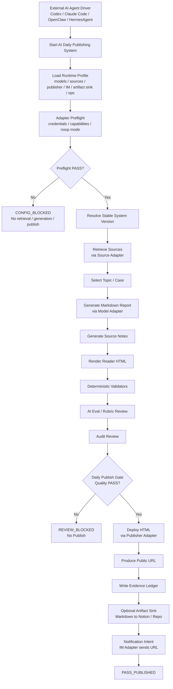
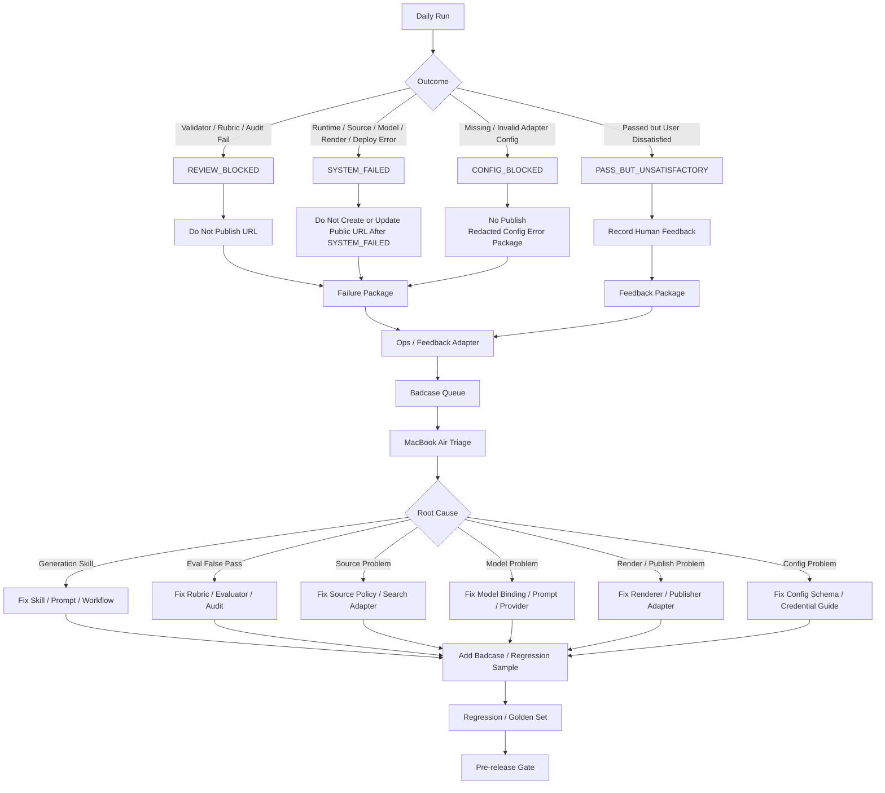
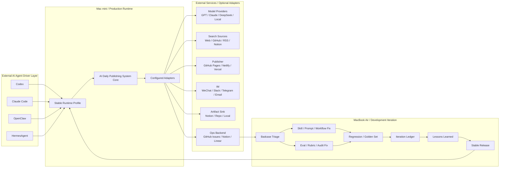
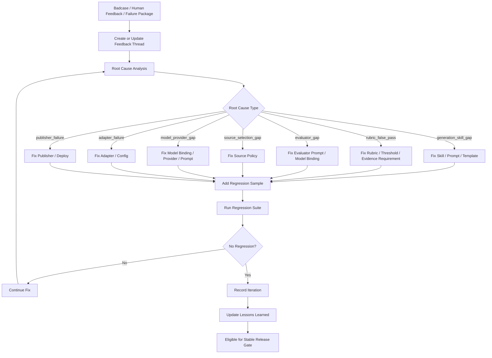
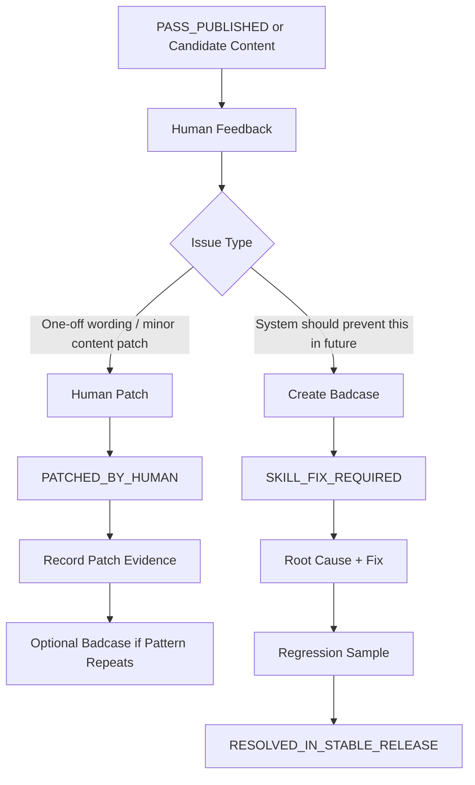
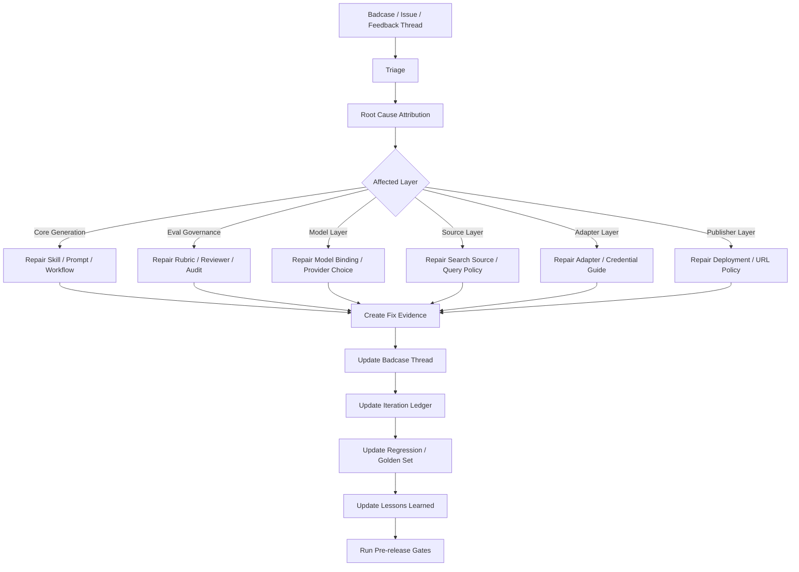
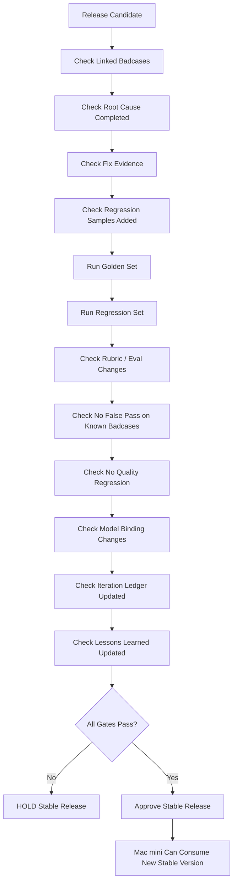

# P2D-1 AI Daily Publishing System Context Pack

Status: `P2D-1a-R2_FINAL_CONTEXT_PACK_READY_FOR_ARCHITECTURE_DRAFT`

## 1. Purpose

This context pack captures the confirmed product architecture direction for P2D-1.

It is the source-of-truth context for the next architecture document:

```text
docs/architecture/p2d-1-ai-daily-publishing-system-core-and-adapter-architecture.md
```

This document exists because the project direction has been clarified beyond the earlier P2D-0 wording.

The system should no longer be framed as a Hermes-specific publisher, a Mac mini scheduled script, or a single-agent workflow.

The confirmed system name is:

```text
AI Daily Publishing System
```

This name is final for the current P2D design stage. Do not reopen naming unless the user explicitly requests a rename.

The system is an AI-agent-drivable content production, evaluation, publishing, and governance system.

External AI agents can start it, pass runtime configuration, receive final results, and forward URLs or failure summaries.

The product system core owns retrieval, generation, evaluation, audit, publish decision, HTML deployment, public URL output, evidence capture, badcase governance, regression testing, release gating, and iteration memory.

This context pack must be read before designing or implementing P2D-1.

---

## 2. Confirmed Naming

### Use

```text
AI Daily Publishing System
```

### Do Not Use As System Name

```text
Hermes Daily Publisher
Hermes Daily Publishing System
Mac mini Daily Runner
```

### Reason

Hermes is only one possible external AI Agent Driver.

Hermes belongs to the same layer as:

```text
Codex
Claude Code
OpenClaw
HermesAgent
future AI agents
```

These agents can drive or trigger the system, but they are not the product system itself.

The system should be named independently from any one agent, runtime, machine, model provider, hosting provider, or notification channel.

### Naming Rule

```text
AI Daily Publishing System = product system name.
HermesAgent = optional external AI Agent Driver.
Codex / Claude Code / OpenClaw = optional external AI Agent Drivers.
Mac mini = reference production runtime host.
MacBook Air = development / iteration / release owner environment.
```

---

## 3. Current Delivery Target

The current delivery target is:

```text
public reader URL
```

Current target does not require:

```text
public API
interactive web app
multi-user dashboard
database-backed SaaS backend
real-time collaboration
```

The primary successful user-facing output is:

```text
a public, accessible, reader-friendly HTML URL
```

The AI Agent Driver can then forward this URL to an IM channel such as WeChat, Slack, Telegram, email, or another configured notification channel.

The system may also store Markdown or evidence artifacts in configured artifact sinks such as repo, Notion, Ops backend, or local storage.

However, the current product goal is URL-first rather than API-first.

---

## 4. Final Product Positioning

AI Daily Publishing System is an AI-agent-drivable publishing product system.

It is not:

```text
a cron script
a Mac mini-only runner
a Hermes-only workflow
a WeChat bot
a static website generator only
an evaluation script only
a model wrapper only
```

It is:

```text
a configurable, auditable, quality-gated AI content production and publishing system
```

The core workflow is:

```text
External AI Agent starts the system
-> system loads runtime profile
-> system checks adapter configuration and credentials
-> system retrieves and selects sources
-> system generates Markdown report
-> system renders HTML
-> system validates deterministic structure
-> system runs AI eval / rubric review
-> system runs audit review
-> system decides whether publication is allowed
-> system deploys HTML only if quality passes
-> system produces public URL
-> system writes evidence ledger
-> system creates failure package when blocked or failed
-> system captures badcases and human feedback
-> system supports regression and release governance
```

The core invariant is:

```text
No quality PASS, no public URL.
```

This invariant must not be configurable.

---

## 5. High-Level System Picture

```text
External AI Agent Driver
Codex / Claude Code / OpenClaw / HermesAgent / future agents
        |
        | start run / pass config / receive result / forward URL or failure summary
        v
AI Daily Publishing System Core
        |
        | preflight -> retrieve -> generate -> validate -> evaluate -> audit -> decide -> deploy -> URL
        | failure -> package -> badcase -> regression -> iteration memory
        v
Configurable Adapter Layer
        |
        | model / source / publisher / notification / artifact sink / ops / feedback
        v
External Services
GPT / Claude / DeepSeek / Web / GitHub / Notion / GitHub Pages / WeChat / Issues
```

The core system is stable.

The outer capabilities are configurable, pluggable, replaceable, and optional.

---

## 6. Role Boundary

## 6.1 External AI Agent Driver

External AI Agent Drivers include:

```text
Codex
Claude Code
OpenClaw
HermesAgent
future agents
```

They may:

```text
start a run
pass runtime config or profile
select which configured profile to use
receive final result
forward URL to IM
forward failure summary to IM
open follow-up issue or task
ask user for confirmation when required
```

They must not:

```text
bypass quality gate
force publish failed content
ignore badcases
mutate stable release directly
modify dev branch from production runtime
silently change evaluation standards
delete evidence
send secrets through IM
override failed validators
override failed rubric review
override failed audit review
override missing required evidence
```

The AI Agent Driver is an orchestration layer, not the quality authority.

Human confirmation may authorize a manual step, but must not override failed validators, failed rubric review, failed audit review, missing required evidence, or missing credential preflight.

---

## 6.2 AI Daily Publishing System Core

The system core owns:

```text
source retrieval orchestration
topic / case selection
Markdown report generation
source notes generation
reader HTML rendering
deterministic validation
AI eval / rubric review
audit review
publish decision gate
HTML deployment decision
public URL output
run ledger
publish ledger
failure package
badcase capture
human feedback capture
regression set update
golden set governance
iteration ledger
lessons learned
stable release gate
idempotency / duplicate publish protection
privacy / redaction boundary
```

The system core must remain:

```text
agent-agnostic
model-agnostic
publisher-agnostic
notification-channel-agnostic
ops-backend-agnostic
runtime-host-agnostic
```

---

## 6.3 Mac mini

Mac mini is a reference production runtime host / user-side runtime environment.

It may be used as the production machine that runs a stable release.

Mac mini executes the configured stable runtime. It does not own product policy.

Mac mini may handle:

```text
production execution
stable release consumption
local runtime credentials
local durable spool
daily run execution
configured adapter invocation
runtime output production
notification handoff
```

The AI Daily Publishing System Core owns:

```text
publish eligibility
failure package rules
quality gates
evidence contracts
badcase contracts
release gate rules
```

Mac mini must not:

```text
run unpublished dev branch
modify Skill dev branch
silently bypass evaluation
publish failed content
store secrets in repo
turn WeChat into evidence store
```

Mac mini is not the product system itself.

---

## 6.4 MacBook Air

MacBook Air is the development, iteration, triage, and stable release owner.

MacBook Air owns:

```text
badcase triage
root cause analysis
Skill / prompt / workflow repair
Rubric / eval / audit repair
source policy repair
adapter repair
regression set update
golden set update
iteration ledger update
lessons learned update
pre-release gate execution
stable release publication
```

MacBook Air is where Codex-driven development and iteration happen.

Long-term governance assets should live in the Codex-developed project repo.

---

## 7. Core vs Configurable Adapter Boundary

## 7.1 Core Owns

These are system guarantees and must not be outsourced to runtime configuration:

```text
daily run state machine
artifact contracts
validation contract
AI eval / rubric review contract
audit review contract
publish eligibility
No quality PASS, no public URL
failure package contract
evidence ledger contract
badcase capture
human feedback capture
regression set governance
golden set governance
iteration record
lessons learned
stable release准出规则
privacy / redaction rules
idempotency / duplicate publish protection
public artifact vs private evidence boundary
```

These rules are product-system invariants.

They should not be changed by external AI agents, notification channels, publisher adapters, model providers, or user runtime preferences.

---

## 7.2 Configurable Adapter Layer Owns

These are configurable and replaceable:

```text
model provider selection
model role binding
search source selection
publisher platform
IM / notification channel
Markdown artifact sink
Notion integration
Ops backend
feedback backend
runtime profile
credentials / API key configuration
retry policy
URL patch policy
timezone / trigger metadata
deployment host
```

These options should be defined through config, profile, or adapter contracts.

They must not be hardcoded into the system core.

---

## 8. Runtime Context Contract

Every run should start with a structured runtime context.

Recommended schema:

```yaml
runtime_context:
  run_id:
  run_date:
  triggered_at:
  trigger_type: scheduled | manual | retry | dry_run | noop_publish | external_agent
  trigger_source:
  agent_driver:
  runtime_host:
  runtime_profile:
  timezone:
  mode:
    publish: real | noop
    notification: real | none | noop
    eval: real | noop
  attempt:
  idempotency_key:
  stable_release_version:
  stable_release_commit:
  config_snapshot_hash:
```

Rules:

```text
Run context is runtime-observed metadata.
Trigger timing and trigger conditions belong to external runtime / agent layer.
The core does not own scheduler logic.
The core does require a complete run context before execution.
```

---

## 9. Adapter Contract Minimum Fields

Every adapter should expose a minimum contract.

Recommended schema:

```yaml
adapter_contract:
  adapter_id:
  adapter_type:
  enabled:
  provider:
  version:
  required_credentials:
    - name:
      env:
      required: true
  capabilities:
    - capability:
      required: true
  inputs:
  outputs:
  failure_modes:
  preflight_check:
    required: true
    checks:
      - credentials_present
      - permissions_valid
      - provider_reachable
      - quota_available
  noop_supported:
  redaction_policy:
  evidence_policy:
  public_output_policy:
```

Adapter contracts must define:

```text
what the adapter does
what credentials it requires
what inputs it accepts
what outputs it returns
how it fails
how it redacts secrets
whether noop mode is supported
whether it can write public artifacts
whether it can write private evidence
```

This prevents Adapter / Config from becoming a loose list of names.

---

## 10. Adapter Catalog

The system should support at least the following adapter categories.

## 10.1 Model Provider Adapter

Purpose:

```text
Provide model access for generation, analysis, evaluation, audit, repair, and summarization.
```

Possible providers:

```text
OpenAI / GPT-5.5
Anthropic / Claude 4.8
DeepSeek
local model
future providers
```

Required abstraction:

```text
ModelProviderAdapter
ModelRoleBinding
ModelRunTrace
```

Model roles:

```text
generator_model
analysis_model
evaluator_model
audit_model
repair_model
summarizer_model
```

Example config:

```yaml
model_bindings:
  generator_model:
    provider: openai
    model: gpt-5.5
    api_key_env: OPENAI_API_KEY
    base_url_env: OPENAI_BASE_URL
  analysis_model:
    provider: anthropic
    model: claude-4.8
    api_key_env: ANTHROPIC_API_KEY
  evaluator_model:
    provider: deepseek
    model: deepseek-r1
    api_key_env: DEEPSEEK_API_KEY
  audit_model:
    provider: openai
    model: gpt-5.5
    api_key_env: OPENAI_API_KEY
  repair_model:
    provider: anthropic
    model: claude-4.8
    api_key_env: ANTHROPIC_API_KEY
```

Every model call should be traceable:

```yaml
model_trace:
  role:
  provider:
  model:
  prompt_version:
  temperature:
  input_hash:
  output_hash:
  latency_ms:
  cost_estimate:
  result_summary:
```

Different roles may use different model providers.

Model choice belongs to config / adapter, not core hardcode.

Each model role must be explicitly bound. Default fallback across roles must be explicit and logged.

---

## 10.2 Source Adapter

Purpose:

```text
Retrieve source material for daily content generation.
```

Possible sources:

```text
Web search
GitHub
RSS
official sites
Notion database
manual input
local knowledge base
future source providers
```

The core should not hardcode a single source.

The system should be able to record:

```yaml
source_manifest:
  source_items:
  provider:
  query:
  retrieval_time:
  freshness:
  source_url:
  source_type:
  selection_reason:
  risk_flags:
```

---

## 10.3 Publisher Adapter

Purpose:

```text
Deploy reader HTML and produce a public URL.
```

Possible publishers:

```text
GitHub Pages
Netlify
Vercel
Cloudflare Pages
static host
future publisher
```

Core contract:

```yaml
publish_result:
  status: success | failed | skipped
  public_url:
  artifact_hash:
  publisher:
  publisher_version:
  publish_ledger_path:
  error_summary:
```

The core must not assume a specific hosting provider.

---

## 10.4 Notification Adapter

Purpose:

```text
Send short result notification after a run.
```

Possible channels:

```text
WeChat
Slack
Telegram
Email
local notification
none
```

Notification is optional.

WeChat is a notification channel only. It is not an evidence store.

Notification message should be a short pointer, not full logs.

Notification contract:

```yaml
notification_intent:
  type: success | quality_blocked | system_failed | human_feedback_ack
  title:
  summary:
  public_url:
  issue_url:
  evidence_pointer:
  run_id:
```

---

## 10.5 Artifact Sink Adapter

Purpose:

```text
Store generated artifacts beyond public HTML.
```

Possible sinks:

```text
local file
Git repo
Notion page
Notion database
Ops repo
future storage
```

Examples:

```text
Markdown report can be stored in repo.
Markdown report can be stored in Notion.
Source notes can be stored in private Ops repo.
Failure package should not be published to public Daily Site.
```

---

## 10.6 Ops / Feedback Adapter

Purpose:

```text
Store operational evidence, badcases, feedback, failure packages, and iteration history.
```

Possible backends:

```text
GitHub Issues
Notion database
Linear
local queue
private Ops repo
future backend
```

A badcase or feedback thread should support replies so each iteration can be recorded in context.

---

## 11. API Key / Credential Boundary

Before enabling any adapter, the user must configure required credentials.

Examples:

```text
model API key
search API key
publisher token
IM webhook / bot token
Notion token
Ops backend token
GitHub token
```

Safety rules:

```text
secrets must not be committed to repo
secrets must not be written to Daily Site
secrets must not be written to public HTML
secrets must not be sent to IM
secrets must not appear in failure package
secrets must not appear in lessons learned
secrets must not appear in iteration ledger
permission / token errors must be redacted
```

Credentials should be loaded from:

```text
local environment variables
secret manager
runtime config outside repo
machine keychain
encrypted local config
```

The system documentation should clearly tell users that Adapter / Config features may require API keys, tokens, webhooks, or credentials before use.

---

## 12. Adapter Credential Preflight and CONFIG_BLOCKED

If a selected runtime profile enables an adapter whose required credentials are missing, invalid, insufficient, or unreachable, the run must stop before retrieval, generation, publish, or notification.

State:

```text
CONFIG_BLOCKED
```

CONFIG_BLOCKED should produce:

```text
redacted config error package
adapter preflight result
missing credential names
required setup guidance
no public URL
no IM secret leakage
no live generation if required model credentials are missing
```

Credential preflight should check:

```text
required environment variables
token presence
permission scope
provider reachability if safe
quota or rate limit when available
noop mode availability
```

Missing credential errors must be redacted.

Example:

```yaml
adapter_preflight_result:
  status: blocked
  blocking_adapter: publisher.github_pages
  missing_credentials:
    - GITHUB_TOKEN
  redacted_message: "GitHub Pages publisher requires configured GitHub token."
  public_url_created: false
```

---

## 13. Gate Taxonomy

The system must distinguish four gate types.

## 13.1 Adapter Configuration Gate

Purpose:

```text
Ensure selected adapters are configured before core execution.
```

Blocks with:

```text
CONFIG_BLOCKED
```

## 13.2 Daily Publish Gate

Purpose:

```text
Decide whether today's generated content can be published as a public URL.
```

Required pass conditions:

```text
required sources present
Markdown generated
HTML rendered
deterministic validators PASS
rubric review PASS
audit review PASS
required evidence complete
no blocking risk flag
no private evidence leaking into public HTML
```

Failure state:

```text
REVIEW_BLOCKED
```

Invariant:

```text
No quality PASS, no public URL.
```

## 13.3 Human Patch Gate

Purpose:

```text
Allow a human patch to improve or correct an already generated or published artifact without pretending the system learned automatically.
```

Possible states:

```text
PATCHED_BY_HUMAN
SKILL_FIX_REQUIRED
```

Rules:

```text
Human patch can repair an artifact.
Human patch does not automatically fix the system.
If the underlying issue should be prevented in future, create or link a badcase and require Skill / Eval / Adapter repair.
```

## 13.4 Stable Release Gate

Purpose:

```text
Decide whether a changed Skill / workflow / eval / adapter / config contract can become stable.
```

Required pass conditions:

```text
linked badcase or change reason
root cause completed
fix evidence complete
golden set PASS
regression set PASS
known badcase replay PASS
no known false pass
no quality regression
iteration ledger updated
lessons learned updated when reusable pattern exists
model binding changes reviewed when applicable
```

Failure state:

```text
STABLE_RELEASE_HELD
```

---

## 14. Normal Production Flow



Normal path principles:

```text
External agent starts the system.
The system core performs retrieval, generation, evaluation, audit, and publish decision.
Adapter preflight must pass before core execution uses selected adapters.
Only PASS can produce a public URL.
Notification sends the URL only after publication succeeds.
Evidence is written regardless of notification success.
```

---

## 15. Exception Flow



Exception path principles:

```text
CONFIG_BLOCKED means required adapter credentials or configuration are missing or invalid.
REVIEW_BLOCKED means quality gate failed. Do not publish.
SYSTEM_FAILED means runtime or infrastructure failed. Preserve evidence.
SYSTEM_FAILED must not create or update a public URL after failure.
If a public URL already existed before the failure, preserve the existing publish ledger and mark the run as failed after the publish boundary.
PASS_BUT_UNSATISFACTORY means human review found quality concerns after system pass.
All four paths can become badcases.
Badcases must be triaged and linked to iteration records.
```

---

## 16. Role Boundary Diagram



---

## 17. Badcase Record Schema

Every badcase should have a structured record.

Recommended schema:

```yaml
badcase_id:
run_id:
date:
entry_type: CONFIG_BLOCKED | REVIEW_BLOCKED | SYSTEM_FAILED | PASS_BUT_UNSATISFACTORY | HUMAN_REPORTED
source_package:
html_url_if_any:
public_url_status:
symptom:
human_feedback:
reviewer_result:
audit_result:
validator_result:
model_run_trace:
suspected_root_cause:
confirmed_root_cause:
evidence_files:
  - source_manifest
  - source_notes
  - training_report
  - reader_html
  - validator_result
  - rubric_review
  - audit_review
  - runtime_log
severity:
owner:
status: open | triage | fixing | regression | resolved | closed_with_reason | non_reproducible
linked_iteration:
linked_regression_case:
linked_lesson:
```

A badcase is not considered resolved unless it links to one of:

```text
iteration record
closed-with-reason note
non-reproducible decision
duplicate-of existing badcase
```

---

## 18. Badcase Return Loop



Badcase rules:

```text
Every badcase must have an owner or an explicit closed reason.
Every badcase should record source artifacts, evaluation output, audit result, and human feedback.
Every confirmed durable issue should produce or update a regression sample.
Every eval false pass should update rubric / evaluator / audit rules.
Every resolved badcase should link to an iteration record.
```

---

## 19. Content Patch vs Skill Improvement Flow

Human feedback can produce two different paths.



Rules:

```text
PATCHED_BY_HUMAN means the artifact was patched manually.
PATCHED_BY_HUMAN does not mean the system was fixed.
SKILL_FIX_REQUIRED means the issue must be fixed in generation, eval, source, model, adapter, or governance layer.
RESOLVED_IN_STABLE_RELEASE means the issue was fixed, tested, and released through stable release gate.
```

---

## 20. Problem Repair and Iteration Mechanism



Each iteration should answer:

```text
What problem was found?
Where did it occur?
Why did it happen?
Why did existing gates miss it?
What was changed?
Which module was changed?
Which badcase or regression sample was added?
Did old badcases pass?
Did new changes regress anything?
Was Rubric updated?
Was the release allowed or held?
What lesson should prevent this class of issue in the future?
```

---

## 21. Pre-release Gate and Stable Release Policy



Stable release准出原则:

```text
A fix is not enough.
A passing regression is not enough.
A stable release requires:
- linked badcase or change reason
- root cause analysis
- fix evidence
- regression / golden set pass
- no known false pass
- no known quality regression
- model binding change review when applicable
- iteration ledger updated
- lessons learned updated when reusable pattern exists
```

Mac mini should only consume stable releases.

MacBook Air owns stable release approval.

---

## 22. Iteration Ledger

Every iteration must be recorded.

The record may appear as a reply to the original badcase / feedback issue.

It must also be summarized in the project repo governance asset.

Recommended path:

```text
docs/governance/iteration-ledger.md
```

Recommended entry schema:

```yaml
iteration_id:
date:
related_run_id:
linked_badcase:
linked_feedback_thread:
problem_summary:
symptom:
root_cause:
why_previous_gate_missed_it:
changed_modules:
fix_summary:
files_changed:
new_or_updated_regression_cases:
new_or_updated_golden_cases:
eval_before:
eval_after:
regression_result:
golden_set_result:
release_gate_result:
rubric_changed:
model_binding_changed:
adapter_changed:
rollback_plan:
release_decision:
release_version:
lessons_learned_link:
owner:
status:
```

Purpose:

```text
Record what changed, why it changed, what it fixed, what evidence proves it, and whether it can ship.
```

---

## 23. Lessons Learned

Lessons Learned is a long-term governance memory.

It is not just a changelog.

Recommended path:

```text
docs/governance/lessons-learned.md
```

Recommended entry schema:

```yaml
lesson_id:
triggered_by_badcase:
triggered_by_iteration:
applies_to:
severity:
problem_pattern:
why_it_happened:
why_previous_gate_missed_it:
new_prevention_rule:
test_to_prevent_recurrence:
rubric_update:
eval_update:
regression_coverage:
adapter_or_config_warning:
future_warning_signals:
do_not_repeat:
owner:
last_reviewed_at:
```

Purpose:

```text
Prevent repeated mistakes.
Preserve system-level learning.
Turn one-off badcases into reusable prevention rules.
Map lessons to test coverage, rubric rules, or adapter safeguards.
```

Lessons Learned should capture reusable patterns such as:

```text
content depth false pass
source freshness failure
model hallucination not caught
evaluator too lenient
audit evidence mismatch
publisher side effect
credential leakage risk
notification mistaken as evidence
```

---

## 24. Eval Governance

Eval governance is a first-class product system concern.

The system must support:

```text
Rubric versioning
Evaluator prompt versioning
Audit prompt versioning
Golden set
Regression set
Known badcase set
False pass tracking
False block tracking
Release gate reports
Eval change log
```

Eval failure categories:

```text
rubric_false_pass
rubric_false_block
evaluator_gap
audit_gap
threshold_gap
evidence_requirement_gap
model_judge_instability
```

When content is poor but passed evaluation, the issue is not only a generation problem.

It may also be an eval governance problem.

The repair must decide whether to modify:

```text
generation Skill
prompt
source selection
model binding
Rubric
threshold
reviewer prompt
audit prompt
golden set
regression set
```

---

## 25. Report Quality Rubric Direction

The system is not producing generic AI articles.

It is expected to produce high-quality AI Daily Publishing System outputs, especially daily product-thinking training content.

The evaluation system should be able to detect:

```text
shallow analysis
lack of P7+ judgment
lack of product tradeoff
lack of evidence
unsupported claims
weak causality
missing user / business / system perspective
generic summary without insight
no reusable pattern
no actionability
poor structure
```

Known quality concern:

```text
Content can pass basic formatting and still be unsatisfactory because it lacks depth, insight, or P7+ product judgment.
```

This must be captured as:

```text
PASS_BUT_UNSATISFACTORY
rubric_false_pass
generation_skill_gap
evaluator_gap
```

depending on root cause.

Rubric and eval should not only check format; they must check reasoning quality, depth, evidence, product judgment, and reusable insight.

---

## 26. Model Governance

Because model providers are configurable, model governance must be recorded.

Every run should record:

```yaml
model_run_summary:
  generator_model:
    provider:
    model:
    prompt_version:
  analysis_model:
    provider:
    model:
    prompt_version:
  evaluator_model:
    provider:
    model:
    prompt_version:
  audit_model:
    provider:
    model:
    prompt_version:
```

If a model change happens, it must be treated as a release-affecting change.

Model changes should trigger:

```text
golden set run
regression set run
badcase replay
comparison against previous model binding
iteration ledger update
```

A model change is not a harmless config tweak if it affects generation, evaluation, audit, or publish decisions.

Evaluator model changes must be tested not only on output quality, but also on:

```text
judge consistency
false pass behavior
false block behavior
evidence alignment
threshold sensitivity
```

Model provider outage, timeout, rate limit, quota failure, or invalid credential should be classified explicitly as adapter/model failure, not a generic unknown runtime error.

---

## 27. Model Role Binding Change Policy

A change in model role binding is release-affecting if it touches:

```text
generator_model
analysis_model
evaluator_model
audit_model
repair_model
summarizer_model
```

Required checks:

```text
record old binding
record new binding
record reason for change
run golden set
run regression set
replay known badcases
compare false pass / false block behavior if evaluator or audit model changed
update iteration ledger
hold stable release if quality regression appears
```

Model binding changes should be visible in release notes.

---

## 28. Source Governance

Source quality matters because bad input can produce poor output.

Source governance should track:

```text
source freshness
source authority
source diversity
source relevance
source duplication
source conflict
source citation availability
source retrieval failure
```

Source-related failure categories:

```text
source_freshness_gap
source_relevance_gap
source_authority_gap
source_selection_gap
source_conflict_unresolved
source_adapter_failure
```

If source quality is weak, the system should not silently generate confident content.

It should either:

```text
mark source risk
ask for fallback source
continue with caveat if non-blocking
block publish if evidence is insufficient
```

---

## 29. Artifact and Evidence Contract

A successful run should produce:

```text
run-ledger.yaml
source-manifest.yaml
source-notes.md
training-report.md
reader.html
validator-result.yaml
rubric-review.json
audit-review.json
publish-ledger.yaml
notification-ledger.yaml
model-run-trace.yaml
artifact-hash.yaml
```

A failed or blocked run should produce:

```text
failure-package.yaml
source-manifest.yaml
source-notes.md
training-report.md if available
reader.html if available
validator-result.yaml if available
rubric-review.json if available
audit-review.json if available
model-run-trace.yaml
runtime-log.md
environment-snapshot.yaml
repair-suggestion.md
```

Human feedback should produce:

```text
feedback-entry.yaml
linked-run-id
linked-url
human-feedback-summary
satisfaction-label
suspected-issue-type
triage-status
```

`training-report.md` is the canonical Markdown report artifact.

---

## 30. Public Artifact vs Private Evidence Boundary

Public artifacts may include:

```text
reader.html
public URL
public-facing title
public-facing summary
safe rendered Markdown content
```

Private evidence may include:

```text
source notes
rubric review
audit review
model traces
runtime logs
failure packages
badcase triage
human feedback
credential errors
environment snapshots
repair suggestions
```

Rules:

```text
reader.html must not contain private reviewer internals
reader.html must not contain model traces
reader.html must not contain secrets
reader.html must not contain private source notes unless explicitly approved
failure packages must not be published to public Daily Site
WeChat / IM notification must not become evidence store
private evidence should be stored in configured Ops / artifact backend
```

---

## 31. Repository Boundary

The system should preserve a clear repository boundary.

Recommended repository roles:

```text
Skill Dev / Release Repo
= system behavior, Skill, prompts, workflow, rubric, validators, generator, renderer, adapter contracts, tests, release notes, iteration ledger, lessons learned.

Daily Site Repo
= public reader HTML pages, public URL archive, public-facing static assets only.

Ops Repo / Ops Backend
= run ledgers, publish ledgers, failure packages, feedback threads, badcases, notification ledgers, model traces, private evidence, triage records.
```

Rules:

```text
Daily Site Repo must not contain failure packages.
Daily Site Repo must not contain private runtime logs.
Daily Site Repo must not contain model traces.
Daily Site Repo must not contain reviewer internals.
Daily Site Repo must not contain audit internals.
Daily Site Repo must not contain secrets or credential errors.
Ops Repo / Ops Backend is the operational evidence store.
Skill Dev / Release Repo is the source of system behavior and stable release governance.
Mac mini may write Daily Site artifacts and Ops runtime evidence through configured adapters.
Mac mini must not mutate Skill Dev / Release source during production.
MacBook Air owns Skill Dev / Release changes, review, repair, and stable release approval.
```

This boundary prevents public artifacts, private evidence, and development source from being mixed.

---

## 32. Idempotency and Duplicate Publish Protection

Each run should have an idempotency key.

Recommended components:

```text
run_date
runtime_profile
stable_release_version
source_manifest_hash
training_report_hash
publish_target
```

The system must prevent:

```text
duplicate publish for same run
conflicting publish for same run_id
overwriting public URL without ledger
silent republish after failure
notification duplication without reason
```

Recommended fields:

```yaml
idempotency:
  idempotency_key:
  run_id:
  publish_target:
  previous_publish_result:
  current_publish_intent:
  duplicate_detected:
  action: allow | block | patch | supersede
  reason:
```

If a public artifact is patched, the patch must be recorded.

---

## 33. State Model

Core states:

```text
SCHEDULED_OR_STARTED
CONFIG_BLOCKED
RETRIEVING
GENERATING
RENDERING
VALIDATING
EVALUATING
AUDITING
PUBLISH_ALLOWED
PASS_PUBLISHED
REVIEW_BLOCKED
SYSTEM_FAILED
ADAPTER_FAILED
NOOP_COMPLETED
PASS_BUT_UNSATISFACTORY
PATCHED_BY_HUMAN
SKILL_FIX_REQUIRED
BADCASE_CREATED
TRIAGE_IN_PROGRESS
FIX_IN_PROGRESS
REGRESSION_TESTING
STABLE_RELEASE_CANDIDATE
STABLE_RELEASE_APPROVED
STABLE_RELEASE_HELD
RESOLVED_IN_STABLE_RELEASE
```

Important transitions:

```text
SCHEDULED_OR_STARTED -> CONFIG_BLOCKED
SCHEDULED_OR_STARTED -> RETRIEVING
EVALUATING -> REVIEW_BLOCKED
AUDITING -> REVIEW_BLOCKED
AUDITING -> PUBLISH_ALLOWED
PUBLISH_ALLOWED -> PASS_PUBLISHED
any runtime stage -> SYSTEM_FAILED
any adapter stage -> ADAPTER_FAILED
noop publish path -> NOOP_COMPLETED
PASS_PUBLISHED -> PASS_BUT_UNSATISFACTORY
PASS_BUT_UNSATISFACTORY -> PATCHED_BY_HUMAN
PASS_BUT_UNSATISFACTORY -> SKILL_FIX_REQUIRED
REVIEW_BLOCKED -> BADCASE_CREATED
SYSTEM_FAILED -> BADCASE_CREATED
ADAPTER_FAILED -> BADCASE_CREATED
CONFIG_BLOCKED -> BADCASE_CREATED if persistent or user-reported
PASS_BUT_UNSATISFACTORY -> BADCASE_CREATED
BADCASE_CREATED -> TRIAGE_IN_PROGRESS
TRIAGE_IN_PROGRESS -> FIX_IN_PROGRESS
FIX_IN_PROGRESS -> REGRESSION_TESTING
REGRESSION_TESTING -> STABLE_RELEASE_CANDIDATE
STABLE_RELEASE_CANDIDATE -> STABLE_RELEASE_APPROVED
STABLE_RELEASE_CANDIDATE -> STABLE_RELEASE_HELD
STABLE_RELEASE_APPROVED -> RESOLVED_IN_STABLE_RELEASE
```


State naming compatibility note:

```text
RESOLVED_IN_STABLE_RELEASE is the new generic state name.
It is compatible with the earlier P2D-0 wording RESOLVED_IN_SKILL_RELEASE when the stable release contains a Skill fix.
Use RESOLVED_IN_STABLE_RELEASE in new P2D documents unless referencing historical P2D-0 wording directly.
```

---

## 34. Adapter / Config User Guidance

The system should tell users which adapters require configuration before use.

Example user-facing config guidance:

```text
To enable OpenAI model adapter, configure OPENAI_API_KEY.
To enable Anthropic model adapter, configure ANTHROPIC_API_KEY.
To enable DeepSeek model adapter, configure DEEPSEEK_API_KEY.
To enable GitHub Pages publisher, configure GitHub token and target repo.
To enable WeChat notification, configure WeChat webhook or bot credential.
To enable Notion artifact sink, configure Notion token and database id.
To enable GitHub Issues Ops backend, configure GitHub token and target repo.
```

The system should support disabled adapters.

Example:

```yaml
notification:
  enabled: false

artifact_sink:
  notion:
    enabled: false

publisher:
  mode: noop
```

Disabled adapter should not block core evaluation unless it is required by the selected runtime profile.

---

## 35. Runtime Profile Concept

Runtime profile is a concrete configuration bundle.

Example reference profile:

```yaml
runtime_profile:
  name: mac-mini-production
  agent_driver: hermes_agent
  model_bindings:
    generator_model:
      provider: openai
      model: gpt-5.5
    evaluator_model:
      provider: anthropic
      model: claude-4.8
    audit_model:
      provider: deepseek
      model: deepseek-r1
  source_adapters:
    - web
    - github
    - rss
  publisher:
    type: github_pages
  notification:
    enabled: true
    channel: wechat
  artifact_sink:
    markdown:
      enabled: true
      target: repo
    notion:
      enabled: false
  ops_backend:
    type: github_issues
  mode:
    publish: real
    notification: real
```

This is only a reference profile. Other profiles may use Codex, Claude Code, OpenClaw, manual runner, or future agents.

Another profile could be:

```yaml
runtime_profile:
  name: local-dry-run
  agent_driver: codex
  publisher:
    type: noop
  notification:
    enabled: false
  mode:
    publish: noop
    notification: none
```

Profiles are configurable.

Core invariants are not.

---

## 36. Non-Goals

P2D-1 should not implement code.

It should not:

```text
write runner scripts
create real deployment
send IM notification
generate real public URL
call live LLM
call external APIs
modify P2C outputs
modify existing P2D-0 docs
commit or push
```

P2D-1 is architecture and governance design.

---

## 37. Acceptance Criteria for P2D-1

P2D-1 is acceptable when it clearly defines:

```text
system name = AI Daily Publishing System
Hermes is external AI Agent Driver, not system name
external agent boundary
system core boundary
Mac mini as production runtime host
MacBook Air as development / iteration owner
current target = public URL, no API required
normal production flow
exception flow
badcase return loop
content patch vs skill improvement flow
problem repair loop
pre-release gate
model adapter and model role binding
model governance
source governance
search / publisher / IM / Notion / Ops adapter surface
adapter contract minimum fields
credential / API key safety boundary
CONFIG_BLOCKED preflight
daily publish gate vs stable release gate
iteration ledger requirement
lessons learned requirement
eval governance and regression governance
stable release准出机制
public artifact vs private evidence boundary
repository boundary
idempotency / duplicate publish protection
```

---

## 38. Open Questions / Decisions Needed

The system name is not open. It is confirmed as:

```text
AI Daily Publishing System
```

Remaining open questions:

```text
Which model providers are required in first implementation?
Should GPT / Claude / DeepSeek all be supported initially, or only adapter contract first?
Where should Markdown output go by default: repo, Notion, both, or configurable?
Which publisher should be first: GitHub Pages, Netlify, Vercel, or noop-only?
Which IM channel should be first: WeChat, Slack, email, or notification intent only?
Should Ops backend start with GitHub Issues or local files?
Should badcase issue replies be the primary iteration record, with repo ledger as summary?
What is the minimum golden set before first stable release?
What is the minimum regression set before first stable release?
How strict should release gate be for rubric changes?
Should model binding changes require full regression replay?
What is the first minimum viable source adapter set?
What is the first public artifact / private evidence storage split?
```

---

## 39. Next Stage Recommendation

After this final R2 context pack is reviewed, create the formal architecture document:

```text
docs/architecture/p2d-1-ai-daily-publishing-system-core-and-adapter-architecture.md
```

Recommended next stage:

```text
P2D-1b Review Final R2 Context Pack
P2D-1c Generate Formal Core and Adapter Architecture
P2D-1d Review Architecture
P2D-1e Commit P2D-1 Docs
```
