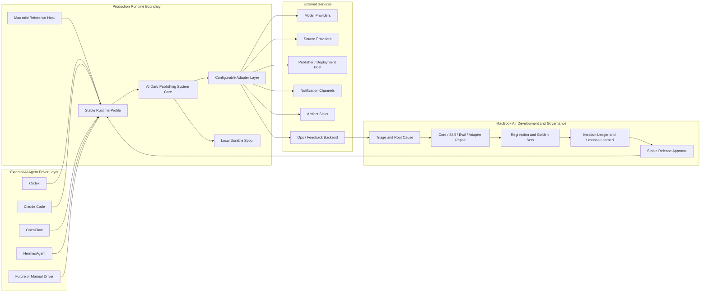
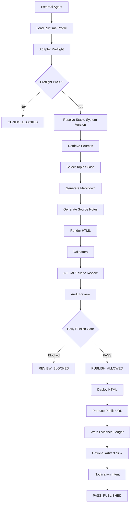
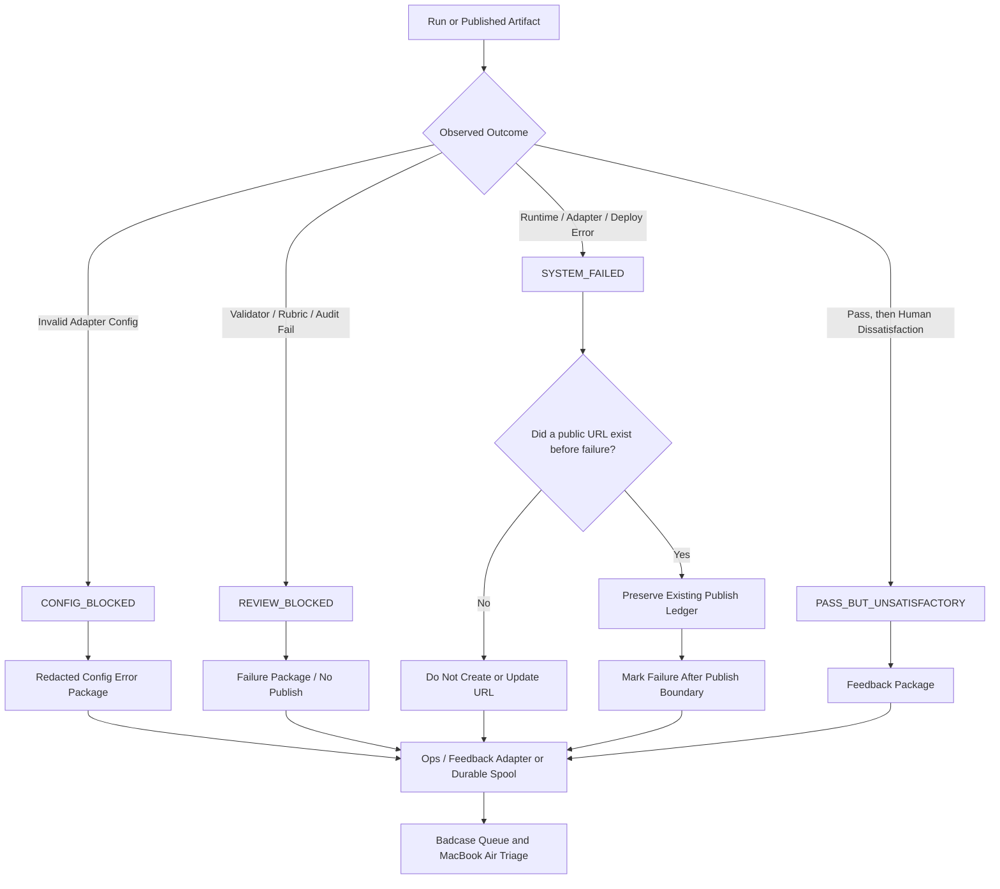
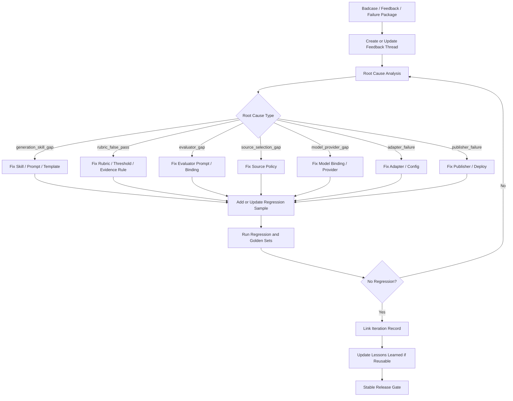
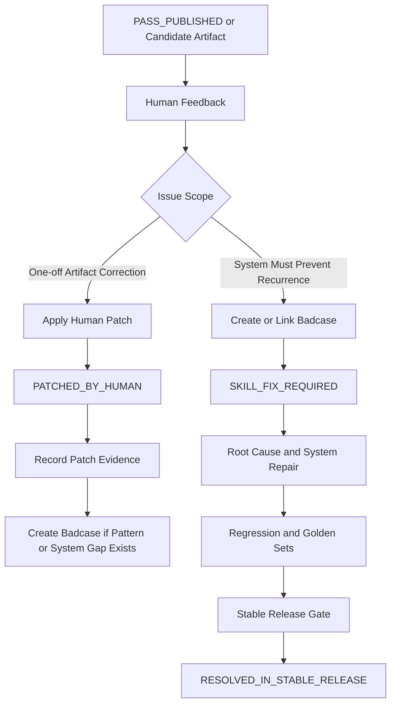
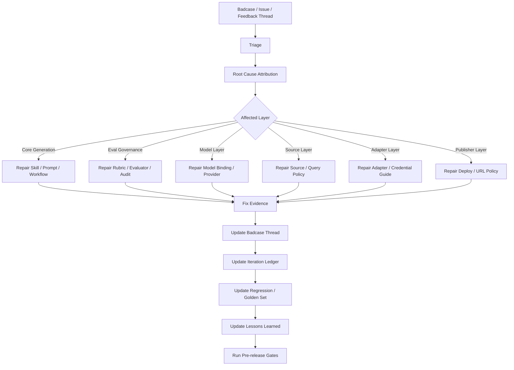
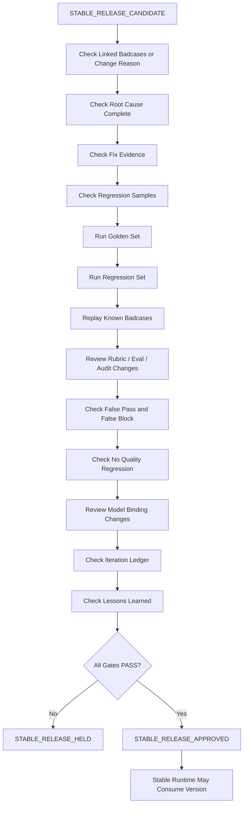

# P2D-1 AI Daily Publishing System Core and Adapter Architecture

Status: `P2D-1c_FORMAL_ARCHITECTURE_DRAFT`

Source of truth:

```text
docs/architecture/p2d-1-ai-daily-publishing-system-context-pack-r2.md
```

Historical boundary reference:

```text
docs/architecture/p2d-0-hermes-daily-publisher-runtime-architecture.md
```

If the historical reference conflicts with the R2 Context Pack in naming or system
positioning, this document follows the R2 Context Pack.

---

## 1. Purpose

This document formalizes the architecture, boundaries, flows, adapters, Eval
Governance, Badcase Governance, and Release Gate of the AI Daily Publishing
System.

It is the implementation-facing architecture contract for:

- the system and role boundaries;
- the Core and configurable Adapter boundary;
- normal, blocked, failed, and post-publication feedback flows;
- badcase return, problem repair, and iteration memory;
- model, eval, source, artifact, evidence, and repository governance;
- daily publication and stable release eligibility;
- the runtime state model.

This document does not implement the system. It defines the contracts and
invariants that later implementation must preserve.

---

## 2. Confirmed Naming and Non-Naming

The confirmed system name is:

```text
AI Daily Publishing System
```

The following names must not be used as the system name:

```text
Hermes Daily Publisher
Hermes Daily Publishing System
Mac mini Daily Runner
```

`HermesAgent` is only an optional External AI Agent Driver. `Codex`, `Claude
Code`, and `OpenClaw` are also optional External AI Agent Drivers. Future agents
may join the same layer without changing the product system name.

Naming is intentionally independent of any one agent, model provider, machine,
hosting provider, or notification channel:

```text
AI Daily Publishing System = product system
HermesAgent / Codex / Claude Code / OpenClaw = optional external drivers
Mac mini = reference production runtime host
MacBook Air = development, iteration, and stable release owner environment
```

---

## 3. Current Delivery Target

The current successful user-facing delivery target is:

```text
public reader URL
```

The current stage does not require a public API or a database-backed SaaS
backend. It also does not require an interactive web app, a multi-user dashboard,
or real-time collaboration.

The public URL points to accessible, reader-friendly HTML. IM is optional and
only forwards the URL or a short failure summary. An IM channel is not the
product output store, evidence store, or system of record.

Configured artifact sinks may additionally retain Markdown or private evidence,
but the product target remains URL-first rather than API-first.

---

## 4. System Positioning

AI Daily Publishing System is not a cron script, a WeChat bot, a static-site-only
tool, or a single-agent workflow. It is also not a Mac mini-only runner, a
Hermes-only workflow, an evaluation script, or a model wrapper.

It is:

```text
a configurable, auditable, quality-gated AI content production and publishing system
```

An External AI Agent Driver may start and observe a run. The Core owns the
content-production loop, quality authority, publication decision, evidence
contracts, feedback return, and release governance. Replaceable integrations sit
behind Adapter contracts.

The primary runtime invariant is:

```text
No quality PASS, no public URL.
```

This invariant is not configurable and cannot be bypassed by an agent, runtime
profile, model provider, publisher, notification channel, or human confirmation.

---

## 5. Role Boundary

### 5.1 Role Boundary Diagram



### 5.2 External AI Agent Driver

An External AI Agent Driver may:

- start a run;
- pass a runtime config or select a configured runtime profile;
- receive the final result;
- forward a public URL or failure summary;
- open a follow-up issue or task;
- request human confirmation where the contract permits a manual step.

It must not:

- bypass validators, rubric review, audit review, or required evidence;
- force publication of failed or incomplete content;
- silently change evaluation standards or stable behavior;
- mutate a stable release or development branch from production;
- delete evidence or ignore badcases;
- send secrets through IM.

The driver is an orchestration surface, not the quality authority.

### 5.3 AI Daily Publishing System Core

The Core owns retrieval orchestration, topic selection, Markdown and source-note
generation, HTML rendering, deterministic validation, AI eval, audit, publish
eligibility, failure packaging, evidence ledgers, badcase capture, feedback
capture, regression and golden-set governance, iteration memory, stable release
gates, idempotency, and redaction rules.

The Core remains agent-, model-, publisher-, notification-, Ops-backend-, and
runtime-host-agnostic.

### 5.4 Mac mini Production Runtime Host

Mac mini is a reference production runtime host. It executes a configured stable
runtime and may hold local credentials, invoke configured adapters, retain a
durable spool, and produce runtime outputs.

Mac mini executes stable runtime but does not own product policy. It must not run
an unpublished development version, mutate Skill Dev / Release source, bypass
evaluation, publish failed content, store secrets in a repository, or treat an
IM channel as evidence storage.

### 5.5 MacBook Air Development and Stable Release Owner

MacBook Air owns repair, governance, regression, and stable release approval.
Its responsibilities include:

- badcase triage and root-cause analysis;
- Skill, prompt, workflow, eval, source policy, and Adapter repair;
- regression, golden-set, rubric, and model-binding review;
- iteration-ledger and Lessons Learned maintenance;
- pre-release gate execution and stable release publication.

### 5.6 Configurable Adapter Layer

The Adapter Layer translates stable Core contracts into provider-specific
capabilities. It owns provider connection, credential requirements, retries,
capability discovery, provider failure normalization, redaction, and evidence
placement according to the contract.

It must not redefine Core states, weaken gates, decide publish eligibility, or
turn private evidence into public output.

### 5.7 External Services

External Services include model and source providers, deployment hosts,
notification channels, artifact sinks, and Ops or feedback backends. Their
availability and provider-specific behavior are represented through Adapters;
they are not part of the Core.

---

## 6. Core vs Adapter Boundary

### 6.1 Core-Owned Invariants

Core owns:

```text
state machine
artifact contracts
validation
AI eval / rubric
audit
publish eligibility
No quality PASS, no public URL
failure package
evidence ledger
badcase capture
regression / golden set
iteration ledger
lessons learned
stable release gate
privacy / redaction
idempotency
public/private evidence boundary
```

These are product guarantees. No runtime configuration or provider may disable
or override them.

### 6.2 Adapter-Owned Configuration

Adapters and runtime configuration own:

```text
model provider
model role binding
source provider
publisher
IM / notification
artifact sink
Notion
Ops backend
feedback backend
runtime profile
credentials
retry
URL patch policy
deployment host
```

Adapter configuration selects how a capability is supplied. It never selects
whether mandatory quality or evidence obligations apply.

### 6.3 Boundary Decision Rule

A concern belongs in Core if changing it could weaken quality authority,
auditability, reproducibility, privacy, release eligibility, or the meaning of a
state. A concern belongs behind an Adapter if it replaces a provider or delivery
mechanism while preserving those meanings.

---

## 7. Runtime Context Contract

Every run must begin with a complete, captured runtime context:

```yaml
runtime_context:
  run_id:
  run_date:
  triggered_at:
  trigger_type:
  trigger_source:
  agent_driver:
  runtime_host:
  runtime_profile:
  timezone:
  mode:
  attempt:
  idempotency_key:
  stable_release_version:
  stable_release_commit:
  config_snapshot_hash:
```

Recommended `trigger_type` values include `scheduled`, `manual`, `retry`,
`dry_run`, `noop_publish`, and `external_agent`. `mode` records whether publish,
notification, and eval behavior is real, disabled, or noop.

Trigger timing and trigger conditions belong to the external runtime or agent
layer. Core does not own scheduler logic. Core does require the runtime context
before execution and records it as runtime-observed evidence.

---

## 8. Adapter Contract Minimum Fields

Every Adapter must expose at least:

```yaml
adapter_contract:
  adapter_id:
  adapter_type:
  enabled:
  provider:
  version:
  required_credentials:
  capabilities:
  inputs:
  outputs:
  failure_modes:
  preflight_check:
  noop_supported:
  redaction_policy:
  evidence_policy:
  public_output_policy:
```

The contract must make explicit:

- what the Adapter does and which capability it supplies;
- the credentials, permissions, and provider reachability it requires;
- accepted inputs and normalized outputs;
- enumerated failure modes and whether they are retryable;
- preflight checks and noop support;
- redaction behavior;
- whether outputs are public artifacts, private evidence, or neither.

An enabled Adapter is not usable merely because it has a provider name. It is
usable only after its required contract and preflight checks pass.

---

## 9. Adapter Catalog

### 9.1 Catalog Summary

| Adapter | Purpose | Possible providers | Typical credentials | Core boundary |
|---|---|---|---|---|
| Model Provider | Model access for generation, analysis, eval, audit, repair, and summarization | GPT / OpenAI, Claude / Anthropic, DeepSeek, local, future provider | API key, base URL, local model access | Returns role-bound model results and traces; never decides publish eligibility |
| Source | Retrieve candidate source material | Web search, GitHub, RSS, official sites, Notion, manual input, local knowledge base | Search key, GitHub token, Notion token, or none | Returns normalized source items; Core applies selection and source governance |
| Publisher | Deploy approved HTML and return a URL | GitHub Pages, Netlify, Vercel, Cloudflare Pages, static host | Deploy token and target configuration | May publish only after `PUBLISH_ALLOWED`; cannot publish private evidence |
| Notification | Send a short result pointer | WeChat, Slack, Telegram, Email, local, none | Webhook, bot token, channel credential | Consumes a notification intent; never stores canonical evidence |
| Artifact Sink | Store non-public or supplementary artifacts | Local files, Git repo, Notion, Ops repo, future storage | Sink-specific token or local permission | Persists only artifacts permitted by evidence policy |
| Ops / Feedback | Store operational evidence and threaded feedback | GitHub Issues, Notion, Linear, local queue, private Ops repo | Backend token and target | Holds badcases and private evidence; does not become release source |

### 9.2 Model Provider Adapter

Purpose: provide model access for all configured model roles.

Required credentials depend on the provider: API keys and optional base URLs for
hosted providers, or reachable local-model credentials and permissions for local
providers.

Failure behavior must distinguish invalid credentials, outage, timeout, quota,
rate limit, malformed response, role-binding absence, and unsupported
capability. Preflight failures produce `CONFIG_BLOCKED`; failures during a call
produce `ADAPTER_FAILED` and may lead to `SYSTEM_FAILED` according to the run
boundary.

Model inputs, raw outputs, and traces are private evidence by default. Only
Core-approved rendered content may enter a public artifact.

### 9.3 Source Adapter

Purpose: retrieve source material using provider-specific search or access.

The Adapter returns normalized source metadata including provider, query,
retrieval time, freshness, URL, source type, selection reason, and risk flags.
Core owns source selection, conflict handling, evidence sufficiency, and the
decision to block publication.

Provider failures are classified as source Adapter failures. When source quality
or availability is insufficient, Core may request a configured fallback, add an
explicit caveat for non-blocking risk, or block publication.

Public citations may be emitted only when permitted. Queries, private notes,
tokens, access errors, and non-public source material remain private evidence.

### 9.4 Publisher Adapter

Purpose: deploy `reader.html` after publication is allowed and return a
normalized publish result:

```yaml
publish_result:
  status: success | failed | skipped
  public_url:
  artifact_hash:
  publisher:
  publisher_version:
  publish_ledger_path:
  error_summary:
```

The Publisher Adapter requires deployment credentials, target configuration, and
write permission. It may not be invoked before `PUBLISH_ALLOWED`. A deployment
failure cannot be relabeled as content success; it is recorded with its exact
publish boundary and does not permit an unledgered retry or overwrite.

Only approved reader artifacts and public static assets may be deployed. Failure
details, reviewer output, audit output, traces, and credentials remain private.

### 9.5 Notification Adapter

Purpose: send a short pointer after the run outcome is known.

Possible channels are WeChat, Slack, Telegram, Email, local notification, or
none. The Adapter consumes:

```yaml
notification_intent:
  type: success | quality_blocked | system_failed | human_feedback_ack
  title:
  summary:
  public_url:
  issue_url:
  evidence_pointer:
  run_id:
```

Notification is optional unless a profile explicitly requires it. Notification
failure after successful publication does not revoke an existing public URL; it
creates notification failure evidence and a controlled retry path. Full logs,
private review content, and secrets must not enter notification payloads.

### 9.6 Artifact Sink Adapter

Purpose: persist artifacts beyond the public HTML, for example in a local path,
Git repository, Notion page or database, or private Ops repository.

Credentials and permissions are sink-specific. A sink failure is normalized as
an Adapter failure and handled based on whether that sink is mandatory in the
selected profile. The sink must enforce artifact classification: public content
may go to a public location; private evidence may only go to an approved private
location.

### 9.7 Ops / Feedback Adapter

Purpose: retain run evidence, failure packages, badcases, feedback, triage, and
iteration-thread context.

The backend should support linking or replies so a badcase can retain its
diagnosis and each iteration in context. If the backend is unavailable, a
configured durable spool may temporarily hold evidence for later synchronization.
This Adapter stores operational truth; it does not grant release approval and
must never receive unredacted secrets.

---

## 10. Model Adapter and Model Governance

### 10.1 Model Roles and Bindings

The Model Provider Adapter supports GPT, Claude, DeepSeek, local models, and
future providers. Each model role must be explicitly bound:

```text
generator_model
analysis_model
evaluator_model
audit_model
repair_model
summarizer_model
```

Different roles may use different providers. Any fallback across roles must be
explicit, policy-approved, and logged rather than silently inferred.

`ModelRoleBinding` records the selected provider, model, credential reference,
prompt version, and fallback policy for a role. `ModelRunTrace` records each
invocation:

```yaml
model_trace:
  role:
  provider:
  model:
  prompt_version:
  temperature:
  input_hash:
  output_hash:
  latency_ms:
  cost_estimate:
  result_summary:
```

Trace fields must be redacted and stored as private evidence.

### 10.2 Failure Classification

Model provider outage, timeout, rate limit, quota exhaustion, invalid credential,
unsupported capability, and malformed response are explicit model Adapter
failures, not generic unknown errors.

- A credential or capability failure found during preflight produces
  `CONFIG_BLOCKED`.
- A provider failure during execution produces `ADAPTER_FAILED`; the run records
  whether retry is permitted and may terminate as `SYSTEM_FAILED`.
- No fallback is silent. The chosen fallback binding and reason become evidence.

### 10.3 Release-Affecting Changes

Changing any ModelRoleBinding is release-affecting, including changes to
generation, analysis, evaluation, audit, repair, or summarization roles.

The change record must include old and new bindings, reason, golden-set result,
regression result, known-badcase replay, iteration-ledger update, and release
decision. Release notes must expose the binding change.

Evaluator or audit model changes require additional review of:

```text
false pass behavior
false block behavior
judge consistency
evidence alignment
threshold sensitivity
```

Any quality regression holds the stable release.

---

## 11. Credential Boundary and CONFIG_BLOCKED

Every enabled Adapter declares required credentials. Credentials may come from a
local environment, secret manager, machine keychain, encrypted local config, or
runtime configuration outside the repository.

If an Adapter is enabled before its required credential setup is complete, the
run enters:

```text
CONFIG_BLOCKED
```

No retrieval, generation, publish, or notification may begin before all required
credential and capability preflight checks pass. Checks may cover credential
presence, permission scope, provider reachability when safe, quota or rate-limit
availability, and required noop capability.

`CONFIG_BLOCKED` produces a redacted configuration error package, Adapter
preflight result, missing credential names, setup guidance, and no public URL.

Secrets and secret values must never enter:

```text
repository source
reader HTML or public artifact
IM message
failure package
Lessons Learned
iteration ledger
runtime evidence
```

Permission, token, and credential errors must be redacted. Evidence may identify
the missing credential name, but not its value.

---

## 12. Gate Taxonomy

| Gate | Question | Required scope | Blocking result |
|---|---|---|---|
| Adapter Configuration Gate | Can the selected profile safely supply its required capabilities? | Credentials, permission, reachability, capability, noop support | `CONFIG_BLOCKED` |
| Daily Publish Gate | Can today's content become a public URL? | Sources, Markdown, HTML, validators, rubric, audit, evidence, risk, public/private boundary | `REVIEW_BLOCKED` |
| Human Patch Gate | Was only this artifact patched, or must future behavior be repaired? | Patch evidence, issue classification, linked badcase when systemic | `PATCHED_BY_HUMAN` or `SKILL_FIX_REQUIRED` |
| Stable Release Gate | Can changed system behavior become stable? | Root cause, fix evidence, golden and regression sets, badcase replay, eval/model review, governance memory | `STABLE_RELEASE_HELD` |

The Adapter Configuration Gate passes only when every required, enabled Adapter
has valid configuration, credential presence, permission, required capability,
and declared noop behavior. Otherwise the run stops at `CONFIG_BLOCKED` before
retrieval, generation, publication, or notification.

The Daily Publish Gate passes only when:

```text
required sources are present
training-report.md was generated
reader.html was rendered
deterministic validators PASS
rubric review PASS
audit review PASS
required evidence is complete
no blocking risk flag remains
no private evidence leaks into public HTML
```

Any failed condition produces `REVIEW_BLOCKED`, no deployment, and no new public
URL.

The Human Patch Gate records patch evidence and decides whether the change is a
one-off artifact correction or evidence of a durable system defect. A durable
defect requires a linked badcase and `SKILL_FIX_REQUIRED`.

The Stable Release Gate passes only with a linked badcase or change reason,
completed root cause, fix evidence, passing golden and regression sets, passing
known-badcase replay, no known false pass or quality regression, applicable model
binding review, an updated Iteration Ledger, and an updated Lessons Learned entry
when a reusable pattern exists. Otherwise it produces `STABLE_RELEASE_HELD`.

The Daily Publish Gate decides whether today's content can become a public URL.
The Stable Release Gate decides whether changed system behavior can become
stable. They are independent decisions and must not be collapsed.

Human patch can fix an artifact but does not mean the system learned. A human
cannot use patch authority to override a failed validator, rubric review, audit
review, required evidence check, or credential preflight.

---

## 13. Normal Production Flow



The Core performs retrieval orchestration, generation, evaluation, audit, and
the publish decision. Adapters perform selected provider operations without
changing the meaning of the flow.

Only a passed Daily Publish Gate may lead to `PUBLISH_ALLOWED` and deployment.
The notification intent is produced after publication succeeds. Evidence is
recorded even when optional artifact or notification delivery later fails.

---

## 14. Exception Flow



`SYSTEM_FAILED` must not create or update a public URL after failure. If a public
URL already existed before the failure—for example, publication succeeded but a
later notification failed—the system preserves the existing publish ledger and
marks the run as failed after the publish boundary. It must not silently
republish or erase successful publication evidence.

All four exception outcomes can become badcases. A persistent or user-reported
`CONFIG_BLOCKED` should become one; quality and execution failures normally do.

---

## 15. Badcase Governance

### 15.1 Badcase Record Schema

```yaml
badcase_id:
run_id:
date:
entry_type:
source_package:
html_url_if_any:
public_url_status:
symptom:
human_feedback:
reviewer_result:
audit_result:
validator_result:
model_run_trace:
suspected_root_cause:
confirmed_root_cause:
evidence_files:
severity:
owner:
status:
linked_iteration:
linked_regression_case:
linked_lesson:
```

`entry_type` supports at least `CONFIG_BLOCKED`, `REVIEW_BLOCKED`,
`SYSTEM_FAILED`, `PASS_BUT_UNSATISFACTORY`, and `HUMAN_REPORTED`. Status supports
`open`, `triage`, `fixing`, `regression`, `resolved`,
`closed_with_reason`, and `non_reproducible`.

A badcase is resolved only when it is linked to an iteration record, explicitly
closed with reason, marked non-reproducible with evidence, or marked as a
duplicate of an existing badcase. Every open badcase requires an owner or an
explicit closure decision.

### 15.2 Root-Cause Types

Root-cause taxonomy includes at least:

```text
generation_skill_gap
rubric_false_pass
evaluator_gap
source_selection_gap
model_provider_gap
adapter_failure
publisher_failure
```

Additional specific categories may include audit, threshold, evidence,
credential, environment, renderer, and notification gaps, but must map to an
owned repair layer.

### 15.3 Badcase Return Loop



Every confirmed durable issue creates or updates regression coverage. Every eval
false pass must evaluate changes to rubric, evaluator, audit, threshold, and
evidence requirements rather than treating the symptom only as a generation
defect.

---

## 16. Content Patch vs Skill Improvement



`PATCHED_BY_HUMAN` means the artifact was manually corrected. It does not mean
the system was fixed.

`SKILL_FIX_REQUIRED` means future system behavior must be repaired in the
generation, eval, source, model, Adapter, publisher, or governance layer.

`RESOLVED_IN_STABLE_RELEASE` means the repair passed regression and the stable
release gate. A code, prompt, rubric, config-contract, or model-binding change by
itself is not resolution.

---

## 17. Problem Repair and Iteration Mechanism



Each iteration records: the problem and symptom; affected layer and root cause;
why existing gates missed it; the exact change and affected module; linked
badcase and tests; old-badcase and new regression results; rubric or model
changes; release allow or hold decision; and any reusable prevention lesson.

---

## 18. Iteration Ledger and Lessons Learned

Long-term governance assets live at:

```text
docs/governance/iteration-ledger.md
docs/governance/lessons-learned.md
```

An iteration record may appear as a reply to the original badcase or feedback
issue so diagnosis and repair remain in context. It must also be summarized in
the repository governance asset so release history is queryable independently
of an external backend.

The Iteration Ledger records what changed, why, which evidence proves the fix,
which regression or golden cases changed, and whether release was allowed or
held. It links the run, badcase, feedback thread, before/after eval, rollback
plan, release version, owner, and Lessons Learned entry.

Lessons Learned is not a changelog. It is system governance memory. It converts
recurring failure patterns into prevention rules, test coverage, rubric or eval
updates, Adapter warnings, and future warning signals.

Reusable lessons include depth false passes, source freshness failures,
uncaught hallucination, lenient evaluation, evidence mismatch, publisher side
effects, credential leakage risk, and notification being mistaken for evidence.

---

## 19. Eval Governance and Report Quality Rubric Direction

### 19.1 Eval Governance Assets

The system must govern and version:

```text
Rubric version
Evaluator prompt version
Audit prompt version
Golden set
Regression set
Known badcase set
False pass tracking
False block tracking
Release gate reports
Eval change log
```

Eval failure categories include rubric false pass, rubric false block, evaluator
gap, audit gap, threshold gap, evidence-requirement gap, and model-judge
instability.

When poor content passes, repair must assess both production and judgment:
generation Skill, prompt, source selection, model binding, rubric, threshold,
reviewer prompt, audit prompt, golden set, and regression set.

### 19.2 Content Quality Direction

Rubric and eval must detect:

```text
shallow analysis
lack of P7+ judgment
lack of product tradeoff
lack of evidence
unsupported claims
weak causality
missing user / business / system perspective
generic summary without insight
no reusable pattern
no actionability
poor structure
```

Rubric and eval must not only check format. They must check reasoning quality,
depth, evidence, product judgment, and reusable insight. Structurally valid but
shallow content is not a quality pass.

### 19.3 Pre-release Gate and Stable Release Policy



A fix alone is insufficient. A single passing regression is insufficient. Stable
release requires the full linked evidence chain and no known quality regression.
MacBook Air owns approval; production runtimes only consume approved stable
versions.

---

## 20. Source Governance

Every selected source set is assessed for:

```text
source freshness
source authority
source diversity
source relevance
source duplication
source conflict
source citation availability
source retrieval failure
```

The source manifest captures provider, query, retrieval time, freshness, URL,
type, selection reason, and risk flags.

Weak source quality must not silently become confident output. Core may request a
configured fallback source, proceed with an explicit caveat when risk is
non-blocking, or block publication when evidence is insufficient or conflicts
remain unresolved.

Source failure categories should distinguish freshness, relevance, authority,
selection, unresolved conflict, and Adapter failure.

---

## 21. Artifact and Evidence Contract

### 21.1 Successful Run

```text
run-ledger.yaml
source-manifest.yaml
source-notes.md
training-report.md
reader.html
validator-result.yaml
rubric-review.json
audit-review.json
publish-ledger.yaml
notification-ledger.yaml
model-run-trace.yaml
artifact-hash.yaml
```

`training-report.md` is the canonical Markdown report artifact.

### 21.2 Failed or Blocked Run

Produce each artifact when its stage has made it available:

```text
failure-package.yaml
source-manifest.yaml
source-notes.md
training-report.md
reader.html
validator-result.yaml
rubric-review.json
audit-review.json
model-run-trace.yaml
runtime-log.md
environment-snapshot.yaml
repair-suggestion.md
```

A failed run records absent or skipped artifacts explicitly. It must not
fabricate evidence from stages that did not run.

### 21.3 Human Feedback

```text
feedback-entry.yaml
linked-run-id
linked-url
human-feedback-summary
satisfaction-label
suspected-issue-type
triage-status
```

Human feedback stays linked to the run, URL if one exists, badcase, and eventual
iteration or explicit closure.

---

## 22. Public Artifact vs Private Evidence Boundary

Public artifacts may contain:

```text
reader.html
public URL
public-facing title
public-facing summary
safe rendered Markdown content
```

Private evidence includes:

```text
source notes
rubric review
audit review
model traces
runtime logs
failure packages
badcase triage
human feedback
credential errors
environment snapshots
repair suggestions
```

`reader.html` must not contain secrets, private reviewer or audit internals,
model traces, or private source notes unless explicitly approved for publication.
Failure packages must never be published to the Daily Site.

IM is a short notification pointer, not an evidence store. Private evidence goes
only to a configured private Ops or artifact backend. Redaction occurs before
storage or transmission, not after accidental exposure.

---

## 23. Repository Boundary

| Repository / Backend | Authority | Allowed contents |
|---|---|---|
| Skill Dev / Release Repo | Source of system behavior and stable release governance | Skill, prompts, workflow, rubric, validators, generator, renderer, Adapter contracts, tests, release notes, iteration ledger, Lessons Learned |
| Daily Site Repo | Public reader delivery | Public reader HTML, URL archive, public-facing static assets |
| Ops Repo / Ops Backend | Operational evidence store | Run and publish ledgers, failure packages, feedback threads, badcases, notification ledgers, model traces, private evidence, triage records |

Daily Site Repo must not contain failure packages, private logs, model traces,
reviewer internals, audit internals, secrets, or credential errors.

Ops Repo / Ops Backend is operational evidence storage, not the source of stable
system behavior. Skill Dev / Release Repo is the source of system behavior and
stable release governance, not the production evidence sink.

Mac mini may write approved public artifacts and Ops evidence through configured
Adapters, but must not mutate Skill Dev / Release source during production.
MacBook Air owns Skill Dev / Release changes, review, repair, and stable release
approval.

---

## 24. Idempotency and Duplicate Publish Protection

Every run has an `idempotency_key`. Recommended inputs include:

```text
run_date
runtime_profile
stable_release_version
source_manifest_hash
training_report_hash
publish_target
```

The system records:

```yaml
idempotency:
  idempotency_key:
  run_id:
  publish_target:
  previous_publish_result:
  current_publish_intent:
  duplicate_detected:
  action: allow | block | patch | supersede
  reason:
```

Core must prevent duplicate publication for the same run, conflicting
publication for one `run_id`, unledgered URL overwrite, silent republish after
failure, and duplicate notification without an explicit reason.

A public artifact patch must be recorded with previous and new artifact hashes,
patch reason, actor, timestamp, URL policy, and related badcase when applicable.
Patch and supersede are explicit actions, never implicit retries.

---

## 25. State Model

### 25.1 State Catalog

| State | Meaning |
|---|---|
| `SCHEDULED_OR_STARTED` | External runtime or driver has initiated a run |
| `CONFIG_BLOCKED` | Required Adapter configuration or credential preflight failed |
| `RETRIEVING` | Source Adapters are retrieving candidate evidence |
| `GENERATING` | Models are selecting the case and generating report artifacts |
| `RENDERING` | Canonical Markdown is being rendered to reader HTML |
| `VALIDATING` | Deterministic validators are running |
| `EVALUATING` | AI rubric evaluation is running |
| `AUDITING` | Independent audit and evidence review is running |
| `PUBLISH_ALLOWED` | Daily Publish Gate passed; deployment may begin |
| `PASS_PUBLISHED` | Approved HTML was deployed and a public URL recorded |
| `REVIEW_BLOCKED` | Content or evidence failed the Daily Publish Gate |
| `SYSTEM_FAILED` | Runtime or infrastructure prevented the run from completing |
| `ADAPTER_FAILED` | A provider-specific operation failed after preflight |
| `NOOP_COMPLETED` | A declared noop path completed without real publication |
| `PASS_BUT_UNSATISFACTORY` | Published or passing content later received negative human judgment |
| `PATCHED_BY_HUMAN` | A specific artifact was manually corrected |
| `SKILL_FIX_REQUIRED` | A durable system behavior repair is required |
| `BADCASE_CREATED` | Failure or feedback has a governed badcase record |
| `TRIAGE_IN_PROGRESS` | Ownership and root cause are being established |
| `FIX_IN_PROGRESS` | A repair is being developed |
| `REGRESSION_TESTING` | Repair is under badcase, regression, and golden-set verification |
| `STABLE_RELEASE_CANDIDATE` | Changed behavior is ready for the release gate |
| `STABLE_RELEASE_APPROVED` | All stable release gates passed |
| `STABLE_RELEASE_HELD` | One or more stable release gates failed or lack evidence |
| `RESOLVED_IN_STABLE_RELEASE` | Verified repair shipped in an approved stable release |

### 25.2 Runtime and Governance Transitions

```text
SCHEDULED_OR_STARTED -> CONFIG_BLOCKED
SCHEDULED_OR_STARTED -> RETRIEVING
RETRIEVING -> GENERATING -> RENDERING -> VALIDATING -> EVALUATING -> AUDITING
EVALUATING -> REVIEW_BLOCKED
AUDITING -> REVIEW_BLOCKED
AUDITING -> PUBLISH_ALLOWED -> PASS_PUBLISHED
any runtime stage -> SYSTEM_FAILED
any adapter stage -> ADAPTER_FAILED
noop publish path -> NOOP_COMPLETED

PASS_PUBLISHED -> PASS_BUT_UNSATISFACTORY
PASS_BUT_UNSATISFACTORY -> PATCHED_BY_HUMAN
PASS_BUT_UNSATISFACTORY -> SKILL_FIX_REQUIRED
CONFIG_BLOCKED -> BADCASE_CREATED when persistent or user-reported
REVIEW_BLOCKED -> BADCASE_CREATED
SYSTEM_FAILED -> BADCASE_CREATED
ADAPTER_FAILED -> BADCASE_CREATED
PASS_BUT_UNSATISFACTORY -> BADCASE_CREATED
BADCASE_CREATED -> TRIAGE_IN_PROGRESS -> FIX_IN_PROGRESS
FIX_IN_PROGRESS -> REGRESSION_TESTING -> STABLE_RELEASE_CANDIDATE
STABLE_RELEASE_CANDIDATE -> STABLE_RELEASE_APPROVED
STABLE_RELEASE_CANDIDATE -> STABLE_RELEASE_HELD
STABLE_RELEASE_APPROVED -> RESOLVED_IN_STABLE_RELEASE
```

`ADAPTER_FAILED` is the classified provider failure. The run ledger then records
whether retry, fallback, `SYSTEM_FAILED`, or a later-stage outcome applies.

### 25.3 Compatibility

`RESOLVED_IN_STABLE_RELEASE` is the new generic state name. It is compatible
with P2D-0 `RESOLVED_IN_SKILL_RELEASE` when the stable release contains a Skill
fix. New P2D documents use `RESOLVED_IN_STABLE_RELEASE`.

---

## 26. Runtime Profile Concept

A runtime profile is a concrete configuration bundle for model bindings, source
Adapters, publisher, notification, artifact sinks, Ops backend, mode, and
runtime metadata.

`mac-mini-production` is a reference profile only. It is not the system identity
or the only deployment topology.

Other profiles may use Codex, Claude Code, OpenClaw, HermesAgent, a manual
runner, or future agents. They may select different providers or noop modes.
Profiles are configurable. Core invariants are not configurable.

Disabled optional Adapters do not block evaluation unless the selected profile
declares their capability required. An enabled required Adapter must pass
preflight before Core execution.

---

## 27. Non-Goals

This architecture stage includes:

```text
No code
No scripts
No runtime implementation
No real deployment
No real notification
No real URL generation
No live LLM
No external API calls
No P2C output modification
No P2D-0 modification
No commit / push
```

It also does not choose first-implementation providers or silently resolve the
open questions below.

---

## 28. Open Questions

The system name is not open. It is confirmed as AI Daily Publishing System.

Remaining open questions inherited from the R2 Context Pack:

1. Which model providers are required in the first implementation?
2. Should GPT, Claude, and DeepSeek all be supported initially, or should the
   first implementation provide only the Adapter contract?
3. Where should Markdown output go by default: repository, Notion, both, or a
   configurable destination?
4. Which publisher should be first: GitHub Pages, Netlify, Vercel, or noop-only?
5. Which IM channel should be first: WeChat, Slack, email, or notification intent
   only?
6. Should the Ops backend start with GitHub Issues or local files?
7. Should badcase issue replies be the primary iteration record, with the
   repository ledger as the summary?
8. What is the minimum golden set before the first stable release?
9. What is the minimum regression set before the first stable release?
10. How strict should the release gate be for rubric changes?
11. Should model-binding changes require full regression replay?
12. What is the first minimum viable Source Adapter set?
13. What is the first public-artifact / private-evidence storage split?

These questions affect implementation sequencing and provider selection. They do
not reopen the confirmed Core invariants, role boundaries, gate meanings, or
system name.
