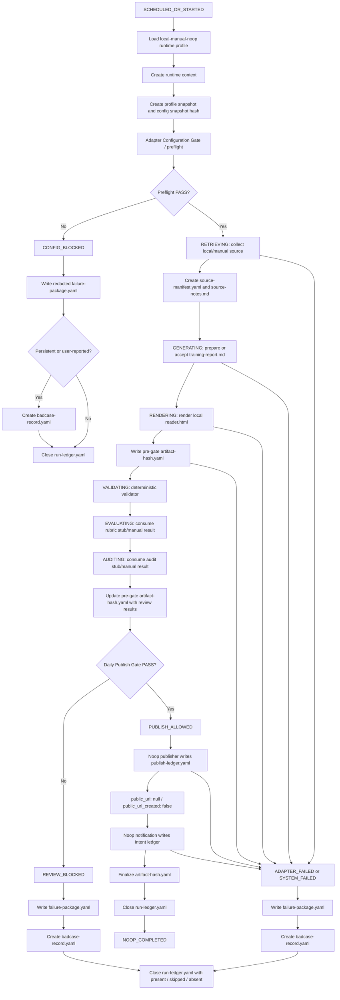

# P2D-2c AI Daily Publishing System Local Noop Runtime Plan

Status: `P2D-2c_LOCAL_NOOP_RUNTIME_PLAN`

This is a documentation-only execution plan for the first local/manual/noop runtime path of the AI Daily Publishing System. It defines the minimum auditable vertical runtime chain for the MVP. It does not implement runtime code, create runtime files, create artifact examples, create artifact directories, call external services, publish, notify, or run tests.

Source of truth:

- `docs/architecture/p2d-1-ai-daily-publishing-system-context-pack-r2.md`
- `docs/architecture/p2d-1-ai-daily-publishing-system-core-and-adapter-architecture.md`
- `docs/architecture/p2d-2a-ai-daily-publishing-system-mvp-scope-plan.md`
- `docs/architecture/p2d-2b-ai-daily-publishing-system-runtime-contract-and-artifact-schema-plan.md`

P2D-1 remains authoritative for Core / Adapter boundaries, state naming, gate semantics, evidence rules, repository boundaries, privacy rules, and idempotency. P2D-2a remains authoritative for the MVP scope:

```text
manual / local / noop-first MVP
```

P2D-2b remains authoritative for runtime contract and artifact schema surface. P2D-2c must not expand that MVP scope.

---

## 1. Goal and Scope Boundary

P2D-2c defines the local/manual/noop runtime execution plan for the first MVP vertical chain.

The goal is to specify how a future runtime should move from a manual or scheduled start through local source intake, local report preparation, local reader render, deterministic validation, explicit rubric and audit review inputs, Daily Publish Gate, noop publish ledger, noop notification ledger, and final run ledger close.

P2D-2c is only an execution plan:

- It defines local noop runtime sequencing and responsibilities.
- It does not implement runtime behavior.
- It does not create runtime files.
- It does not create artifact examples.
- It does not create `src/`, `runtime/`, or `artifacts/` directories.
- It does not connect to real external services.
- It does not call a live LLM.
- It does not deploy.
- It does not publish.
- It does not send notifications.
- It does not expand P2D-2a MVP scope.

Core invariant:

```text
No quality PASS, no public URL.
```

Noop invariant:

```text
NOOP_COMPLETED != PASS_PUBLISHED
public_url: null
public_url_created: false
```

`NOOP_COMPLETED` means the declared local/manual/noop runtime path completed and left auditable evidence. It does not mean public delivery succeeded. `PASS_PUBLISHED` is not produced in the MVP noop runtime.

---

## 2. Runtime Execution Overview

Primary local noop chain:

```text
SCHEDULED_OR_STARTED
-> load runtime profile
-> create runtime context
-> adapter configuration preflight
-> collect local/manual source
-> create source manifest and source notes
-> prepare or accept local/manual training report
-> render reader.html locally
-> run deterministic validation
-> consume rubric review stub/manual result
-> consume audit review stub/manual result
-> Daily Publish Gate
-> noop publisher
-> noop notification ledger
-> close run ledger
-> NOOP_COMPLETED
```

Execution rules:

- This is a local runtime plan, not a code implementation.
- Local preview does not equal a public URL.
- The local `reader.html` is a local public candidate artifact, not a deployed page.
- The noop publisher only records a ledger. It does not deploy or create a real URL.
- The noop notification path only records intent. It does not send IM, WeChat, Slack, Telegram, Email, webhook, bot, or any other external message.
- Adapter Configuration Gate runs before retrieval, generation, rendering, publishing, or notification.
- Daily Publish Gate runs before the noop publisher.
- Review stub file presence is not a PASS.
- `NOT_RUN`, `BLOCKED`, missing, ambiguous, or unparseable review status blocks Daily Publish Gate.
- Missing validator result blocks Daily Publish Gate.
- Private evidence leak into `reader.html` blocks Daily Publish Gate.

---

## 3. Runtime Responsibilities

| Step | Owner | Input | Output | State | Failure State | Notes |
|---|---|---|---|---|---|---|
| Runtime profile load | External runtime / Core config loader | Runtime profile name | Runtime profile snapshot evidence | `SCHEDULED_OR_STARTED` | `CONFIG_BLOCKED` | MVP profile is local/manual/noop. Real providers must be disabled or blocked. |
| Runtime context creation | Core | Run date, trigger metadata, agent driver, runtime host, timezone, stable release reference, attempt | `runtime-context.yaml` plan artifact | `SCHEDULED_OR_STARTED` | `SYSTEM_FAILED` | Context must not contain secrets, raw prompts, private notes, tokens, or credential values. |
| Config snapshot hash | Core | Effective runtime profile snapshot | `config_snapshot_hash` reference | `SCHEDULED_OR_STARTED` | `CONFIG_BLOCKED` | Hash is evidence and idempotency input. It must not include secret values. |
| Adapter preflight | Core + Adapter contracts | Runtime profile snapshot, adapter contracts, credential names, noop policy | `adapter-preflight-result.yaml` | `SCHEDULED_OR_STARTED` | `CONFIG_BLOCKED` | Must pass before source collection, report preparation, render, publish, or notification. |
| Local source collection | Source Adapter | Local/manual source path or source bundle pointer | Local source evidence pointer | `RETRIEVING` | `ADAPTER_FAILED` or `REVIEW_BLOCKED` | Missing adapter access is adapter failure; insufficient or missing required local source evidence is review-blocking when source stage is reached. |
| Source manifest creation | Core | Local/manual source evidence | `source-manifest.yaml` | `RETRIEVING` | `REVIEW_BLOCKED` | Manifest must be non-empty for success and include explicit citation and risk flags. |
| Source notes creation | Core | Local/manual source evidence and private run notes | `source-notes.md` | `RETRIEVING` | `REVIEW_BLOCKED` | Private evidence by default. Must not be copied into `reader.html` or notification payloads. |
| Training report preparation | Core / manual driver | Local/manual report source or generator placeholder | `training-report.md` | `GENERATING` | `SYSTEM_FAILED` or `REVIEW_BLOCKED` | MVP may accept manual content. It must be non-empty and public-safe where rendered. |
| Reader HTML render | Core renderer | `training-report.md` and public-safe metadata | `reader.html` | `RENDERING` | `SYSTEM_FAILED` | Local preview only. Must not contain private source notes, reviews, logs, ledgers, traces, or secrets. |
| Artifact hashing | Core / artifact sink | Present artifacts by phase | `artifact-hash.yaml` pre-gate draft before validator / Daily Publish Gate; final `artifact-hash.yaml` update before run-ledger final close | `VALIDATING` and final close | `SYSTEM_FAILED` or `REVIEW_BLOCKED` | Validator and Daily Publish Gate consume pre-gate hash evidence. Final close consumes finalized hash evidence. Missing/skipped artifacts must not receive fabricated hashes and are recorded in ledgers. |
| Validator execution | Core validator | Required artifact set, hashes, `reader.html`, noop URL policy | `validator-result.yaml` | `VALIDATING` | `REVIEW_BLOCKED` | Missing validator result blocks. Private evidence leak and non-null noop URL checks are blocking. |
| Rubric review stub/manual consumption | Core gate input reader | `rubric-review.stub.json` or `rubric-review.json` | Explicit rubric status evidence | `EVALUATING` | `REVIEW_BLOCKED` | File existence is not PASS. Only explicit `PASS` can pass this input. |
| Audit review stub/manual consumption | Core gate input reader | `audit-review.stub.json` or `audit-review.json` | Explicit audit status evidence | `AUDITING` | `REVIEW_BLOCKED` | PASS requires explicit boundary checks. `NOT_RUN`, `BLOCKED`, missing, ambiguous, or unparseable status blocks. |
| Daily Publish Gate decision | Core | Sources, Markdown, HTML, validator, rubric, audit, evidence, risk flags, privacy checks | Gate decision in `run-ledger.yaml` | `AUDITING` -> `PUBLISH_ALLOWED` | `REVIEW_BLOCKED` | Passing gate allows only noop publish in MVP, not real deployment. |
| Noop publish ledger | Publisher Adapter in noop mode | `PUBLISH_ALLOWED`, `reader.html`, idempotency key, noop target | `publish-ledger.yaml` | `PUBLISH_ALLOWED` | `SYSTEM_FAILED` | Must set `mode: noop`, `public_url: null`, `public_url_created: false`. |
| Noop notification ledger | Notification Adapter in noop/none mode | Run outcome and notification intent | `notification-ledger.yaml` | `PUBLISH_ALLOWED` | `SYSTEM_FAILED` | Records intent only. `sent: false`, `external_message_id: null`. No message is sent. |
| Run ledger close | Core | Runtime context, artifacts, gates, publish and notification ledgers, terminal state | `run-ledger.yaml` final close | `NOOP_COMPLETED` or terminal failure | `SYSTEM_FAILED` | Must record present, skipped, and absent artifacts explicitly. |
| Failure package creation | Core | Failed or blocked stage, missing artifacts, redacted evidence | `failure-package.yaml` | Any blocked/failed terminal close | `SYSTEM_FAILED` | Written before terminal blocked/failed close. Must be redacted. |
| Badcase creation when required | Core / Ops local evidence | Failure package and terminal state | `badcase-record.yaml` | `BADCASE_CREATED` | `SYSTEM_FAILED` | Required for `REVIEW_BLOCKED`, `SYSTEM_FAILED`, and `ADAPTER_FAILED`; `CONFIG_BLOCKED` only when persistent or user-reported. |

---

## 4. Runtime Inputs

Required inputs:

| Input | Required | Source | Notes |
|---|---:|---|---|
| Runtime profile name | yes | External runtime or manual driver | MVP default concept is `local-manual-noop`. |
| Run date | yes | External runtime | Date-only run identity and idempotency input. |
| Trigger metadata | yes | External runtime | Includes trigger type, source, and timestamp; must be redacted. |
| Agent driver name | yes | External runtime | Identity only, for example Codex, HermesAgent, manual driver, or future driver. |
| Runtime host label | yes | External runtime | Host label only; no local secrets or machine credentials. |
| Local/manual source path or source bundle pointer | yes | Manual driver or local Source Adapter | Must identify the local source evidence without exposing private evidence publicly. |
| Local/manual training report source or generator placeholder | yes | Manual driver or Core placeholder | MVP may accept prepared local Markdown; no live model call is required or allowed by this plan. |
| Rubric review stub/manual result | yes before Daily Publish Gate | Manual reviewer or stub producer | Must contain explicit `PASS`, `BLOCKED`, or `NOT_RUN`. |
| Audit review stub/manual result | yes before Daily Publish Gate | Manual reviewer or stub producer | Must contain explicit status and boundary checks for PASS. |
| Stable release version / commit | yes | External runtime / release resolver | Evidence only; must not imply current runtime has executed release gates. |
| Timezone | yes | External runtime | Required for reproducible run context. |

Derived inputs:

- `run_id`, if generated by Core at start.
- Runtime profile snapshot, from selected runtime profile.
- `config_snapshot_hash`, from effective runtime profile snapshot.
- `source_manifest_hash`, from `source-manifest.yaml`.
- `training_report_hash`, from `training-report.md`.
- Idempotency key, from approved P2D-2b idempotency inputs.
- Artifact output root concept, as a planned path only. P2D-2c does not create it.
- Noop publish target or noop reference, from runtime profile and local preview policy.

Forbidden inputs:

- Credential values.
- Live provider tokens.
- Deploy tokens.
- Webhook tokens.
- Cookies.
- Raw prompt traces.
- Raw model inputs or outputs.
- Private evidence intended for public HTML.
- Private source notes intended to be rendered into `reader.html`.
- Full reviewer internals intended for notification payloads.
- Secret-derived values in hashes, IDs, filenames, ledgers, failure packages, or public candidates.

---

## 5. Runtime Outputs

Successful terminal state:

```text
NOOP_COMPLETED
```

Required success outputs:

- `runtime-context.yaml`
- `run-ledger.yaml`
- Runtime profile snapshot / config snapshot reference in planned evidence
- `adapter-preflight-result.yaml`
- `source-manifest.yaml`
- `source-notes.md`
- `training-report.md`
- `reader.html`
- `validator-result.yaml`
- `rubric-review.stub.json` or `rubric-review.json`
- `audit-review.stub.json` or `audit-review.json`
- `publish-ledger.yaml`
- `notification-ledger.yaml`
- `artifact-hash.yaml`

Success rules:

- `publish-ledger.yaml` records `mode: noop`.
- `public_url` is `null`.
- `public_url_created` is `false`.
- `local_preview_path` may point to `reader.html`.
- No real public URL is generated, reserved, implied, or deployed.
- No real notification is sent.
- `NOOP_COMPLETED` must not be mapped to `PASS_PUBLISHED`.

Blocked or failed terminal states:

- `CONFIG_BLOCKED`
- `REVIEW_BLOCKED`
- `SYSTEM_FAILED`
- `ADAPTER_FAILED`

Required blocked/failed outputs:

- `runtime-context.yaml`
- `run-ledger.yaml`
- `adapter-preflight-result.yaml`
- `failure-package.yaml`
- `artifact-hash.yaml`
- `badcase-record.yaml` when required
- Available stage artifacts only
- Explicit skipped / absent artifact records

Blocked/failed rules:

- `failure-package.yaml` records terminal state, failed stage, failed gate or adapter, missing artifacts, skipped stages, available redacted evidence, and recommended next action.
- `badcase-record.yaml` is required for `REVIEW_BLOCKED`, `SYSTEM_FAILED`, and `ADAPTER_FAILED`.
- `CONFIG_BLOCKED` creates a badcase only when persistent or user-reported.
- `artifact-hash.yaml` hashes only present artifacts. It must not fabricate hashes for missing artifacts.
- `run-ledger.yaml` records present, skipped, and absent artifacts explicitly.
- No blocked or failed state may create a public URL.

---

## 6. State Transition Plan

Successful local/manual/noop path:

```text
SCHEDULED_OR_STARTED
-> RETRIEVING
-> GENERATING
-> RENDERING
-> VALIDATING
-> EVALUATING
-> AUDITING
-> PUBLISH_ALLOWED
-> NOOP_COMPLETED
```

Configuration blocked path:

```text
SCHEDULED_OR_STARTED -> CONFIG_BLOCKED
```

Quality blocked path:

```text
SCHEDULED_OR_STARTED
-> RETRIEVING
-> GENERATING
-> RENDERING
-> VALIDATING
-> EVALUATING
-> AUDITING
-> REVIEW_BLOCKED
-> BADCASE_CREATED
```

System failure path:

```text
any runtime stage -> SYSTEM_FAILED -> BADCASE_CREATED
```

Adapter failure path:

```text
any adapter stage -> ADAPTER_FAILED -> BADCASE_CREATED
```

State rules:

- `NOOP_COMPLETED` does not equal `PASS_PUBLISHED`.
- `PASS_PUBLISHED` is contract-only for future real publisher runs and is not produced in the MVP noop runtime.
- `PUBLISH_ALLOWED` means Daily Publish Gate passed and the noop publisher may record its ledger.
- `PUBLISH_ALLOWED` does not create a real URL.
- `public_url` must be `null`.
- `public_url_created` must be `false`.
- A non-null noop `public_url` is a violation and must prevent `NOOP_COMPLETED`.
- Any private evidence leak into public candidate output maps to `REVIEW_BLOCKED` when caught by validation or gate.

---

## 7. Gate Execution Plan

### Adapter Configuration Gate

Execution time:

- Immediately after runtime profile load, runtime context creation, and config snapshot reference.
- Before retrieval, generation, rendering, validation side effects beyond preflight evidence, publish, notification, live provider calls, or external calls.

Input artifacts and evidence:

- Runtime profile name and profile snapshot.
- `runtime-context.yaml`.
- `config_snapshot_hash`.
- Adapter contract metadata for local source, local artifact sink, noop publisher, noop notification, local Ops backend, and disabled or contract-only model provider.
- Credential names and capability declarations, not credential values.
- Noop policy requiring noop publisher support and noop or none notification support.

PASS conditions:

- Required enabled adapters are present in the selected profile.
- Required local/manual source capability is declared.
- Local artifact sink is configured as a planned local sink concept.
- Publisher is `noop` and supports noop mode.
- Notification is `noop` or `none`.
- Model provider is disabled, manual, stub, or contract-only for MVP.
- No real provider is enabled in a way that would require live credentials or external calls.
- No credential values are present in profile evidence.
- `public_url_created` is false.

BLOCKED conditions:

- Required adapter is missing.
- Required noop support is missing.
- Real model provider, source provider, publisher, notification channel, artifact sink, or Ops backend is enabled without an allowed MVP noop/manual configuration.
- Required credential name is missing, invalid, insufficient, or unsafe when a real provider is selected.
- Credential values, live tokens, deploy tokens, or webhook values appear in evidence.
- Profile ambiguity would allow silent fallback to real external service use.

Terminal state mapping:

```text
Adapter Configuration Gate BLOCKED -> CONFIG_BLOCKED
```

Redaction rules:

- May record missing credential names.
- May record stable reason codes.
- Must not record credential values, tokens, cookies, webhook values, secret-derived hashes, raw prompt traces, or unredacted provider errors.

### Daily Publish Gate

Execution time:

- After `reader.html` is rendered.
- After deterministic validation result exists.
- After rubric review stub/manual result is consumed.
- After audit review stub/manual result is consumed.
- Before noop publisher and before noop notification ledger.

Input artifacts and evidence:

- `runtime-context.yaml`
- `adapter-preflight-result.yaml`
- `source-manifest.yaml`
- `source-notes.md` as private evidence pointer only
- `training-report.md`
- `reader.html`
- `validator-result.yaml`
- `rubric-review.stub.json` or `rubric-review.json`
- `audit-review.stub.json` or `audit-review.json`
- Pre-gate artifact hash evidence from `artifact-hash.yaml`
- Pre-gate artifact hash must cover all present pre-gate artifacts.
- `publish-ledger.yaml` and `notification-ledger.yaml` are post-gate artifacts and are not required in the pre-gate hash.
- Post-gate ledgers are added during the final artifact hash update before run-ledger close.
- Run ledger draft with state transitions and present/skipped/absent records

PASS conditions:

- Required sources are present.
- `training-report.md` exists and is non-empty.
- `reader.html` exists, is non-empty, and is local-preview renderable.
- `validator-result.yaml` exists and has explicit `PASS`.
- Rubric review result has explicit `PASS`.
- Audit review result has explicit `PASS`.
- Audit result explicitly confirms private evidence and public/private boundary checks.
- Required evidence is complete.
- Pre-gate artifact hash evidence exists for all present pre-gate artifacts.
- No blocking source, content, artifact, risk, or privacy flag remains.
- `reader.html` contains no private evidence, source notes, review internals, audit internals, runtime logs, failure package content, badcase content, model traces, credential errors, or secrets.
- Noop URL policy is intact: `public_url: null`, `public_url_created: false`.

BLOCKED conditions:

- Validator result is missing, `BLOCKED`, ambiguous, unparseable, or incomplete.
- Rubric review is missing, `NOT_RUN`, `BLOCKED`, ambiguous, or unparseable.
- Audit review is missing, `NOT_RUN`, `BLOCKED`, ambiguous, or unparseable.
- Review stub file exists but does not explicitly PASS.
- Required source manifest is missing or empty.
- Required Markdown or HTML artifact is missing or empty.
- Private evidence appears in `reader.html`.
- Noop public URL is non-null or `public_url_created` is true.
- Required pre-gate artifact hashes are missing for present pre-gate artifacts.
- Missing evidence is not explicitly recorded as skipped or absent.

Terminal state mapping:

```text
Daily Publish Gate BLOCKED -> REVIEW_BLOCKED -> BADCASE_CREATED
Daily Publish Gate PASS -> PUBLISH_ALLOWED
```

Public/private boundary requirements:

- `reader.html` is the only MVP public candidate.
- Source notes, validator results, review results, ledgers, failure packages, badcases, hashes, logs, credential errors, and model traces remain private evidence.
- Notification ledger may point to private evidence but must not inline private evidence dumps.

Noop URL requirements:

- Daily Publish Gate may allow noop publisher execution only when no public URL exists.
- The noop publisher must keep `public_url: null`.
- The noop publisher must keep `public_url_created: false`.
- Any non-null noop URL prevents `NOOP_COMPLETED`.

---

## 8. Artifact Write Order

Recommended success write order:

This revises the earlier 14-step order into a 17-step two-phase artifact hash write order. The change removes the contradiction where validation and Daily Publish Gate depended on hash evidence before `artifact-hash.yaml` existed.

1. `runtime-context.yaml`
2. Runtime profile snapshot / config snapshot reference
3. `adapter-preflight-result.yaml`
4. `source-manifest.yaml`
5. `source-notes.md`
6. `training-report.md`
7. `reader.html`
8. artifact-hash.yaml pre-gate draft for present pre-gate artifacts
9. `validator-result.yaml`
10. `rubric-review.stub.json` / `rubric-review.json`
11. `audit-review.stub.json` / `audit-review.json`
12. artifact-hash.yaml pre-gate update after review artifacts, before Daily Publish Gate
13. Daily Publish Gate decision recorded in run-ledger draft
14. `publish-ledger.yaml`
15. `notification-ledger.yaml`
16. artifact-hash.yaml final update / finalize
17. `run-ledger.yaml` final close

Write order rules:

- `runtime-context.yaml` is written before runtime stage work so the run is identifiable even on failure.
- Runtime profile snapshot and config snapshot reference are captured before Adapter Configuration Gate.
- `adapter-preflight-result.yaml` is written before source collection or other runtime work.
- Source artifacts precede report and render artifacts.
- `reader.html` is rendered only from public-safe report content.
- The pre-gate artifact hash draft is written before `validator-result.yaml` and Daily Publish Gate.
- The pre-gate artifact hash draft covers present artifacts only: `runtime-context.yaml`, runtime profile snapshot / config snapshot reference, `adapter-preflight-result.yaml`, `source-manifest.yaml`, `source-notes.md`, `training-report.md`, and `reader.html`.
- Validator result consumes the pre-gate artifact hash draft as validation evidence.
- Validator result precedes review consumption and Daily Publish Gate.
- Review stub/manual artifacts are consumed as gate inputs, not as automatic PASS switches.
- After review artifacts exist, `artifact-hash.yaml` receives a pre-gate update before Daily Publish Gate to include present rubric and audit review artifacts.
- Missing or skipped pre-gate artifacts cannot receive fabricated hashes and must be recorded in the run-ledger draft or failure package.
- `publish-ledger.yaml` and `notification-ledger.yaml` are post-gate artifacts and are not required in the pre-gate artifact hash.
- `publish-ledger.yaml` is written only after `PUBLISH_ALLOWED`.
- `notification-ledger.yaml` is written after noop publish ledger or terminal outcome intent is known.
- The final artifact hash update occurs after noop publisher and noop notification ledger and before `run-ledger.yaml` final close.
- The final artifact hash update adds present post-gate artifacts, final gate decision evidence, and final terminal evidence.
- Final artifact hash evidence is an input to run-ledger final close.
- Final artifact hash update cannot retroactively bypass failed validation or a failed Daily Publish Gate.
- `artifact-hash.yaml` records present artifacts only.
- `run-ledger.yaml` final close is last and indexes terminal state, transitions, present artifacts, skipped artifacts, absent artifacts, gates, and evidence pointers.

Failure write order rules:

- `failure-package.yaml` is written before terminal failure or blocked close.
- `REVIEW_BLOCKED` before publish must have pre-gate `artifact-hash.yaml` evidence unless the artifact sink itself failed.
- If missing `artifact-hash.yaml` or incomplete hash evidence is the blocking reason, `failure-package.yaml` records missing hash evidence and no publish occurs.
- `badcase-record.yaml` is written for `REVIEW_BLOCKED`, `SYSTEM_FAILED`, and `ADAPTER_FAILED`.
- `CONFIG_BLOCKED` writes a badcase only when persistent or user-reported.
- `run-ledger.yaml` records each artifact as present, skipped, or absent.
- On `SYSTEM_FAILED` or `ADAPTER_FAILED`, `artifact-hash.yaml` should best-effort record artifacts already persisted. Artifacts not written are marked absent or skipped, never given fabricated hashes.
- `artifact-hash.yaml` must not fabricate hashes for missing artifacts.
- If the local artifact sink fails before all required evidence can be written, the runtime records best-effort durable evidence and terminates as `SYSTEM_FAILED`.

---

## 9. Failure Handling Plan

| Failure Type | Trigger | Terminal State | Required Artifacts | Failure Package Behavior | Badcase Behavior | Skipped / Absent Artifacts | Public URL and Credential Rules |
|---|---|---|---|---|---|---|---|
| Config blocked | Adapter Configuration Gate finds missing, invalid, unsafe, real-provider, or non-noop configuration | `CONFIG_BLOCKED` | `runtime-context.yaml`, `run-ledger.yaml`, `adapter-preflight-result.yaml`, `failure-package.yaml`, `artifact-hash.yaml` | Redacted config package lists failed adapter, reason codes, missing credential names, and setup guidance | Only when persistent or user-reported | Retrieval, generation, render, publish, and notification are marked skipped or absent | No public URL; `public_url_created: false`; no credential values |
| Review blocked | Validator, rubric, audit, evidence, risk, source, artifact, or privacy check blocks Daily Publish Gate | `REVIEW_BLOCKED` | Runtime context, run ledger, preflight result, failure package, badcase record, artifact hash, and available stage artifacts | Lists failed gate, blocking checks, missing artifacts, redacted evidence pointers, and next action | Required | Available artifacts remain; missing or skipped stages are explicit | No publish; no real URL; no leaked private evidence |
| System failed | Runtime infrastructure, local sink write, renderer crash, ledger close failure, or policy violation prevents completion | `SYSTEM_FAILED` | Best-effort runtime context, run ledger, preflight result if available, failure package, badcase record, artifact hash if available, and durable evidence | Captures failed runtime stage, redacted summary, available evidence, and recovery guidance | Required | All unavailable artifacts are marked absent/skipped when ledger can be written | Must not create or update a public URL after failure; no credential leakage |
| Adapter failed | Enabled adapter passes preflight but fails during local source, artifact sink, noop publish, noop notification, or other adapter stage | `ADAPTER_FAILED` | Runtime context, run ledger, preflight result, failure package, badcase record, artifact hash, redacted adapter failure evidence | Names failed adapter and stable reason codes without provider secrets | Required | Downstream artifacts are skipped/absent; upstream artifacts remain evidence | No relabeling as success; no silent retry; no new public URL; no credential values |

Failure handling invariants:

- Blocked or failed runs must not claim `NOOP_COMPLETED`.
- Blocked or failed runs must not claim `PASS_PUBLISHED`.
- Missing evidence must not be fabricated.
- Failure packages must be redacted before storage.
- Notification must not send private evidence or failure dumps.
- Public URL fields remain absent or null with `public_url_created: false`.

---

## 10. Idempotency and Duplicate Run Plan

MVP idempotency key inputs:

- `run_date`
- `runtime_profile_snapshot.profile_name`
- `runtime_profile_snapshot.profile_version`
- `stable_release_version`
- `config_snapshot_hash`
- `source_manifest_hash`
- `training_report_hash`
- Publish target or noop publish target / noop reference

Calculation timing:

- A preliminary key may be recorded after runtime profile snapshot and config snapshot hash exist.
- The final MVP idempotency key is closed after `source_manifest_hash`, `training_report_hash`, and noop publish target/reference are known.
- The final key is recorded in runtime context, run ledger, publish ledger, and artifact hash evidence.

Artifact hash participation:

- `config_snapshot_hash` represents the effective runtime profile.
- `source_manifest_hash` represents selected local/manual source evidence.
- `training_report_hash` represents canonical report content.
- Noop publish target/reference participates as the publish boundary identity.
- `reader.html` may be integrity evidence but is not the primary MVP idempotency input unless a later plan adds it.

Duplicate handling:

- A duplicate noop publish ledger for the same final idempotency key must not be silently overwritten.
- Retry attempts record `attempt` and prior run linkage.
- A retry may produce a new run ledger, but must preserve prior evidence pointers and explain duplicate handling.
- Patch, supersede, or retry behavior must be explicit and ledgered.
- Notification duplication must require an explicit reason.

Safety rules:

- Idempotency key inputs must not include secrets.
- Idempotency keys must not encode credential values, tokens, cookies, raw prompts, or private source note content.
- Non-null noop `public_url` is a runtime contract violation.
- `public_url_created: true` in noop mode is a runtime contract violation.
- This section plans behavior only; it does not implement idempotency.

---

## 11. Public / Private Boundary Plan

Public candidate:

- `reader.html`
- Safe public static assets only, in a future implementation

Private evidence:

- `source-notes.md`
- `validator-result.yaml`
- `rubric-review.stub.json`
- `rubric-review.json`
- `audit-review.stub.json`
- `audit-review.json`
- `run-ledger.yaml`
- `publish-ledger.yaml`
- `notification-ledger.yaml`
- `failure-package.yaml`
- `badcase-record.yaml`
- `artifact-hash.yaml`
- Runtime logs
- Credential errors
- Model traces
- Raw prompt traces
- Environment snapshots
- Repair suggestions

Boundary rules:

- `reader.html` must not contain private evidence.
- `reader.html` must not contain source notes, raw review output, audit internals, model traces, runtime logs, private ledgers, failure package content, badcase triage, credential errors, secrets, tokens, cookies, or webhooks.
- `source-notes.md` must not directly enter public output.
- `training-report.md` may contain public-safe content that renders into `reader.html`, but it must not contain forbidden private evidence.
- Notification ledger may contain a redacted evidence pointer, but not a private evidence dump.
- Failure package must be redacted.
- Credential errors may name missing credential names only when safe; credential values must never appear.
- Daily Site style public output is out of scope for MVP noop runtime.

---

## 12. Local Noop Publisher Plan

Noop publisher behavior:

- Runs only after Daily Publish Gate PASS and `PUBLISH_ALLOWED`.
- Writes `publish-ledger.yaml`.
- Uses `mode: noop`.
- Records `status: noop_completed`, `skipped`, or `blocked`.
- Keeps `public_url: null`.
- Keeps `public_url_created: false`.
- May record `local_preview_path` pointing to `reader.html`.
- May record `noop_reference` to identify the local noop publish target.
- Records artifact hash and idempotency key.
- Does not deploy.
- Does not create, fake, reserve, or imply a real URL.
- Does not upload public artifacts.
- Does not contact GitHub Pages, Netlify, Vercel, Cloudflare Pages, static hosts, or any deployment provider.
- Does not produce `PASS_PUBLISHED`.

Violation handling:

- If noop publisher is called before `PUBLISH_ALLOWED`, terminal state is `SYSTEM_FAILED`.
- If noop publisher writes non-null `public_url` or `public_url_created: true`, terminal state is `SYSTEM_FAILED` if detected as runtime violation, or `REVIEW_BLOCKED` if caught by validator/gate before terminal close.
- Noop publisher failure after preflight is `ADAPTER_FAILED` when it is a provider/adapter boundary failure.

---

## 13. Local Noop Notification Plan

Noop notification behavior:

- Records notification intent only.
- Does not send real messages.
- Writes `notification-ledger.yaml`.
- Uses `mode: noop` or `mode: none`.
- Uses `channel: noop` or `channel: none`.
- Records `sent: false`.
- Records `external_message_id: null`.
- May record a redacted `evidence_pointer` to private run evidence.
- May record success, blocked, or failed outcome intent.
- Must not inline private evidence.
- Must not contain source notes, review internals, audit internals, failure package dumps, badcase details, credential values, tokens, webhooks, or secrets.

Forbidden notification behavior:

- No IM send.
- No WeChat send.
- No Slack send.
- No Telegram send.
- No Email send.
- No webhook call.
- No bot call.
- No external message ID.
- No notification payload containing private evidence.

---

## 14. Runtime Sequence Diagram



Diagram guarantees:

- Preflight occurs before retrieval, generation, render, publish, and notification.
- Pre-gate artifact hash exists before validation and Daily Publish Gate unless the artifact sink itself failed.
- Daily Publish Gate occurs before noop publisher.
- Final artifact hash occurs after noop publisher / noop notification and before run ledger final close.
- Blocked and failed paths write failure package and required badcase evidence.
- Noop publisher does not create a public URL.

---

## 15. Acceptance Cases

| Case | Input Condition | Expected Terminal State | Required Artifacts | Must Not Happen |
|---|---|---|---|---|
| 1. Valid local noop run | Local/manual source exists; preflight PASS; `training-report.md` and `reader.html` exist; pre-gate hash exists before validation/gate; validator PASS; rubric PASS; audit PASS; noop publish ledger keeps URL null; final hash is finalized before run-ledger close | `NOOP_COMPLETED` | All success artifacts: runtime context, run ledger, preflight, source manifest, source notes, training report, reader HTML, validator, rubric, audit, publish ledger, notification ledger, pre-gate and final artifact hash evidence | No `PASS_PUBLISHED`; no real URL; no real notification; no external API; no credential values; no Daily Publish Gate PASS without pre-gate hash evidence; no NOOP_COMPLETED without final hash evidence |
| 2. Missing local source | Required local source path is absent, unreadable, or source evidence is insufficient | `ADAPTER_FAILED` if local Source Adapter cannot access required input after preflight; `REVIEW_BLOCKED` if source stage is reached but evidence is missing/insufficient for gate | Runtime context, run ledger, preflight result, failure package, artifact hash, badcase for `ADAPTER_FAILED` or `REVIEW_BLOCKED`, plus available artifacts | No fabricated `source-manifest.yaml`; no publish; no `NOOP_COMPLETED`; no fake source hash |
| 3. Real model provider enabled | MVP profile enables real model provider or live model role without allowed noop/manual contract | `CONFIG_BLOCKED` | Runtime context, run ledger, adapter preflight result, failure package, artifact hash; badcase only if persistent or user-reported | No live LLM call; no generation; no external API; no credential value exposure |
| 4. Rubric `NOT_RUN` | `rubric-review.stub.json` exists but status is `NOT_RUN` | `REVIEW_BLOCKED` | Available run artifacts, rubric stub, validator result if reached, failure package, badcase record, artifact hash, run ledger | Stub existence must not count as PASS; no noop publish; no `NOOP_COMPLETED` |
| 5. Audit `BLOCKED` | `audit-review.stub.json` or `audit-review.json` status is `BLOCKED` | `REVIEW_BLOCKED` | Available run artifacts, audit result, failure package, badcase record, artifact hash, run ledger | No publish; no `NOOP_COMPLETED`; no manual override of audit failure |
| 6. Validator detects private evidence in `reader.html` | `reader.html` contains source notes, review internals, audit internals, runtime logs, model traces, credential errors, or private ledger content | `REVIEW_BLOCKED` | Validator result with blocking leak check, failure package, badcase record, artifact hash, available report/render artifacts | No public output; no notification with leaked content; no real URL; no `NOOP_COMPLETED` |
| 7. Noop publisher called before Daily Publish Gate | Runtime invokes noop publisher before `PUBLISH_ALLOWED` | `SYSTEM_FAILED` | Runtime context, run ledger, preflight result, failure package, badcase record, artifact hash if available, redacted policy violation evidence | No publish ledger claiming success; no URL; no notification claiming completion |
| 8. Artifact hash missing or incomplete | Pre-gate artifact hash is missing or incomplete before validation / Daily Publish Gate; or final artifact hash update fails after noop publisher / noop notification before run-ledger close | `REVIEW_BLOCKED` when pre-gate hash evidence is missing before publish; `SYSTEM_FAILED` when final hash update cannot finalize required terminal evidence before run-ledger close | Failure package, badcase record for `REVIEW_BLOCKED` or `SYSTEM_FAILED`, run ledger with missing hash evidence, available hash evidence only for present artifacts | No Daily Publish Gate PASS without pre-gate hash evidence; no `NOOP_COMPLETED` without final hash evidence; no fabricated missing artifact hash; no publish after missing pre-gate hash |
| 9. Local artifact sink write failure | Local sink cannot write required artifact, pre-gate artifact hash, final artifact hash, failure package, or ledger | `SYSTEM_FAILED` | Best-effort runtime context, run ledger if writable, preflight result if available, failure package if writable, badcase if writable, pre-gate/final hash evidence if writable, durable evidence that was successfully written | No fake success; no public URL; no notification claiming completion; no silent loss of evidence; no `NOOP_COMPLETED` after final hash finalize failure |
| 10. Adapter execution failure after preflight | Enabled adapter passes preflight but fails during local source collection, artifact sink write, noop publish, or noop notification | `ADAPTER_FAILED` | Runtime context, run ledger, adapter preflight result, failure package, badcase record, artifact hash, redacted adapter failure evidence | No relabeling as success; no silent retry; no credential leakage; no new public URL |

---

## 16. Non-Goals

P2D-2c does not:

- Write code.
- Implement runtime behavior.
- Create runtime files.
- Create artifact examples.
- Create directories.
- Create `src/`, `runtime/`, or `artifacts/`.
- Create real `.yaml` or `.json` schema files.
- Implement Adapters.
- Implement evaluator behavior.
- Implement validator behavior.
- Implement gates.
- Implement publisher behavior.
- Implement notifier behavior.
- Connect to a real source provider.
- Call a live LLM.
- Call external APIs.
- Run a scheduler.
- Run tests.
- Deploy.
- Publish.
- Generate a real public URL.
- Send IM, WeChat, Slack, Telegram, Email, webhook, bot, or any external notification.
- Modify P2C outputs.
- Modify P2C ledgers.
- Modify source package files.
- Modify `AGENTS.md`.
- Modify P2D-0 documents.
- Modify P2D-1 documents.
- Modify P2D-2a documents.
- Modify P2D-2b documents.
- Run `git add`.
- Commit.
- Push.

---

## 17. Definition of Done

P2D-2c is done when this document defines:

- Local/manual/noop runtime chain.
- Runtime inputs.
- Runtime outputs.
- State transitions.
- Gate execution plan.
- Artifact write order.
- Failure handling plan.
- Idempotency and duplicate run plan.
- Public/private boundary plan.
- Local noop publisher plan.
- Local noop notification plan.
- Mermaid runtime sequence diagram.
- Acceptance cases.
- Non-goals.
- Safety boundary.

P2D-2c is not done by implementing runtime capability. It is done by freezing the local/manual/noop runtime execution plan so later implementation stages can remain small, auditable, local-first, noop-first, and contract-aligned.

---

## 18. Safety Boundary

Allowed for P2D-2c:

- Read repository documentation.
- Create this planning document.
- Inspect this planning document.
- Run `git status`.
- Run `git diff`.

Forbidden for P2D-2c:

- Writing code.
- Adding scripts.
- Creating `src/`, `runtime/`, or `artifacts/` directories.
- Creating real `.yaml` or `.json` schema files.
- Creating artifact example files.
- Implementing runtime behavior.
- Implementing Adapters.
- Implementing evaluators.
- Implementing validators.
- Implementing gates.
- Implementing publisher behavior.
- Implementing notifier behavior.
- Running tests.
- Calling live LLMs.
- Calling external APIs.
- Deploying.
- Publishing.
- Generating a real public URL.
- Sending notifications.
- Modifying P2C outputs.
- Modifying P2C ledgers.
- Modifying source package files.
- Modifying `AGENTS.md`.
- Modifying P2D-0 documents.
- Modifying P2D-1 documents.
- Modifying P2D-2a documents.
- Modifying P2D-2b documents.
- Running `git add`.
- Committing.
- Pushing.

The only allowed repository change for P2D-2c is:

```text
docs/architecture/p2d-2c-ai-daily-publishing-system-local-noop-runtime-plan.md
```
