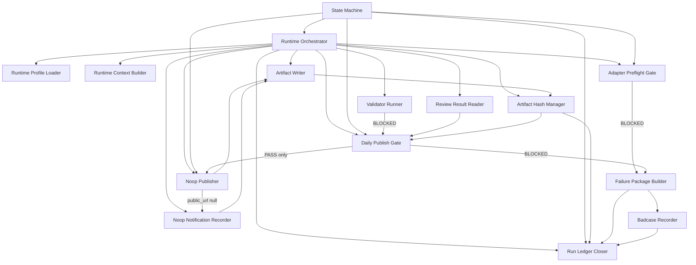
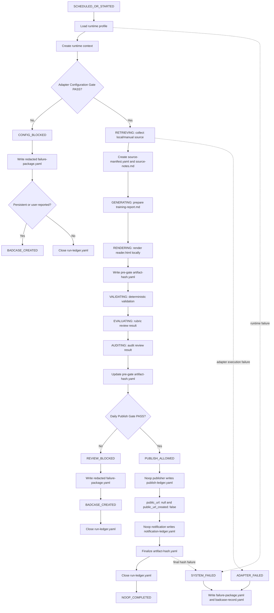

# P2D-2d AI Daily Publishing System Gate and State Machine Implementation Plan

Status: `P2D-2d_GATE_STATE_MACHINE_IMPLEMENTATION_PLAN`

This is a documentation-only implementation plan for the future gate, state
machine, artifact writer, artifact hash, ledger, and failure-boundary
implementation of the AI Daily Publishing System MVP. It does not implement
runtime code.

Source of truth:

- `AGENTS.md`
- `docs/architecture/p2d-1-ai-daily-publishing-system-context-pack-r2.md`
- `docs/architecture/p2d-1-ai-daily-publishing-system-core-and-adapter-architecture.md`
- `docs/architecture/p2d-2a-ai-daily-publishing-system-mvp-scope-plan.md`
- `docs/architecture/p2d-2b-ai-daily-publishing-system-runtime-contract-and-artifact-schema-plan.md`
- `docs/architecture/p2d-2c-ai-daily-publishing-system-local-noop-runtime-plan.md`

Source-of-truth hierarchy:

1. P2D-1 owns architecture, Core / Adapter boundary, state naming, and repository boundary.
2. P2D-2a owns MVP scope.
3. P2D-2b owns runtime contract and artifact schema.
4. P2D-2c owns local/manual/noop runtime execution chain.

---

## 1. Goal and Scope Boundary

P2D-2d is an implementation plan, not an implementation. It freezes the future
minimum module boundaries needed to implement the local/manual/noop MVP without
weakening the Core invariants already defined in P2D-1 through P2D-2c.

P2D-2d only plans future implementation boundaries:

- gate module boundary;
- state machine boundary;
- artifact writer boundary;
- two-phase artifact hash boundary;
- ledger boundary;
- failure package and badcase boundary;
- runtime orchestration boundary;
- acceptance test plan;
- staged future implementation sequence.

P2D-2d does not:

- write code;
- create `src/`, `runtime/`, or `artifacts/`;
- create schema files;
- create artifact examples;
- run tests;
- connect to real external services;
- call a live LLM;
- publish;
- send notification;
- expand P2D-2a MVP scope.

The MVP remains manual/local/noop-first. `NOOP_COMPLETED` means the declared
noop path completed with evidence. It does not mean public publication.

---

## 2. Implementation Module Boundary

The future implementation should be split into small modules with explicit
inputs, outputs, and "must not do" boundaries. This section names the planned
modules only; P2D-2d creates no files.

| Module | Responsibility | Inputs | Outputs | Must Not Do | Related Artifacts | Related States |
|---|---|---|---|---|---|---|
| Runtime Orchestrator | Coordinates the local/manual/noop run sequence and invokes modules in P2D-2c order | Trigger metadata, runtime profile name, local/manual source pointer, local/manual report pointer, stable release reference | Ordered module calls, transition requests, run-ledger draft references | Bypass gates, call live providers directly, claim success without terminal evidence | `run-ledger.yaml`, all stage artifact references | `SCHEDULED_OR_STARTED`, all runtime states |
| Runtime Context Builder | Builds redacted run context evidence | Run date, trigger metadata, agent driver, runtime host, timezone, attempt, stable release reference | `runtime-context.yaml` content plan, run id, initial idempotency inputs | Store secrets, raw prompts, tokens, cookies, private notes, or credential values | `runtime-context.yaml` | `SCHEDULED_OR_STARTED`, `SYSTEM_FAILED` |
| Runtime Profile Loader | Loads the selected local/manual/noop profile and computes config snapshot evidence | Runtime profile name, allowed MVP profile contracts, adapter declarations | Profile snapshot, `config_snapshot_hash`, noop policy inputs | Silently fall back to real providers, read or persist credential values, weaken Core invariants | Profile snapshot reference, `adapter-preflight-result.yaml` inputs | `SCHEDULED_OR_STARTED`, `CONFIG_BLOCKED` |
| Adapter Preflight Gate | Decides whether selected adapters can safely run in MVP mode | Profile snapshot, adapter contract metadata, credential names, capability declarations, noop policy | Preflight decision, blocking adapter list, reason codes | Start retrieval/generation/render/publish/notification, expose credential values, treat real provider config as safe by default | `adapter-preflight-result.yaml`, `failure-package.yaml` on block | `CONFIG_BLOCKED`, `RETRIEVING` |
| State Machine | Validates allowed transitions and records transition evidence | Current state, requested next state, reason code, gate or module evidence refs | Accepted transition entry or rejected transition reason | Write artifacts, call adapters, decide quality, publish, notify, mutate gates | `run-ledger.yaml` state transitions | All Core MVP states |
| Artifact Writer | Persists allowed artifacts and records present/skipped/absent status | Artifact payload, artifact classification, run id, target artifact path, redaction status | Persisted artifact pointer, write status, present/skipped/absent record | Decide quality PASS, bypass gates, call external providers, publish, notify, fabricate missing hashes | All MVP artifacts and ledgers | All states that produce evidence |
| Artifact Hash Manager | Maintains pre-gate and final hashes for present artifacts | Artifact inventory, file paths, visibility classification, hash phase, idempotency inputs | `artifact-hash.yaml` pre-gate draft/update, final hash evidence, aggregate hash | Hash missing artifacts as if present, bypass failed gates, create public output, hide sink failures | `artifact-hash.yaml`, run-ledger hash refs | `VALIDATING`, `AUDITING`, `PUBLISH_ALLOWED`, terminal close |
| Validator Runner | Runs deterministic validation checks over artifacts and noop URL policy | Required artifact inventory, `reader.html`, pre-gate hash evidence, noop URL fields if available | `validator-result.yaml` with explicit `PASS` or `BLOCKED` | Call live LLM, make rubric/audit judgments, treat missing validator as PASS, publish | `validator-result.yaml`, `failure-package.yaml` on block | `VALIDATING`, `REVIEW_BLOCKED` |
| Review Result Reader | Reads rubric and audit stub/manual results as gate inputs | `rubric-review.stub.json` or manual equivalent, `audit-review.stub.json` or manual equivalent | Parsed explicit statuses, reason codes, evidence refs | Treat file existence as PASS, run evaluators, overwrite review results, publish | Rubric review result, audit review result | `EVALUATING`, `AUDITING`, `REVIEW_BLOCKED` |
| Daily Publish Gate | Decides whether local candidate may enter noop publish boundary | Source, Markdown, HTML, validator, rubric, audit, pre-gate hash, risk, privacy, noop URL policy | Gate decision: `PASS` to `PUBLISH_ALLOWED`, or `BLOCKED` to `REVIEW_BLOCKED` | Deploy, create URL, send notification, override missing evidence, treat noop as publication | Gate decision in `run-ledger.yaml`, `failure-package.yaml` on block | `AUDITING`, `PUBLISH_ALLOWED`, `REVIEW_BLOCKED` |
| Noop Publisher | Records noop publish outcome only after `PUBLISH_ALLOWED` | `PUBLISH_ALLOWED`, `reader.html` pointer, idempotency key, noop reference | `publish-ledger.yaml` with `public_url: null` and `public_url_created: false` | Run before `PUBLISH_ALLOWED`, deploy, create/fake/reserve URL, produce `PASS_PUBLISHED` | `publish-ledger.yaml` | `PUBLISH_ALLOWED`, `NOOP_COMPLETED`, `SYSTEM_FAILED`, `ADAPTER_FAILED` |
| Noop Notification Recorder | Records noop or none notification intent | Terminal intent, noop/none notification mode, evidence pointer policy | `notification-ledger.yaml` with `sent: false` and `external_message_id: null` | Send IM, WeChat, Slack, Telegram, Email, webhook, bot, or private evidence dump | `notification-ledger.yaml` | `PUBLISH_ALLOWED`, `NOOP_COMPLETED`, `SYSTEM_FAILED`, `ADAPTER_FAILED` |
| Failure Package Builder | Builds redacted failure evidence for blocked or failed runs | Terminal state, failed stage, failed gate or adapter, missing artifacts, skipped stages, evidence refs | `failure-package.yaml` | Leak secrets, fabricate unavailable evidence, relabel failures as success | `failure-package.yaml` | `CONFIG_BLOCKED`, `REVIEW_BLOCKED`, `SYSTEM_FAILED`, `ADAPTER_FAILED` |
| Badcase Recorder | Records governed badcases when required | Failure package, terminal state, reason codes, evidence refs, owner hint | `badcase-record.yaml` | Publish, retry silently, mark repair complete, include unredacted private evidence | `badcase-record.yaml` | `BADCASE_CREATED` after required blocked/failed states |
| Run Ledger Closer | Finalizes terminal run index | Runtime context, transition evidence, artifact inventory, gate decisions, failure/badcase refs, final hash | Final `run-ledger.yaml` | Close without present/skipped/absent records, claim success without final hash, hide failed writes | `run-ledger.yaml` | All terminal states |

---

## 3. State Machine Implementation Boundary

The future state machine is a Core-owned constraint module. It preserves the
meaning of states and transitions; it does not perform runtime side effects.

MVP states:

| State | Meaning in P2D-2d implementation boundary |
|---|---|
| `SCHEDULED_OR_STARTED` | A manual, scheduled, retry, dry-run, noop, or external-agent trigger initiated a run |
| `CONFIG_BLOCKED` | Adapter Configuration Gate blocked before runtime side effects |
| `RETRIEVING` | Local/manual source evidence is being collected or normalized |
| `GENERATING` | Local/manual training report is being prepared or accepted |
| `RENDERING` | `training-report.md` is being rendered to local `reader.html` |
| `VALIDATING` | Deterministic validation is running over artifacts and policy checks |
| `EVALUATING` | Rubric review stub/manual result is being consumed |
| `AUDITING` | Audit review stub/manual result and boundary checks are being consumed |
| `PUBLISH_ALLOWED` | Daily Publish Gate passed; noop publisher may record a ledger |
| `REVIEW_BLOCKED` | Content, evidence, privacy, artifact, review, validator, or gate condition blocked publish eligibility |
| `SYSTEM_FAILED` | Runtime infrastructure, local sink, render, hash finalization, ledger close, or policy violation prevented completion |
| `ADAPTER_FAILED` | An enabled adapter passed preflight but failed during execution |
| `NOOP_COMPLETED` | The declared noop path completed without real publication |
| `BADCASE_CREATED` | A governed badcase record exists for required blocked/failed outcomes |

Allowed MVP transitions:

```text
SCHEDULED_OR_STARTED -> CONFIG_BLOCKED
SCHEDULED_OR_STARTED -> RETRIEVING
RETRIEVING -> GENERATING
GENERATING -> RENDERING
RENDERING -> VALIDATING
VALIDATING -> EVALUATING
EVALUATING -> AUDITING
EVALUATING -> REVIEW_BLOCKED
AUDITING -> REVIEW_BLOCKED
AUDITING -> PUBLISH_ALLOWED
PUBLISH_ALLOWED -> NOOP_COMPLETED
any runtime stage -> SYSTEM_FAILED
any adapter stage -> ADAPTER_FAILED
CONFIG_BLOCKED -> BADCASE_CREATED when persistent or user-reported
REVIEW_BLOCKED -> BADCASE_CREATED
SYSTEM_FAILED -> BADCASE_CREATED
ADAPTER_FAILED -> BADCASE_CREATED
```

Forbidden MVP transitions:

- `SCHEDULED_OR_STARTED -> PUBLISH_ALLOWED` without retrieval, generation, render, validation, review, audit, and Daily Publish Gate.
- `SCHEDULED_OR_STARTED -> NOOP_COMPLETED` without gate and ledger evidence.
- `CONFIG_BLOCKED -> RETRIEVING`; config block stops before retrieval, generation, rendering, publish, and notification.
- `REVIEW_BLOCKED -> PUBLISH_ALLOWED`; a blocked Daily Publish Gate cannot be bypassed.
- `SYSTEM_FAILED -> NOOP_COMPLETED`; runtime failure cannot be relabeled as success.
- `ADAPTER_FAILED -> NOOP_COMPLETED`; adapter failure cannot be silently retried or relabeled.
- `PUBLISH_ALLOWED -> PASS_PUBLISHED` in MVP noop runtime.
- `NOOP_COMPLETED -> PASS_PUBLISHED`; noop completion is not public publication.
- Any transition that creates a public URL in MVP noop runtime.

Terminal states:

- `CONFIG_BLOCKED` is terminal for unsafe or incomplete configuration before runtime work.
- `REVIEW_BLOCKED` is terminal for quality, evidence, review, privacy, source, artifact, or gate block.
- `SYSTEM_FAILED` is terminal for runtime or infrastructure failure.
- `ADAPTER_FAILED` is terminal for provider/adapter execution failure after preflight.
- `NOOP_COMPLETED` is terminal for successful local/manual/noop completion.
- `BADCASE_CREATED` is a required governance follow-on for `REVIEW_BLOCKED`, `SYSTEM_FAILED`, and `ADAPTER_FAILED`; it is required for `CONFIG_BLOCKED` only when persistent or user-reported.

Transition evidence:

- every accepted transition records `from`, `to`, timestamp, reason code, and evidence refs;
- gate transitions reference gate decision evidence;
- blocked transitions reference failure package evidence;
- publish-boundary transitions reference `publish-ledger.yaml`;
- notification-boundary transitions reference `notification-ledger.yaml`;
- terminal transitions reference final artifact hash and run-ledger close evidence when available.

Failed transition handling:

- rejected transition requests are runtime policy violations;
- if the violation is detected before terminal close and can be recorded, the run terminates as `SYSTEM_FAILED`;
- if an adapter caused the failed transition after passing preflight, the run may terminate as `ADAPTER_FAILED`;
- the failure package records the rejected transition, reason codes, available evidence, and skipped downstream artifacts;
- blocked or failed runs must not claim `NOOP_COMPLETED`, `PASS_PUBLISHED`, or quality success.

The state machine does not:

- write artifacts;
- hash artifacts;
- validate content;
- read review files;
- decide gate PASS;
- call adapters;
- publish;
- notify;
- create badcases;
- close ledgers by itself.

State invariants:

- `NOOP_COMPLETED != PASS_PUBLISHED`.
- `PASS_PUBLISHED` is not produced in the MVP noop runtime.
- `PUBLISH_ALLOWED` does not equal real publish.
- Blocked and failed states cannot claim success.

---

## 4. Gate Function Boundary

P2D-2d plans future gate function boundaries only. It does not write gate code.

### Adapter Configuration Gate

Purpose: determine whether the selected runtime profile can safely supply the
required local/manual/noop MVP capabilities before retrieval, generation,
rendering, validation side effects, publish, notification, live provider calls,
or external calls.

Inputs:

- runtime profile name and profile snapshot;
- `runtime-context.yaml` reference;
- `config_snapshot_hash`;
- adapter contract metadata for local source, local artifact sink, noop publisher, noop notification, local Ops backend, and disabled or contract-only model provider;
- credential names and capability declarations, never credential values;
- noop policy requiring noop publisher support and noop or none notification support.

Pass conditions:

- every required enabled adapter is present in the selected profile;
- local/manual source capability is declared;
- local artifact sink is configured as the MVP evidence sink concept;
- publisher is `noop` and supports noop mode;
- notification is `noop` or `none`;
- model provider is disabled, manual, stub, or contract-only for MVP;
- no real provider is enabled in a way that requires live credentials or external calls;
- profile evidence contains no credential values;
- `public_url_created` remains false.

Blocked conditions:

- required adapter is missing;
- required noop support is missing;
- real model provider, source provider, publisher, notification channel, artifact sink, or Ops backend is enabled without an allowed MVP noop/manual configuration;
- required credential name is missing, invalid, insufficient, or unsafe when a real provider is selected;
- credential values, live tokens, deploy tokens, webhook values, cookies, or secret-derived values appear in evidence;
- profile ambiguity would allow silent fallback to real external service use.

Output decision shape:

```text
adapter_preflight_decision:
  run_id
  status: PASS | BLOCKED
  checked_at
  profile_name
  checked_adapters
  blocking_adapters
  reason_codes
  redacted_message
  public_url_created: false
  maps_to_state: RETRIEVING | CONFIG_BLOCKED
```

Reason code examples:

- `MISSING_REQUIRED_ADAPTER`
- `MISSING_CREDENTIAL_NAME`
- `INVALID_CREDENTIAL_DECLARATION`
- `NOOP_NOT_SUPPORTED`
- `REAL_PROVIDER_DISABLED_IN_MVP`
- `UNSAFE_REAL_PROVIDER_IN_MVP`
- `PROFILE_AMBIGUOUS_EXTERNAL_FALLBACK`
- `SECRET_VALUE_IN_PROFILE_EVIDENCE`

Redaction rules:

- missing credential names may be recorded;
- stable reason codes may be recorded;
- credential values, tokens, cookies, webhooks, secret-derived hashes, raw prompt traces, and unredacted provider errors must not be recorded.

State mapping:

```text
Adapter Configuration Gate BLOCKED -> CONFIG_BLOCKED
Adapter Configuration Gate PASS -> RETRIEVING
```

### Daily Publish Gate

Purpose: determine whether the local candidate may enter the noop publish
boundary. In MVP noop runtime, a PASS permits only noop publisher ledger writing;
it does not create a public URL.

Inputs:

- `runtime-context.yaml`;
- `adapter-preflight-result.yaml`;
- `source-manifest.yaml`;
- `source-notes.md` as a private evidence pointer only;
- `training-report.md`;
- `reader.html`;
- `validator-result.yaml`;
- `rubric-review.stub.json` or `rubric-review.json`;
- `audit-review.stub.json` or `audit-review.json`;
- pre-gate artifact hash evidence from `artifact-hash.yaml`;
- run-ledger draft with state transitions and present/skipped/absent records;
- noop URL policy evidence.

Pass conditions:

- required sources are present;
- `training-report.md` exists and is non-empty;
- `reader.html` exists, is non-empty, and is renderable enough for local preview;
- `validator-result.yaml` exists and has explicit `PASS`;
- rubric review result has explicit `PASS`;
- audit review result has explicit `PASS`;
- audit result explicitly confirms private evidence and public/private boundary checks;
- required evidence is complete;
- pre-gate artifact hash evidence exists for all present pre-gate artifacts;
- no blocking source, content, artifact, risk, or privacy flag remains;
- `reader.html` contains no private evidence, source notes, review internals, audit internals, runtime logs, failure package content, badcase content, model traces, credential errors, or secrets;
- noop URL policy is intact: `public_url: null`, `public_url_created: false`.

Blocked conditions:

- validator result is missing, `BLOCKED`, ambiguous, unparseable, or incomplete;
- rubric review is missing, `NOT_RUN`, `BLOCKED`, ambiguous, or unparseable;
- audit review is missing, `NOT_RUN`, `BLOCKED`, ambiguous, or unparseable;
- review stub file exists but does not explicitly PASS;
- required source manifest is missing or empty;
- required Markdown or HTML artifact is missing or empty;
- private evidence appears in `reader.html`;
- noop public URL is non-null or `public_url_created` is true;
- required pre-gate artifact hashes are missing for present pre-gate artifacts;
- missing evidence is not explicitly recorded as skipped or absent.

Output decision shape:

```text
daily_publish_gate_decision:
  run_id
  status: PASS | BLOCKED
  checked_at
  input_evidence_refs
  blocking_checks
  reason_codes
  redaction_status
  noop_url_policy
  maps_to_state: PUBLISH_ALLOWED | REVIEW_BLOCKED
```

Reason code examples:

- `VALIDATOR_RESULT_MISSING`
- `VALIDATOR_BLOCKED`
- `RUBRIC_NOT_RUN`
- `RUBRIC_BLOCKED`
- `RUBRIC_STATUS_AMBIGUOUS`
- `AUDIT_NOT_RUN`
- `AUDIT_BLOCKED`
- `AUDIT_BOUNDARY_CHECK_MISSING`
- `PRIVATE_EVIDENCE_LEAK`
- `PRE_GATE_HASH_MISSING`
- `NOOP_PUBLIC_URL_NON_NULL`
- `NOOP_PUBLIC_URL_CREATED_TRUE`
- `SOURCE_MANIFEST_MISSING`
- `REQUIRED_ARTIFACT_EMPTY`
- `MISSING_EVIDENCE_NOT_LEDGERED`

Redaction rules:

- evidence refs must be pointers, not private evidence dumps;
- source notes, review internals, audit internals, ledgers, failure packages, badcases, hashes, logs, credential errors, and model traces remain private evidence;
- notification evidence may point to private evidence but must not inline it.

State mapping:

```text
Daily Publish Gate PASS -> PUBLISH_ALLOWED
Daily Publish Gate BLOCKED -> REVIEW_BLOCKED
```

Gate invariants:

- review stub existence != PASS;
- missing validator blocks;
- rubric/audit `NOT_RUN`, `BLOCKED`, missing, ambiguous, or unparseable blocks;
- private evidence leak blocks;
- pre-gate artifact hash missing blocks;
- non-null noop `public_url` blocks;
- `PUBLISH_ALLOWED` does not create a real URL.

---

## 5. Artifact Writer Boundary

The future Artifact Writer owns evidence persistence mechanics for allowed MVP
artifacts. It is not a gate and does not decide quality.

Responsibilities:

- write only artifacts allowed by P2D-2b and P2D-2c;
- use an atomic-ish write plan: prepare content, validate classification and redaction status, write to an implementation-defined temporary path, then commit to the intended artifact path;
- return write evidence that can be recorded as present, skipped, or absent;
- enforce public/private classification before write;
- record redaction boundary status for failure and private evidence artifacts;
- prevent private evidence from becoming public output;
- refuse fabricated hashes for missing artifacts;
- preserve available evidence for failed or blocked runs;
- support best-effort evidence writing for `SYSTEM_FAILED` and `ADAPTER_FAILED`;
- provide artifact inventory inputs to the Artifact Hash Manager and Run Ledger Closer.

Allowed artifact classes:

- public candidate: `reader.html` only in MVP local preview;
- private evidence: source notes, validator result, rubric review, audit review;
- ledger: run, publish, notification, artifact hash;
- failure evidence: failure package;
- governance: badcase record.

Present/skipped/absent tracking:

- `present` means the artifact was successfully written and can be referenced;
- `skipped` means the stage did not run by policy or due to an earlier terminal state;
- `absent` means the artifact was required or expected but unavailable, with reason code;
- missing artifacts must not receive fabricated hashes.

The Artifact Writer does not:

- decide quality PASS;
- bypass Adapter Configuration Gate or Daily Publish Gate;
- call external providers;
- publish;
- send notifications;
- create schema files in P2D-2d;
- turn private evidence into public HTML.

---

## 6. Two-phase Artifact Hash Manager Boundary

The future Artifact Hash Manager carries forward the P2D-2c two-phase hash
design. Hash evidence is required before the Daily Publish Gate and again before
final run-ledger close.

### Phase 1: Pre-gate Hash

Timing:

- after `reader.html` exists;
- before `validator-result.yaml`;
- before Daily Publish Gate;
- updated after review artifacts exist and before Daily Publish Gate.

Coverage:

- present pre-gate artifacts only;
- expected pre-gate artifacts include `runtime-context.yaml`, profile snapshot or config snapshot reference, `adapter-preflight-result.yaml`, `source-manifest.yaml`, `source-notes.md`, `training-report.md`, `reader.html`, validator result after validation, rubric review result, and audit review result;
- missing or skipped artifacts are recorded in run-ledger draft or failure package, not hashed as present.

Output:

- `artifact-hash.yaml` pre-gate draft;
- updated pre-gate hash evidence including review artifacts before Daily Publish Gate;
- aggregate hash over present artifacts.

Failure boundary:

- missing pre-gate hash evidence before Daily Publish Gate maps to `REVIEW_BLOCKED` when the artifact sink can still write failure evidence;
- inability to write the pre-gate hash because the local artifact sink failed maps to `SYSTEM_FAILED`;
- pre-gate hash missing cannot be bypassed by a gate PASS.

### Phase 2: Final Hash

Timing:

- after `publish-ledger.yaml`;
- after `notification-ledger.yaml`;
- before `run-ledger.yaml` final close.

Coverage:

- present pre-gate artifacts;
- present post-gate artifacts;
- final gate decision evidence;
- publish and notification ledger evidence;
- terminal evidence required for run-ledger close.

Output:

- finalized `artifact-hash.yaml`;
- final aggregate hash;
- hash reference consumed by `run-ledger.yaml` final close.

Failure boundary:

- final hash update cannot retroactively bypass failed validation or failed Daily Publish Gate;
- final hash finalize failure after noop publish and notification ledgers maps to `SYSTEM_FAILED`;
- missing artifacts must not receive fabricated hashes;
- `NOOP_COMPLETED` cannot be claimed without final hash evidence.

Inputs:

- artifact inventory with present/skipped/absent status;
- artifact paths and visibility classification;
- idempotency-relevant artifact hashes;
- phase marker: pre-gate draft, pre-gate update, or final.

Relationship with idempotency:

- `config_snapshot_hash`, `source_manifest_hash`, `training_report_hash`, and noop publish target/reference participate in the MVP idempotency key;
- hash records must not include secrets or secret-derived values;
- `reader.html` may be integrity evidence, but it is not a primary MVP idempotency input unless a later plan explicitly changes that policy.

Relationship with run-ledger close:

- run-ledger final close consumes final artifact hash evidence;
- terminal state is valid only when `run-ledger.yaml` records present, skipped, and absent artifacts explicitly;
- failure packages record missing hash evidence when hash incompleteness is the blocker.

---

## 7. Ledger Boundary

Ledgers are evidence. They are not bypass mechanisms, and they do not grant
quality approval by their existence.

| Ledger | Writer | Timing | Required Fields Concept | Visibility | Gate Dependency | Failure Behavior |
|---|---|---|---|---|---|---|
| `run-ledger.yaml` | Run Ledger Closer | Final close, with drafts during runtime | run id, start/end, terminal state, transitions, context/profile refs, preflight refs, artifact inventory, gate decisions, failure/badcase refs, idempotency key | ledger/private evidence | Records Adapter Configuration Gate and Daily Publish Gate outcomes when reached | Required for all terminal states; invalid if present/skipped/absent records are missing |
| `publish-ledger.yaml` | Noop Publisher | Only after `PUBLISH_ALLOWED` | run id, mode noop, status, publish_allowed, `public_url: null`, `public_url_created: false`, local preview path, noop reference, artifact hash, idempotency key, reason codes | ledger/private evidence | Requires Daily Publish Gate PASS and `PUBLISH_ALLOWED` | Called before `PUBLISH_ALLOWED` is `SYSTEM_FAILED`; non-null noop URL is `REVIEW_BLOCKED` if caught before close or `SYSTEM_FAILED` if runtime violation |
| `notification-ledger.yaml` | Noop Notification Recorder | After noop publish ledger or terminal outcome intent is known | run id, mode noop or none, status, notification intent, channel, `sent: false`, `external_message_id: null`, evidence pointer, reason codes | ledger/private evidence | Must not imply publish; may record intent only | Any real send attempt is `SYSTEM_FAILED`; adapter boundary failure after preflight may be `ADAPTER_FAILED` |
| `artifact-hash.yaml` | Artifact Hash Manager | Pre-gate draft/update before Daily Publish Gate; final before run-ledger close | run id, algorithm, artifact entries, visibility, hash, required_for, aggregate hash | ledger/private evidence | Pre-gate hash required for Daily Publish Gate; final hash required for `NOOP_COMPLETED` | Missing pre-gate hash blocks as `REVIEW_BLOCKED`; hash write/finalize failure is `SYSTEM_FAILED`; no fabricated hashes |
| `failure-package.yaml` | Failure Package Builder | Before blocked/failed terminal close | run id, terminal state, failed stage, failed gate, failed adapter, summary, reason codes, missing artifacts, skipped stages, evidence refs, redaction status, recommended next action | failure evidence/private | Required for `CONFIG_BLOCKED`, `REVIEW_BLOCKED`, `SYSTEM_FAILED`, `ADAPTER_FAILED` | Must be redacted; if it cannot be written due to sink failure, preserve best-effort durable evidence and classify as `SYSTEM_FAILED` |
| `badcase-record.yaml` | Badcase Recorder | After required blocked/failed classification and failure package | badcase id, run id, entry type, severity, symptom, public URL status, evidence refs, suspected root cause, owner, status, linked iteration/lesson | governance/private evidence | Required after `REVIEW_BLOCKED`, `SYSTEM_FAILED`, `ADAPTER_FAILED`; conditional for persistent/user-reported `CONFIG_BLOCKED` | Must not contain unredacted private evidence; write failure is `SYSTEM_FAILED` if required evidence cannot be recorded |

Ledger invariants:

- ledgers are evidence, not bypass mechanisms;
- publish-ledger noop does not equal public URL;
- notification-ledger noop does not equal sent message;
- failure package must be redacted;
- badcase is required for `REVIEW_BLOCKED`, `SYSTEM_FAILED`, and `ADAPTER_FAILED`;
- `CONFIG_BLOCKED` creates a badcase only when persistent or user-reported.

---

## 8. Failure Classification Boundary

| Failure Class | Trigger | Owner | Required Evidence | Failure Package Requirement | Badcase Requirement | Retry Implication | No-public-url Rule |
|---|---|---|---|---|---|---|---|
| `CONFIG_BLOCKED` | Adapter Configuration Gate finds missing, invalid, unsafe, real-provider, non-noop, or ambiguous configuration before runtime side effects | Adapter Preflight Gate and Runtime Profile Loader | runtime context, profile/config snapshot, adapter preflight result, blocking adapter ids, reason codes | Required, redacted, with failed gate and setup guidance | Only when persistent or user-reported | Retry only after configuration/profile correction | No retrieval, generation, render, publish, notification, or public URL |
| `REVIEW_BLOCKED` | Validator, rubric, audit, source, artifact, evidence, risk, privacy, or Daily Publish Gate condition blocks publish eligibility | Validator Runner, Review Result Reader, Daily Publish Gate | available artifacts, validator/review/gate evidence, pre-gate hash if available, missing/skipped/absent records | Required, redacted, with failed gate and missing artifacts | Required | Retry only after evidence/content/review issue is repaired and rerun is explicitly ledgered | No publish, no real URL, no `NOOP_COMPLETED`, no `PASS_PUBLISHED` |
| `SYSTEM_FAILED` | Runtime infrastructure, renderer crash, artifact sink write failure, hash finalize failure, ledger close failure, or policy violation prevents completion | Runtime Orchestrator, Artifact Writer, Hash Manager, Run Ledger Closer | best-effort runtime context, preflight if available, available artifacts, failure evidence, write/finalize error reason | Required when writable; otherwise preserve best-effort durable evidence | Required | Retry may be allowed after runtime/infrastructure repair; no silent retry | Must not create or update public URL after failure |
| `ADAPTER_FAILED` | Enabled adapter passes preflight but fails during local source, artifact sink, noop publish, noop notification, or another adapter stage | Failing adapter boundary plus Runtime Orchestrator classification | runtime context, preflight result, adapter id, stable reason codes, redacted adapter failure evidence, available artifacts | Required with `failed_adapter` | Required | Retry/fallback only when policy explicitly allows and prior evidence is preserved | No relabeling as success; no new public URL |

Boundary decisions:

- Config problem vs adapter execution failure: if unsafe or incomplete setup is detected before runtime side effects, use `CONFIG_BLOCKED`; if an enabled adapter passes preflight and fails during execution, use `ADAPTER_FAILED`.
- Quality/gate block vs runtime system failure: if evidence exists but gate conditions are not met, use `REVIEW_BLOCKED`; if the runtime cannot write, hash, render, or close required evidence, use `SYSTEM_FAILED`.
- Missing source evidence vs source adapter access failure: if source adapter cannot access required local input after preflight, use `ADAPTER_FAILED`; if the source stage is reached but evidence is insufficient or missing for gate eligibility, use `REVIEW_BLOCKED`.
- Pre-gate hash missing vs artifact sink write failure: missing or incomplete pre-gate hash before Daily Publish Gate is `REVIEW_BLOCKED`; inability to write hash evidence because the sink failed is `SYSTEM_FAILED`.
- Final hash finalize failure: after publish and notification ledgers, failure to finalize artifact hash before run-ledger close is `SYSTEM_FAILED`.

All failure classes must preserve available evidence, avoid credential leakage,
avoid fabricated artifacts, and avoid new public URLs.

---

## 9. Runtime Orchestration Sequence

P2D-2d inherits the P2D-2c local/manual/noop runtime chain:

```text
SCHEDULED_OR_STARTED
-> load runtime profile
-> create runtime context
-> adapter configuration preflight
-> collect local/manual source
-> create source manifest and source notes
-> prepare or accept local/manual training report
-> render reader.html locally
-> pre-gate artifact hash
-> deterministic validation
-> rubric review result
-> audit review result
-> pre-gate artifact hash update
-> Daily Publish Gate
-> noop publisher
-> noop notification
-> final artifact hash
-> run ledger close
-> NOOP_COMPLETED
```

Module ownership:

| Step | Module Owner | Primary State | Primary Evidence |
|---|---|---|---|
| Load runtime profile | Runtime Profile Loader | `SCHEDULED_OR_STARTED` | Profile snapshot, `config_snapshot_hash` input |
| Create runtime context | Runtime Context Builder | `SCHEDULED_OR_STARTED` | `runtime-context.yaml` |
| Adapter configuration preflight | Adapter Preflight Gate | `SCHEDULED_OR_STARTED` to `RETRIEVING` or `CONFIG_BLOCKED` | `adapter-preflight-result.yaml` |
| Collect local/manual source | Runtime Orchestrator with Source Adapter boundary | `RETRIEVING` | local source evidence pointer |
| Create source manifest and source notes | Artifact Writer with Core source normalization | `RETRIEVING` | `source-manifest.yaml`, `source-notes.md` |
| Prepare or accept report | Runtime Orchestrator and Artifact Writer | `GENERATING` | `training-report.md` |
| Render local reader | Runtime Orchestrator with renderer boundary | `RENDERING` | `reader.html` |
| Create pre-gate hash draft | Artifact Hash Manager | `VALIDATING` preparation | `artifact-hash.yaml` pre-gate draft |
| Run deterministic validation | Validator Runner | `VALIDATING` | `validator-result.yaml` |
| Read rubric review result | Review Result Reader | `EVALUATING` | rubric review stub/manual result |
| Read audit review result | Review Result Reader | `AUDITING` | audit review stub/manual result |
| Update pre-gate hash | Artifact Hash Manager | `AUDITING` before gate | updated `artifact-hash.yaml` |
| Decide Daily Publish Gate | Daily Publish Gate | `AUDITING` to `PUBLISH_ALLOWED` or `REVIEW_BLOCKED` | gate decision in run-ledger draft |
| Record noop publisher | Noop Publisher | `PUBLISH_ALLOWED` | `publish-ledger.yaml` |
| Record noop notification | Noop Notification Recorder | `PUBLISH_ALLOWED` | `notification-ledger.yaml` |
| Finalize artifact hash | Artifact Hash Manager | before terminal close | final `artifact-hash.yaml` |
| Close run ledger | Run Ledger Closer | `NOOP_COMPLETED` or failure terminal state | final `run-ledger.yaml` |

The Runtime Orchestrator calls modules in order, but the State Machine constrains
which transitions are valid. Artifact Writer and Artifact Hash Manager provide
evidence. Gates decide eligibility. Noop publisher and noop notification record
only noop evidence.

---

## 10. Suggested Future File Layout

This file layout is future implementation guidance only. P2D-2d does not create
these directories or files. A later implementation stage must separately confirm
the exact layout.

```text
src/ai_daily_publishing_system/
  core/
    runtime/
    state_machine/
    gates/
    artifacts/
    validation/
    reviews/
    publishing/
    notifications/
    failures/
  adapters/
    contracts/
    local/
    noop/
tests/
  contract/
  gates/
  state_machine/
  artifacts/
  runtime/
```

Suggested responsibility split:

- `core/runtime/`: orchestrator, runtime context builder, profile loader boundary;
- `core/state_machine/`: state catalog, allowed transitions, transition evidence validation;
- `core/gates/`: Adapter Configuration Gate and Daily Publish Gate decisions;
- `core/artifacts/`: artifact writer, classification, hash manager, present/skipped/absent inventory;
- `core/validation/`: deterministic validator runner;
- `core/reviews/`: rubric and audit result readers;
- `core/publishing/`: noop publisher boundary;
- `core/notifications/`: noop notification recorder boundary;
- `core/failures/`: failure package builder and badcase recorder;
- `adapters/contracts/`: stable adapter contract types in a future implementation;
- `adapters/local/`: local/manual source and local artifact sink boundaries;
- `adapters/noop/`: noop publisher and notification adapters.

---

## 11. Acceptance Test Plan

This section plans future tests only. P2D-2d does not create test files and does
not run tests.

| Case | Given | When | Then | Expected Terminal State | Required Artifacts | Must Not Happen |
|---|---|---|---|---|---|---|
| 1. Valid local noop run | Local/manual source exists; preflight PASS; `training-report.md` and `reader.html` exist; pre-gate hash exists; validator PASS; rubric PASS; audit PASS | Runtime executes full local/noop sequence | Noop publisher and notification ledgers are written; final hash precedes run-ledger close | `NOOP_COMPLETED` | all success artifacts, publish ledger, notification ledger, final artifact hash, run ledger | no `PASS_PUBLISHED`, no real URL, no real notification, no external API |
| 2. Real provider enabled | MVP profile enables a real provider without allowed noop/manual configuration | Adapter Configuration Gate runs | Preflight blocks before retrieval | `CONFIG_BLOCKED` | runtime context, preflight result, failure package, artifact hash, run ledger; badcase only if persistent/user-reported | no live LLM, no external call, no render, no publish |
| 3. Missing validator result | `reader.html` and pre-gate hash exist, but `validator-result.yaml` is missing | Daily Publish Gate evaluates inputs | Gate blocks because validator missing | `REVIEW_BLOCKED` | available artifacts, failure package, badcase, artifact hash, run ledger | no gate PASS, no noop publisher, no `NOOP_COMPLETED` |
| 4. Rubric `NOT_RUN` | Rubric review stub exists with status `NOT_RUN` | Review Result Reader and Daily Publish Gate evaluate | Stub existence is not PASS; gate blocks | `REVIEW_BLOCKED` | rubric result, available artifacts, failure package, badcase, artifact hash, run ledger | no noop publish, no hidden manual override |
| 5. Audit `BLOCKED` | Audit review stub/manual result has status `BLOCKED` | Daily Publish Gate evaluates | Gate blocks on audit result | `REVIEW_BLOCKED` | audit result, available artifacts, failure package, badcase, artifact hash, run ledger | no publish, no `NOOP_COMPLETED` |
| 6. Private evidence in `reader.html` | HTML contains source notes, review internals, audit internals, model trace, runtime logs, private ledger content, credential errors, or secrets | Validator or Daily Publish Gate checks public/private boundary | Privacy check blocks | `REVIEW_BLOCKED` | validator result if reached, failure package, badcase, artifact hash, available report/render artifacts | no public output, no notification with leaked content, no real URL |
| 7. Pre-gate artifact hash missing | Present pre-gate artifacts lack required hash evidence before validation or Daily Publish Gate | Validator or Daily Publish Gate evaluates | Missing integrity evidence blocks | `REVIEW_BLOCKED` | failure package, badcase, run ledger with missing hash evidence, available artifact hash if any | no Daily Publish Gate PASS, no fabricated hashes, no publish |
| 8. Final artifact hash finalize failure | Noop publisher and notification ledgers exist, but final hash cannot be finalized before run-ledger close | Artifact Hash Manager finalizes | Runtime cannot claim terminal success | `SYSTEM_FAILED` | best-effort context, run ledger if writable, preflight result, failure package, badcase, available hash evidence | no `NOOP_COMPLETED`, no silent close, no fake final hash |
| 9. Noop publisher before `PUBLISH_ALLOWED` | Runtime invokes noop publisher before Daily Publish Gate PASS | State Machine or publisher boundary detects invalid call | Runtime policy violation is recorded | `SYSTEM_FAILED` | runtime context, preflight result, failure package, badcase, artifact hash if available, run ledger if writable | no publish ledger claiming success, no URL, no notification |
| 10. Noop publisher non-null `public_url` | Noop publish ledger has non-null `public_url` or `public_url_created: true` | Validator/gate or runtime close detects violation | Violation blocks or fails terminal close | `REVIEW_BLOCKED` if caught before terminal close; `SYSTEM_FAILED` if detected as runtime violation | failure package, artifact hash, badcase, run ledger | no `NOOP_COMPLETED`, no `PASS_PUBLISHED`, no fake URL |
| 11. Source adapter access failure | Local source adapter passes preflight but cannot access required input path or source bundle | Retrieval executes | Adapter execution failure is classified | `ADAPTER_FAILED` | runtime context, preflight result, failure package, badcase, artifact hash if available, redacted adapter evidence | no fabricated source manifest, no silent retry, no publish |
| 12. Missing source evidence after retrieval | Source stage is reached, but source evidence is empty, insufficient, or malformed for gate eligibility | Source manifest/gate evidence is evaluated | Quality/evidence block is recorded | `REVIEW_BLOCKED` | available source artifacts, failure package, badcase, artifact hash, run ledger | no fake source hash, no publish, no `NOOP_COMPLETED` |
| 13. Notification attempts real send | Notification module attempts IM, WeChat, Slack, Telegram, Email, webhook, bot, or external message in MVP noop mode | Notification boundary runs | Policy violation is classified | `SYSTEM_FAILED` | notification failure evidence if writable, failure package, badcase, run ledger, artifact hash if available | no sent message, no external message id, no private evidence dump |
| 14. Run ledger missing present/skipped/absent records | Terminal close lacks explicit artifact inventory | Run Ledger Closer validates close evidence | Close is invalid | `REVIEW_BLOCKED` if detected as pre-close gate evidence gap; `SYSTEM_FAILED` if final close cannot write a valid ledger | failure package, badcase when required, available artifacts and hash evidence | no valid terminal state, no hidden missing artifacts, no success claim |

---

## 12. Implementation Sequence

The following sequence is suggested only. It does not authorize implementation in
P2D-2d.

| Future Stage | Focus | Output Boundary | Must Not Expand |
|---|---|---|---|
| P2D-2e | Skeleton directories and type contracts only | Minimal future package/module skeleton and contract names | No runtime behavior, no external services |
| P2D-2f | State machine and transition tests | State catalog, transition validation, terminal-state evidence checks | No artifact writing, no gates beyond transition evidence |
| P2D-2g | Artifact writer and hash manager | Allowed artifact persistence boundary, present/skipped/absent inventory, two-phase hash manager | No publish, no notification, no schema expansion beyond P2D-2b |
| P2D-2h | Gates | Adapter Configuration Gate and Daily Publish Gate decisions | No live providers, no evaluator implementation beyond reading explicit inputs |
| P2D-2i | Local noop orchestration | Runtime Orchestrator wires local/manual/noop sequence | No real provider calls, no real deploy, no real notification |
| P2D-2j | Failure package and badcase | Redacted failure package and badcase record creation | No external Ops backend, no issue creation |
| P2D-2k | End-to-end local noop dry run | Auditable local noop chain reaches `NOOP_COMPLETED` under valid inputs | No `PASS_PUBLISHED`, no public URL, no external API |

Each future stage should have its own confirmation, scope boundary, tests, and
review before implementation.

---

## 13. Mermaid Diagrams

### 13.1 Module Dependency Graph



### 13.2 Runtime Orchestration Sequence



Diagram invariants:

- State Machine is the Core constraint.
- Adapter Configuration Gate runs before source, render, publish, and notification.
- Daily Publish Gate runs before noop publisher.
- Artifact Writer and Artifact Hash Manager do not bypass gates.
- Noop Publisher does not generate a public URL.
- Final hash occurs before run-ledger final close.

---

## 14. Non-Goals

P2D-2d does not:

- write code;
- create directories;
- create `src/`, `runtime/`, or `artifacts/`;
- create schema files;
- create artifact examples;
- implement runtime behavior;
- implement adapters;
- implement validators;
- implement gates;
- implement state machine code;
- implement artifact writer code;
- implement artifact hash code;
- implement publisher behavior;
- implement notifier behavior;
- run tests;
- connect to a real source provider;
- call a live LLM;
- call external APIs;
- deploy;
- publish;
- generate a real public URL;
- send IM, WeChat, Slack, Telegram, Email, webhook, bot, or external notification;
- modify P2C outputs;
- modify P2C ledgers;
- modify source package files;
- modify `AGENTS.md`;
- modify P2D-0 documents;
- modify P2D-1 documents;
- modify P2D-2a documents;
- modify P2D-2b documents;
- modify P2D-2c documents;
- run `git add`;
- commit;
- push.

The only allowed repository change for this stage is this documentation file:

```text
docs/architecture/p2d-2d-ai-daily-publishing-system-gate-state-machine-implementation-plan.md
```

---

## 15. Definition of Done

P2D-2d is done when this document defines:

- module boundaries;
- state machine boundary;
- gate function boundary;
- artifact writer boundary;
- two-phase artifact hash manager boundary;
- ledger boundary;
- failure classification boundary;
- runtime orchestration sequence;
- future file layout guidance;
- acceptance test plan;
- implementation sequence;
- Mermaid module dependency graph;
- Mermaid runtime orchestration sequence;
- non-goals and safety boundary.

P2D-2d is not done by implementing runtime capability. It is done by freezing
implementation boundaries so later stages can remain small, auditable,
local-first, noop-first, and contract-aligned.
