# P2D-2e AI Daily Publishing System Skeleton and Type Contract Plan

Status: `P2D-2e_SKELETON_AND_TYPE_CONTRACT_PLAN`

This is a documentation-only plan for a future minimal package skeleton and
static type-contract surface for the AI Daily Publishing System MVP. It does not
create the planned package, type-contract files, schemas, examples, tests, or
runtime behavior.

Source of truth:

- `AGENTS.md`
- `docs/architecture/p2d-1-ai-daily-publishing-system-context-pack-r2.md`
- `docs/architecture/p2d-1-ai-daily-publishing-system-core-and-adapter-architecture.md`
- `docs/architecture/p2d-2a-ai-daily-publishing-system-mvp-scope-plan.md`
- `docs/architecture/p2d-2b-ai-daily-publishing-system-runtime-contract-and-artifact-schema-plan.md`
- `docs/architecture/p2d-2c-ai-daily-publishing-system-local-noop-runtime-plan.md`
- `docs/architecture/p2d-2d-ai-daily-publishing-system-gate-state-machine-implementation-plan.md`

Source-of-truth hierarchy:

1. P2D-1 owns architecture, the Core / Adapter boundary, state naming, and the
   repository boundary.
2. P2D-2a owns MVP scope.
3. P2D-2b owns the runtime contract and artifact schema.
4. P2D-2c owns the local/manual/noop runtime execution chain.
5. P2D-2d owns the implementation module boundary and gate/state-machine
   boundary.

---

## 1. Goal and Scope Boundary

P2D-2e is a skeleton and type-contract plan, not skeleton implementation. Its
goal is to freeze the smallest future package layout and static contract
categories that may be created only after separate execution approval.

This stage only plans later skeleton/type-contract creation. It does not:

- create `src/`;
- create tests;
- create schema files;
- create artifact examples;
- write code;
- create type-contract files;
- implement runtime behavior;
- connect to real external services;
- call a live LLM;
- publish;
- send notifications;
- expand the manual/local/noop-first MVP scope owned by P2D-2a.

The Core invariants remain unchanged:

```text
No quality PASS, no public URL.
NOOP_COMPLETED != PASS_PUBLISHED.
```

The only repository output authorized for this planning stage is this document.

---

## 2. Source-of-Truth Hierarchy

### 2.1 P2D-1: Architecture Authority

P2D-1 owns the product name, Core / Adapter separation, state meanings,
repository boundaries, public/private evidence boundary, and the rule that
Adapters cannot weaken Core gates or redefine Core states.

### 2.2 P2D-2a: MVP Scope Authority

P2D-2a fixes the first implementation cut as manual/local/noop-first. Live model
calls, real source providers, real deployment, real notification, and external
Ops integration remain out of scope.

### 2.3 P2D-2b: Runtime and Artifact Contract Authority

P2D-2b owns runtime-context fields, artifact names, artifact schema surfaces,
terminal-state artifact obligations, and the distinction between public
candidates, private evidence, ledgers, failure evidence, and governance
evidence.

### 2.4 P2D-2c: Local/Manual/Noop Sequence Authority

P2D-2c owns the sequencing of the local noop path, including preflight before
runtime work, the Daily Publish Gate before noop publish, pre-gate and final
hash evidence, and noop URL/notification invariants.

### 2.5 P2D-2d: Module and Gate/State Boundary Authority

P2D-2d owns the future module responsibilities, allowed state transitions, gate
decision boundaries, artifact writer/hash boundaries, failure classification,
and the staged recommendation that P2D-2e remain skeleton/type-contract only.

P2D-2e does not override any upstream source of truth. It translates those
approved contracts into a bounded plan for future skeleton and type-contract
creation.

---

## 3. Future Skeleton Scope

Nothing in this section authorizes file or directory creation. Every future
item requires separate user approval.

### 3.1 Allowed in future execution, if separately approved

- Minimal package directories required to hold static contracts.
- Empty or near-empty `__init__.py` files with no import side effects.
- Type-contract files.
- Constants or enums for approved state names and artifact names.
- Interface or protocol definitions.
- Noop placeholder exports only when needed for import sanity.
- A short documentation note or README only when needed to explain the static
  package boundary.

Allowed files must remain minimal, static, and contract-only.

### 3.2 Conditionally allowed

- Minimal import/type-contract placeholder tests, only if explicitly approved.
- Package configuration, only if the repository needs it and the user
  separately approves it.
- Index/export files, only if they introduce no runtime logic or import side
  effects.
- Typing-only dataclasses, `TypedDict`, `Literal`, or `Protocol` declarations.

Conditional items are excluded by default. Their mention here is not approval
to create them.

### 3.3 Forbidden in P2D-2e

- Runtime orchestrator implementation.
- Gate logic implementation.
- State-transition execution logic.
- Artifact writing implementation.
- Artifact hash calculation implementation.
- Validator implementation.
- Review reader implementation.
- Noop publisher implementation.
- Notification recorder implementation.
- Failure package builder implementation.
- Badcase recorder implementation.
- Real YAML/JSON artifact generation.
- Live provider calls.
- Tests that execute runtime flow.
- Fixture artifacts that resemble real run artifacts.
- Public URL, notification, or deployment behavior.

---

## 4. Proposed Future Directory Layout

This is future execution guidance only. This planning document does not create
any of these directories or files.

```text
src/ai_daily_publishing_system/
  __init__.py
  core/
    __init__.py
    states.py
    artifacts.py
    decisions.py
    contracts.py
  adapters/
    __init__.py
    contracts.py
```

| Future File | Reason for Existence | Boundary |
|---|---|---|
| `src/ai_daily_publishing_system/__init__.py` | Marks the future package and exposes only deliberately approved static names if imports require them | Empty or near-empty; no initialization logic or side effects |
| `src/ai_daily_publishing_system/core/__init__.py` | Marks the Core contract namespace | Empty or near-empty; no orchestration or eager runtime imports |
| `src/ai_daily_publishing_system/core/states.py` | Holds approved MVP state names, terminal-state categories, and allowed-transition record shapes | Static vocabulary and shapes only; no transition executor |
| `src/ai_daily_publishing_system/core/artifacts.py` | Holds artifact names, inventory status, visibility categories, and hash-phase names | Static names/types only; no artifact IO or hash calculation |
| `src/ai_daily_publishing_system/core/decisions.py` | Holds gate decision, failure classification, reason-code, redaction, and noop-policy shapes | Decision records only; no gate evaluation |
| `src/ai_daily_publishing_system/core/contracts.py` | Holds shared runtime-context, ledger-reference, idempotency-input, and evidence-reference shapes | Static record boundaries only; no file reads, writes, or validation |
| `src/ai_daily_publishing_system/adapters/__init__.py` | Marks the Adapter contract namespace | Empty or near-empty; no provider discovery or registration |
| `src/ai_daily_publishing_system/adapters/contracts.py` | Holds Source, Artifact Sink, Noop Publisher, Noop Notification, Local Ops/badcase, and disabled Model Provider protocol shapes | Protocols only; no real Adapter implementation or external call |

P2D-2e does not need to create the complete future layout proposed by P2D-2d
in one step. Runtime-oriented directories for orchestration, gates, artifact
writing, validation, review reading, publishing, notification, and failures
remain deferred. No runtime behavior module may be created unless a later stage
is explicitly approved.

---

## 5. Type Contract Boundary

Future type contracts define static vocabulary, record shapes, and protocol
surfaces. They do not execute the runtime.

| Contract Category | Planned Static Boundary |
|---|---|
| State names | Closed vocabulary of approved MVP states |
| Terminal states | Runtime terminal outcomes separated from governance follow-on states |
| Allowed transition shape | `from`, `to`, reason code, timestamp/reference, and evidence-reference shape without transition execution |
| Gate decision shape | Shared PASS/BLOCKED decision metadata |
| Adapter preflight decision shape | Checked/blocking adapters, reason codes, redaction status, and state mapping |
| Daily publish gate decision shape | Evidence references, blocking checks, reason codes, noop URL policy, and state mapping |
| Artifact record shape | Artifact name/path reference, visibility, inventory status, and hash reference |
| Artifact inventory shape | Collection of present, skipped, and absent artifact records |
| Artifact visibility classification | Public candidate, public-safe render source, private evidence, ledger, failure evidence, or governance evidence |
| Presence status | `present`, `skipped`, or `absent` |
| Hash phase names | `pre-gate draft`, `pre-gate update`, and `final` |
| Ledger reference shape | Ledger kind and redacted path/reference without reading the ledger |
| Failure classification shape | `CONFIG_BLOCKED`, `REVIEW_BLOCKED`, `SYSTEM_FAILED`, or `ADAPTER_FAILED` |
| Reason code shape | Stable machine-readable code plus optional redacted human summary |
| Runtime context reference shape | Run identifier plus reference to redacted runtime context evidence |
| Idempotency key input shape | Approved non-secret inputs from P2D-2b/P2D-2c |
| Noop publish policy shape | Noop mode, null public URL, false URL-created flag, local preview/noop reference policy |
| Noop notification policy shape | Noop/none mode, false sent flag, null external message ID, and redacted evidence-pointer policy |
| Redaction status shape | Explicit redaction state without secret or private-evidence payloads |

These contracts are static boundaries. They do not:

- run orchestration or state transitions;
- read or write files;
- inspect or validate real artifacts;
- calculate hashes;
- call Adapters;
- decide validator, rubric, audit, or gate PASS;
- publish or notify.

---

## 6. State Contract Boundary

The future MVP state contract contains exactly:

```text
SCHEDULED_OR_STARTED
CONFIG_BLOCKED
RETRIEVING
GENERATING
RENDERING
VALIDATING
EVALUATING
AUDITING
PUBLISH_ALLOWED
REVIEW_BLOCKED
SYSTEM_FAILED
ADAPTER_FAILED
NOOP_COMPLETED
BADCASE_CREATED
```

Runtime terminal outcomes:

- `CONFIG_BLOCKED`
- `REVIEW_BLOCKED`
- `SYSTEM_FAILED`
- `ADAPTER_FAILED`
- `NOOP_COMPLETED`

`BADCASE_CREATED` is a governance follow-on state for outcomes that require a
governed badcase. `PUBLISH_ALLOWED` is an intermediate eligibility state.

State invariants:

- `NOOP_COMPLETED != PASS_PUBLISHED`.
- `PASS_PUBLISHED` does not enter the MVP enum.
- `PASS_PUBLISHED` may be mentioned only as a future real-publisher
  contract-only reference.
- The MVP runtime must never produce `PASS_PUBLISHED`.
- `PUBLISH_ALLOWED` does not equal real publish and does not create a URL.
- Blocked and failed states cannot claim quality, publication, or noop success.
- An allowed-transition declaration is static contract data; transition
  validation and execution remain deferred to P2D-2f or later.

---

## 7. Artifact Contract Boundary

P2D-2e plans names and types only. It does not create any artifact listed here,
does not create YAML/JSON examples, and does not generate artifact contents.

Planned artifact names:

- `runtime-context.yaml`
- Runtime profile snapshot / config snapshot reference
- `adapter-preflight-result.yaml`
- `source-manifest.yaml`
- `source-notes.md`
- `training-report.md`
- `reader.html`
- `validator-result.yaml`
- `rubric-review.stub.json`
- `rubric-review.json`
- `audit-review.stub.json`
- `audit-review.json`
- `publish-ledger.yaml`
- `notification-ledger.yaml`
- `artifact-hash.yaml`
- `run-ledger.yaml`
- `failure-package.yaml`
- `badcase-record.yaml`

### 7.1 Public candidate

- `reader.html`

For the MVP, `reader.html` is the only public candidate. It remains a local
preview artifact until a future real publisher is separately implemented and a
Daily Publish Gate has passed.

### 7.2 Public-safe render source / canonical report content

- `training-report.md`

`training-report.md` is canonical report content, a local/manual report
artifact, and the public-safe render input to `reader.html`.
`training-report.md` is not public candidate.

### 7.3 Private evidence

- `source-manifest.yaml`
- `source-notes.md`
- `validator-result.yaml`
- `rubric-review.stub.json`
- `rubric-review.json`
- `audit-review.stub.json`
- `audit-review.json`

### 7.4 Ledger

- `runtime-context.yaml`
- Runtime profile snapshot / config snapshot reference
- `adapter-preflight-result.yaml`
- `publish-ledger.yaml`
- `notification-ledger.yaml`
- `artifact-hash.yaml`
- `run-ledger.yaml`

### 7.5 Failure evidence

- `failure-package.yaml`

### 7.6 Governance evidence

- `badcase-record.yaml`

Artifact name constants and classification types must not create, parse, read,
write, render, validate, hash, or publish these artifacts.

---

## 8. Gate Decision Contract Boundary

Gate contracts describe decision records only. They do not perform gate
evaluation.

### 8.1 Adapter Configuration Gate decision

Planned fields:

```text
status: PASS | BLOCKED
reason_codes
checked_adapters
blocking_adapters
redaction_status
maps_to_state: RETRIEVING | CONFIG_BLOCKED
```

### 8.2 Daily Publish Gate decision

Planned fields:

```text
status: PASS | BLOCKED
input_evidence_refs
blocking_checks
reason_codes
redaction_status
noop_url_policy
maps_to_state: PUBLISH_ALLOWED | REVIEW_BLOCKED
```

Both shapes are static records only. They perform no actual gate evaluation, no
quality PASS computation, no artifact reads, no file writes, and no publish
operation. A record type cannot grant publish authority.

---

## 9. Artifact Hash Contract Boundary

The planned hash phase vocabulary is:

```text
pre-gate draft
pre-gate update
final
```

Static contract surfaces:

- Hash-phase name.
- Artifact hash entry shape.
- Aggregate hash reference.
- Artifact inventory linkage.
- Required-for reference.
- Hash algorithm name/reference.

Hash invariants:

- Only present artifacts may have artifact hash entries.
- Skipped or absent records must not be hashed or represented as present.
- Pre-gate hash evidence is required before the Daily Publish Gate.
- Final hash evidence is required before `NOOP_COMPLETED`.
- Missing pre-gate hash evidence maps to `REVIEW_BLOCKED`.
- Artifact sink write failure maps to `SYSTEM_FAILED`.
- Final hash finalization failure maps to `SYSTEM_FAILED`.
- A final hash cannot retroactively override failed validation or a blocked
  Daily Publish Gate.

P2D-2e performs no actual hash calculation unless a later stage is separately
approved. It performs no file IO and reads no artifact content.

---

## 10. Adapter Contract Boundary

Future adapter contracts are static protocols only.

| Adapter Contract | Planned Shape Boundary | Must Not Do |
|---|---|---|
| Source Adapter | Adapter identity, local/manual source input, normalized source-reference output, declared failure modes, redaction/evidence policy | Retrieve from a live provider or fabricate source evidence |
| Artifact Sink Adapter | Allowed artifact reference, classification, target reference, write-result shape, declared failure modes | Write files in P2D-2e or connect to a remote sink |
| Noop Publisher Adapter | `PUBLISH_ALLOWED` input reference, local preview/noop target, idempotency reference, null-URL policy, noop result shape | Deploy, create/fake/reserve a URL, or produce `PASS_PUBLISHED` |
| Noop Notification Adapter | Outcome intent, noop/none mode, redacted evidence pointer, false sent flag, null external message ID | Send any message or expose private evidence |
| Local Ops / badcase backend | Failure/badcase reference inputs and local contract result shape | Create files, GitHub issues, or external Ops records |
| Model Provider contract-only / disabled | Disabled/manual/stub/contract-only mode and capability declaration | Call a model, require live credentials, generate, evaluate, audit, or repair |

P2D-2e includes no real Adapter implementation, external API, credentials,
provider calls, deployment, or notification send.

---

## 11. Failure / Badcase Contract Boundary

Failure classifications:

```text
CONFIG_BLOCKED
REVIEW_BLOCKED
SYSTEM_FAILED
ADAPTER_FAILED
```

Static failure/badcase surfaces:

- Failure package reference shape.
- Badcase reference shape.
- Redacted evidence pointer.
- Stable reason codes.
- Retry implication.
- Failed gate, stage, or Adapter reference.
- Missing/skipped/absent artifact references.
- No-public-URL policy.

Retry implications must distinguish configuration correction, evidence/content
repair, infrastructure repair, and policy-controlled Adapter retry. No
classification permits silent retry or relabeling failure as success.

Blocked and failed outcomes must not create or claim a public URL. P2D-2e
performs no failure package generation, badcase file creation, GitHub issue
creation, or external Ops backend call.

---

## 12. Test Skeleton Boundary

P2D-2e does not create tests by default. It only plans future test ownership:

- P2D-2f owns state-machine and transition tests.
- Later stages own artifact, gate, adapter, failure, and orchestration tests.
- P2D-2e may create import/type-contract placeholder tests only after explicit
  user approval.
- Any such placeholder tests may check importability or static contract
  availability only.
- Placeholder tests must not run runtime flow or generate artifacts.
- P2D-2e must not create runtime-flow tests.

No tests run in this P2D-2e planning stage. No test files are created in this
planning stage.

---

## 13. Acceptance Criteria for Future P2D-2e Execution

A separately approved future skeleton/type-contract execution passes only when:

- Only approved skeleton and type-contract files are created.
- No runtime behavior exists.
- No external call exists.
- No real artifact is created.
- No schema or example is created.
- No test is created unless explicitly approved.
- Every created file is minimal and contract-only.
- State names align with P2D-2d.
- Artifact names align with P2D-2b and P2D-2c.
- Artifact classification keeps `reader.html` as the only public candidate.
- `training-report.md` remains a public-safe render source and canonical report
  content, not a public candidate.
- Gate decision shapes align with P2D-2d.
- Hash phases align with P2D-2c and P2D-2d.
- The MVP skeleton cannot generate `PASS_PUBLISHED`.
- Imports have no side effects.
- The worktree contains only the files approved for that execution.

---

## 14. Review Checklist

Future P2D-2e execution review must perform:

- [ ] File scope audit.
- [ ] Package configuration scope audit.
- [ ] Code behavior audit.
- [ ] Import side-effect audit.
- [ ] No IO audit.
- [ ] No external API audit.
- [ ] No artifact generation audit.
- [ ] No schema/example audit.
- [ ] No tests run unless authorized audit.
- [ ] State names audit.
- [ ] Artifact names audit.
- [ ] Artifact visibility classification audit.
- [ ] Gate decision shape audit.
- [ ] Hash phase audit.
- [ ] Public/private boundary audit.
- [ ] Noop URL and notification invariant audit.

Review must reject any runtime behavior hidden behind constructors, imports,
helpers, default factories, registration hooks, protocol examples, or package
initialization.

---

## 15. Future Skeleton Dependency Mermaid Diagram

```mermaid
flowchart TB
    DOC["P2D-2e planning document<br/>created now; creates no skeleton files"]

    subgraph STATIC["Future separately approved static contract skeleton"]
        SC["State contracts<br/>static names and shapes"]
        ARTC["Artifact contracts<br/>static artifact names, visibility, and inventory shapes"]
        HC["Hash contracts<br/>static hash phases and hash reference shapes"]
        GC["Gate decision contracts<br/>static decision shapes"]
        CC["Core record contracts<br/>static references and policies"]
        ADC["Adapter protocols<br/>contract-only"]
    end

    subgraph LATER["Deferred future implementation modules"]
        RT["Runtime and state-transition execution"]
        GA["Gate evaluation"]
        AR["Artifact writing and hashing"]
        VA["Validation and review reading"]
        PN["Publishing and notification"]
        FB["Failure and badcase creation"]
        AI["Real Adapter implementations"]
    end

    DOC -. "plans only; does not create" .-> SC
    DOC -. "plans only; does not create" .-> ARTC
    DOC -. "plans only; does not create" .-> HC
    DOC -. "plans only; does not create" .-> GC
    DOC -. "plans only; does not create" .-> CC
    DOC -. "plans only; does not create" .-> ADC

    RT --> SC
    RT --> CC
    GA --> GC
    GA --> SC
    AR --> ARTC
    AR --> HC
    VA --> ARTC
    PN --> GC
    PN --> ADC
    FB --> CC
    FB --> ARTC
    AI --> ADC
```



Diagram rules:

- The static contract areas keep State, Artifact, Hash, Gate Decision, Core
  Record, and Adapter Protocol contracts as independent boundaries.
- There are no runtime execution edges within the P2D-2e contract skeleton.
- Adapter definitions are contract-only.
- Runtime implementation modules depend on contracts later; contracts do not
  depend on runtime implementations.
- This P2D-2e planning document does not create skeleton files.

---

## 16. Non-Goals

P2D-2e Plan does not:

- create any file other than this planning document;
- create directories;
- create `src/`;
- write code or scripts;
- create tests;
- create schema files;
- create artifact examples;
- create skeleton code or type-contract files;
- implement runtime behavior;
- run tests;
- connect to a real source provider;
- call a live LLM;
- call an external API;
- connect to a real publisher;
- connect to a real notification channel;
- deploy;
- publish;
- generate a real public URL;
- send notifications;
- modify P2C outputs or ledgers;
- modify source package files;
- modify `AGENTS.md`;
- modify P2D-0, P2D-1, P2D-2a, P2D-2b, P2D-2c, or P2D-2d documents;
- run `git add`;
- commit;
- push.

---

## 17. Definition of Done

P2D-2e Plan is complete when:

- Skeleton scope is defined.
- The proposed future file layout is defined.
- Type-contract categories are defined.
- The state contract boundary is defined.
- The artifact contract boundary is defined.
- Artifact classification is corrected so only `reader.html` is a public
  candidate and `training-report.md` is a public-safe render source.
- The gate decision contract boundary is defined.
- The artifact hash contract boundary is defined.
- The Adapter contract boundary is defined.
- The failure/badcase contract boundary is defined.
- The test skeleton boundary is defined.
- Acceptance criteria are defined.
- The future review checklist is defined.
- The Mermaid dependency diagram is included.
- Non-goals and safety boundaries are defined.
- No `src/` directory is created.
- No tests are created or run.
- No code, schemas, artifact examples, or type-contract files are created.
- No commit or push occurs.

P2D-2e is not complete by implementing a skeleton. It is complete by freezing
the boundaries for a later, separately approved skeleton/type-contract
execution.
