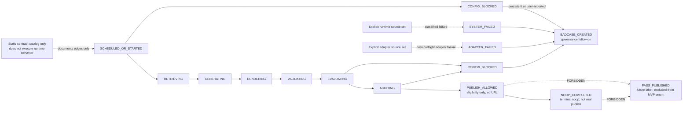

# P2D-2f AI Daily Publishing System State Machine and Transition Test Plan

Status: `P2D-2f_STATE_MACHINE_AND_TRANSITION_TEST_PLAN`

## Source of Truth

This plan is governed by:

- `AGENTS.md`
- `docs/architecture/p2d-1-ai-daily-publishing-system-context-pack-r2.md`
- `docs/architecture/p2d-1-ai-daily-publishing-system-core-and-adapter-architecture.md`
- `docs/architecture/p2d-2a-ai-daily-publishing-system-mvp-scope-plan.md`
- `docs/architecture/p2d-2b-ai-daily-publishing-system-runtime-contract-and-artifact-schema-plan.md`
- `docs/architecture/p2d-2c-ai-daily-publishing-system-local-noop-runtime-plan.md`
- `docs/architecture/p2d-2d-ai-daily-publishing-system-gate-state-machine-implementation-plan.md`
- `docs/architecture/p2d-2e-ai-daily-publishing-system-skeleton-and-type-contract-plan.md`

The source-of-truth hierarchy is:

1. P2D-1: architecture, Core-Adapter boundary, state naming, and repository boundary
2. P2D-2a: MVP scope
3. P2D-2b: runtime contract and artifact schema
4. P2D-2c: local/manual/noop runtime execution chain
5. P2D-2d: implementation module boundary and gate-state-machine boundary
6. P2D-2e: skeleton/type-contract boundary

If a lower-level plan appears to widen or contradict a higher-level boundary, the
higher-level source controls. P2D-2f does not expand the P2D-2a MVP.

## 1. Goal and Scope Boundary

P2D-2f is a state-machine and transition-test planning document. It defines the
future static state vocabulary, transition catalog, transition record shape,
invariants, and contract-test ownership. It is not an implementation phase.

This planning phase only plans later state-machine and transition tests. It:

- does not create `src/`;
- does not create `tests/`;
- does not write code;
- does not create type-contract files;
- does not implement a state machine;
- does not implement a transition validator;
- does not implement a runtime orchestrator;
- does not implement a gate;
- does not implement an artifact writer;
- does not implement a hash manager;
- does not create artifacts;
- does not run tests;
- does not connect to external services;
- does not call a live LLM;
- does not publish;
- does not send notifications; and
- does not expand the P2D-2a MVP scope.

The output of this phase is this planning document only. All future files,
implementation, and test execution remain separately gated.

## 2. Future P2D-2f Execution Scope

### Allowed in future execution, if separately approved

- A state contract file, if the P2D-2e skeleton exists or is approved together
- A transition table or transition catalog represented as static data
- Terminal state sets represented as static data
- State invariant declarations represented as static data
- Transition test files, if tests are separately approved
- Tests for every allowed transition
- Tests for every forbidden transition
- Tests for terminal-state behavior as contract checks
- Tests for `NOOP_COMPLETED != PASS_PUBLISHED`
- Tests that `PASS_PUBLISHED` is not in the MVP state enum
- Tests that `PUBLISH_ALLOWED` is non-terminal and is not real publication

### Conditionally allowed

- A minimal package skeleton only if P2D-2e execution has not happened and the
  user explicitly authorizes a combined minimal skeleton
- Import-only tests
- Static contract tests
- Pytest configuration only when it is necessary and separately approved

Conditional items are not implicitly authorized by approval of this plan. Each
file and each execution action requires an explicit future approval.

### Forbidden in P2D-2f

- Runtime orchestration
- Side-effectful transition execution
- Artifact writing
- Artifact hashing
- Gate evaluation
- Validator, rubric, or audit implementation
- Adapter calls
- Source retrieval
- Report generation
- HTML rendering
- Noop publisher implementation
- Notification implementation
- Failure package creation
- Badcase creation
- Real YAML or JSON artifact generation
- Fixture artifacts that look like real runs
- External API calls
- Live LLM calls
- Deploy, publish, or notification actions
- Public URL creation

## 3. State Catalog Boundary

The future MVP state catalog contains exactly these 14 states:

- `SCHEDULED_OR_STARTED`
- `CONFIG_BLOCKED`
- `RETRIEVING`
- `GENERATING`
- `RENDERING`
- `VALIDATING`
- `EVALUATING`
- `AUDITING`
- `PUBLISH_ALLOWED`
- `REVIEW_BLOCKED`
- `SYSTEM_FAILED`
- `ADAPTER_FAILED`
- `NOOP_COMPLETED`
- `BADCASE_CREATED`

The required classification is:

| Classification | States |
|---|---|
| Initial | `SCHEDULED_OR_STARTED` |
| Active | `RETRIEVING`, `GENERATING`, `RENDERING`, `VALIDATING`, `EVALUATING`, `AUDITING` |
| Intermediate eligibility | `PUBLISH_ALLOWED` |
| Runtime terminal outcomes | `CONFIG_BLOCKED`, `REVIEW_BLOCKED`, `SYSTEM_FAILED`, `ADAPTER_FAILED`, `NOOP_COMPLETED` |
| Governance follow-on | `BADCASE_CREATED` |

State meaning is constrained as follows:

- `PASS_PUBLISHED` is excluded from the MVP state enum.
- `PASS_PUBLISHED` may appear only as a future real-publisher
  forbidden/reference label.
- The MVP runtime must never produce `PASS_PUBLISHED`.
- `NOOP_COMPLETED != PASS_PUBLISHED`.
- `PUBLISH_ALLOWED` does not equal real publication.
- `PUBLISH_ALLOWED` is non-terminal.
- `BADCASE_CREATED` is a governance follow-on, not a successful runtime
  terminal outcome.
- Blocked or failed states cannot claim quality, publication, noop, or runtime
  success.

## 4. Allowed Transition Boundary

The future allowed-transition catalog is static data. Catalog inspection must
not execute runtime behavior or produce side effects.

### Base allowed transition catalog

```text
SCHEDULED_OR_STARTED -> CONFIG_BLOCKED
SCHEDULED_OR_STARTED -> RETRIEVING

RETRIEVING -> GENERATING
GENERATING -> RENDERING
RENDERING -> VALIDATING
VALIDATING -> EVALUATING

EVALUATING -> AUDITING
EVALUATING -> REVIEW_BLOCKED

AUDITING -> REVIEW_BLOCKED
AUDITING -> PUBLISH_ALLOWED

PUBLISH_ALLOWED -> NOOP_COMPLETED

CONFIG_BLOCKED -> BADCASE_CREATED
  condition: persistent_or_user_reported

REVIEW_BLOCKED -> BADCASE_CREATED
SYSTEM_FAILED -> BADCASE_CREATED
ADAPTER_FAILED -> BADCASE_CREATED
```

The base edges carry documented conditions:

| Transition | Condition metadata |
|---|---|
| `SCHEDULED_OR_STARTED -> CONFIG_BLOCKED` | configuration or adapter preflight did not pass |
| `SCHEDULED_OR_STARTED -> RETRIEVING` | `adapter_preflight_pass` |
| `RETRIEVING -> GENERATING` | required retrieval contract completed |
| `GENERATING -> RENDERING` | required generation contract completed |
| `RENDERING -> VALIDATING` | required rendering contract completed |
| `VALIDATING -> EVALUATING` | required validation contract completed |
| `EVALUATING -> AUDITING` | `rubric_pass` |
| `EVALUATING -> REVIEW_BLOCKED` | `rubric_blocked_or_invalid` |
| `AUDITING -> REVIEW_BLOCKED` | `audit_or_daily_publish_gate_blocked` |
| `AUDITING -> PUBLISH_ALLOWED` | `daily_publish_gate_pass` |
| `PUBLISH_ALLOWED -> NOOP_COMPLETED` | `noop_contract_completed` |
| `CONFIG_BLOCKED -> BADCASE_CREATED` | `persistent_or_user_reported` |
| `REVIEW_BLOCKED -> BADCASE_CREATED` | `badcase_required_for_terminal_outcome` |
| `SYSTEM_FAILED -> BADCASE_CREATED` | `badcase_required_for_terminal_outcome` |
| `ADAPTER_FAILED -> BADCASE_CREATED` | `badcase_required_for_terminal_outcome` |

### Explicit runtime-failure source set

The phrase “any runtime stage” must be expanded into the following explicit,
testable source-state set:

```text
SCHEDULED_OR_STARTED
RETRIEVING
GENERATING
RENDERING
VALIDATING
EVALUATING
AUDITING
PUBLISH_ALLOWED
```

Future static catalog work must enumerate these edges individually:

```text
SCHEDULED_OR_STARTED -> SYSTEM_FAILED
RETRIEVING -> SYSTEM_FAILED
GENERATING -> SYSTEM_FAILED
RENDERING -> SYSTEM_FAILED
VALIDATING -> SYSTEM_FAILED
EVALUATING -> SYSTEM_FAILED
AUDITING -> SYSTEM_FAILED
PUBLISH_ALLOWED -> SYSTEM_FAILED
```

Each edge carries the symbolic condition `runtime_failure_classified`.

### Explicit adapter-failure source set

The phrase “any adapter stage” must be expanded into the following explicit,
testable source-state set:

```text
RETRIEVING
GENERATING
RENDERING
VALIDATING
EVALUATING
AUDITING
PUBLISH_ALLOWED
```

Future static catalog work must enumerate these edges individually:

```text
RETRIEVING -> ADAPTER_FAILED
GENERATING -> ADAPTER_FAILED
RENDERING -> ADAPTER_FAILED
VALIDATING -> ADAPTER_FAILED
EVALUATING -> ADAPTER_FAILED
AUDITING -> ADAPTER_FAILED
PUBLISH_ALLOWED -> ADAPTER_FAILED
```

Each edge carries the symbolic condition
`adapter_preflight_passed_then_execution_failed`.

`SCHEDULED_OR_STARTED` is not in the adapter-failure source set. A
configuration or adapter-preflight failure maps to `CONFIG_BLOCKED`, while a
pre-runtime infrastructure failure maps to `SYSTEM_FAILED`.

### Symbolic condition vocabulary

The planned catalog documents, at minimum, these symbolic conditions:

- `adapter_preflight_pass`
- `rubric_pass`
- `rubric_blocked_or_invalid`
- `audit_or_daily_publish_gate_blocked`
- `daily_publish_gate_pass`
- `noop_contract_completed`
- `runtime_failure_classified`
- `adapter_preflight_passed_then_execution_failed`
- `persistent_or_user_reported`
- `badcase_required_for_terminal_outcome`

Conditions are metadata only. P2D-2f does not evaluate them. A conditional edge
is not an unconditional transition, and neither catalog import nor catalog
inspection performs runtime side effects.

## 5. Forbidden Transition Boundary

The future forbidden-transition contract includes these explicit cases:

```text
SCHEDULED_OR_STARTED -> PUBLISH_ALLOWED
SCHEDULED_OR_STARTED -> NOOP_COMPLETED
CONFIG_BLOCKED -> RETRIEVING
REVIEW_BLOCKED -> PUBLISH_ALLOWED
SYSTEM_FAILED -> NOOP_COMPLETED
ADAPTER_FAILED -> NOOP_COMPLETED
PUBLISH_ALLOWED -> PASS_PUBLISHED
NOOP_COMPLETED -> PASS_PUBLISHED
```

It also includes these forbidden families:

- Any transition or semantic claim that creates, reserves, fakes, or implies a
  public URL
- Any blocked or failed state claiming quality, publication, noop, or runtime
  success
- Any same-run transition from a runtime terminal outcome back to an initial,
  active, or intermediate state
- Any terminal-to-active edge used to model retry, repair, resume, or recovery

The same-run terminal source set is exactly:

```text
CONFIG_BLOCKED
REVIEW_BLOCKED
SYSTEM_FAILED
ADAPTER_FAILED
NOOP_COMPLETED
```

The forbidden same-run destination set is:

```text
SCHEDULED_OR_STARTED
RETRIEVING
GENERATING
RENDERING
VALIDATING
EVALUATING
AUDITING
PUBLISH_ALLOWED
```

A subsequent attempt must use a new run/state-machine instance and a new run
identity. It must not be represented as a terminal-to-active edge in the same
run.

`PASS_PUBLISHED` forbidden entries use a raw external reference label, never an
MVP enum member. Forbidden transitions are contract-test inputs only. P2D-2f
does not plan runtime repair, retry, resume, or recovery logic.

## 6. Transition Record Shape Boundary

The future static transition record shape contains exactly these required
fields:

```text
from_state
to_state
reason_code
evidence_refs
condition
is_allowed
source_of_truth
notes
```

Field boundaries are:

| Field | Planning boundary |
|---|---|
| `from_state` | An MVP enum member |
| `to_state` | An MVP enum member, except enum-exclusion tests may use `PASS_PUBLISHED` as an external label |
| `reason_code` | A stable, static explanation identifier |
| `evidence_refs` | Static references expected by the contract; no evidence is read or written here |
| `condition` | Explicit symbolic metadata, including `none` for unconditional entries |
| `is_allowed` | Static allowed/forbidden classification |
| `source_of_truth` | The governing P2D document and section |
| `notes` | Non-executable clarification |

This is a shape-only plan. Unless separately approved, it includes no runtime
validation implementation, timestamp, runtime evaluator, mutation, IO, ledger
writes, artifact writes, or external calls.

## 7. State Invariant Boundary

Future static invariant tests must establish:

- `NOOP_COMPLETED != PASS_PUBLISHED`.
- `PASS_PUBLISHED` is absent from the MVP state enum and cannot be produced.
- `PUBLISH_ALLOWED` is non-terminal.
- `PUBLISH_ALLOWED` carries no public-URL implication.
- Runtime terminal outcomes are exactly:
  - `CONFIG_BLOCKED`
  - `REVIEW_BLOCKED`
  - `SYSTEM_FAILED`
  - `ADAPTER_FAILED`
  - `NOOP_COMPLETED`
- `BADCASE_CREATED` is a governance follow-on.
- Blocked and failed outcomes cannot claim quality, publication, noop, or
  runtime success.
- Terminal close requires downstream evidence under later runtime contracts,
  but P2D-2f tests only the state contract, not artifact existence, hash
  behavior, ledger behavior, or ledger closure.

## 8. Test Plan Boundary

This phase creates and runs no tests. If a later execution phase separately
authorizes tests, they remain static contract tests only.

### Future static contract tests

1. Exact enum completeness and absence of extra states
2. State-category partition and terminal-set equality
3. Every base allowed transition
4. Every explicitly expanded runtime-to-`SYSTEM_FAILED` transition
5. Every explicitly expanded adapter-to-`ADAPTER_FAILED` transition
6. Conditional `CONFIG_BLOCKED -> BADCASE_CREATED` metadata
7. Required badcase follow-on transitions
8. Every explicit forbidden transition
9. The same-run terminal-to-initial/active/intermediate forbidden matrix
10. `PASS_PUBLISHED` exclusion from the MVP enum
11. `NOOP_COMPLETED != PASS_PUBLISHED`
12. `PUBLISH_ALLOWED` is non-terminal and has no public-URL semantics
13. `BADCASE_CREATED` is governance-only
14. Allowed and forbidden catalogs contain all required transition record
    fields
15. Catalog imports perform no IO, create no artifacts, and call no external
    APIs
16. Static/import tests do not execute runtime flow

Static import checks may inspect declarations but must not retrieve sources,
generate reports, render HTML, evaluate gates, mutate state, write artifacts,
write ledgers, call adapters, publish, notify, or create URLs.

### Forbidden future tests

- Runtime-flow or end-to-end tests
- Artifact-writing fixtures
- Real YAML or JSON run artifacts
- Gate execution
- Ledger close
- Publisher execution
- Notification execution
- Retry tests
- Repair tests
- Live LLM tests
- External API tests

## 9. Future File Scope Options

### Option A — recommended/default

Create only:

```text
docs/architecture/p2d-2f-ai-daily-publishing-system-state-machine-and-transition-test-plan.md
```

This is the safest option. It creates only the plan document and creates no
`src/`, `tests/`, or code.

### Option B — conditional, not currently authorized

A separately approved execution may create:

```text
src/ai_daily_publishing_system/core/states.py
tests/state_machine/test_states.py
tests/state_machine/test_transitions.py
```

Option B requires all of the following:

- Separate user approval
- The P2D-2e skeleton is approved and merged, or separately approved for use
- Static enums, catalogs, record shapes, and tests only
- No runtime
- No IO
- No artifacts
- No gates
- No external calls
- No publishing
- No notification
- Tests are not run without separate authorization
- Required `__init__.py`, package configuration, pytest configuration, or
  other skeleton files are not added implicitly; each requires separate
  approval

Recommendation: choose Option A now.

## 10. Acceptance Criteria

P2D-2f planning is acceptable only when:

- The state catalog is exactly the approved 14-state MVP vocabulary.
- `PASS_PUBLISHED` is excluded from the MVP enum.
- Allowed and forbidden transitions align with P2D-2d.
- Runtime and Adapter wildcard language is expanded into explicit source-state
  sets.
- Conditional transitions contain explicit condition metadata.
- Future tests remain static-contract-only.
- No real-publish transition exists.
- No `NOOP_COMPLETED -> PASS_PUBLISHED` path exists.
- No runtime, side effect, artifact, external call, or import side effect is
  authorized.
- Only explicitly approved files are in scope.
- `PUBLISH_ALLOWED` remains eligibility-only, non-terminal, and free of URL
  semantics.
- `NOOP_COMPLETED` remains a terminal noop outcome and never means real
  publication.

## 11. Review Checklist

- [ ] File-scope audit: only explicitly approved files are listed or changed
- [ ] State-catalog audit: exactly 14 approved MVP states
- [ ] Runtime-terminal-set audit: exact five-state runtime terminal set
- [ ] Allowed-transition audit: all required base and expanded edges present
- [ ] Forbidden-transition audit: explicit edges and forbidden families present
- [ ] Condition-metadata audit: conditional edges are not treated as
      unconditional
- [ ] `PASS_PUBLISHED` exclusion audit: external forbidden/reference label only
- [ ] `PUBLISH_ALLOWED` non-terminal/no-URL audit
- [ ] `NOOP_COMPLETED` invariant audit
- [ ] Governance-follow-on audit: `BADCASE_CREATED` is not runtime success
- [ ] No-IO audit
- [ ] No-runtime audit
- [ ] No-artifact audit
- [ ] No-external-API audit
- [ ] No-import-side-effect audit
- [ ] Static-tests-only audit
- [ ] No-unapproved-`src`/`tests` audit

## 12. Mermaid Diagram



This diagram is a static contract catalog only and does not execute runtime
behavior. The accompanying transition sections enumerate the runtime and
Adapter failure source sets explicitly. `NOOP_COMPLETED` is terminal but is not
real publication. The forbidden `PASS_PUBLISHED` paths use a future
real-publisher reference label, not an MVP enum value.

## 13. Non-Goals

The P2D-2f plan does not:

- create any file other than this planning document;
- create `src/`;
- create `tests/`;
- write code;
- implement a state machine;
- implement a transition validator;
- implement runtime validation;
- implement transition dispatch;
- implement gates;
- implement artifact, hash, ledger, failure, or badcase logic;
- run tests;
- create artifacts;
- create fixtures;
- create schemas;
- create examples;
- connect to external services;
- call a live LLM;
- deploy;
- publish;
- notify;
- commit; or
- push.

## 14. Definition of Done

The P2D-2f plan is complete when:

- Scope and safety boundaries are defined.
- The exact state catalog and classifications are defined.
- Allowed transitions are defined.
- Forbidden transitions are defined.
- Conditional transition handling is defined.
- The transition record shape is defined.
- State invariants are defined.
- Static-only test ownership is defined.
- Future file options and approval gates are defined.
- Acceptance criteria are defined.
- The review checklist is defined.
- The Mermaid representation is included.
- Non-goals are included.
- No file is created except this planning document.
- No `src/` is created.
- No `tests/` is created.
- No code is written.
- No tests are run.
- No commit is created.
- No push is performed.
