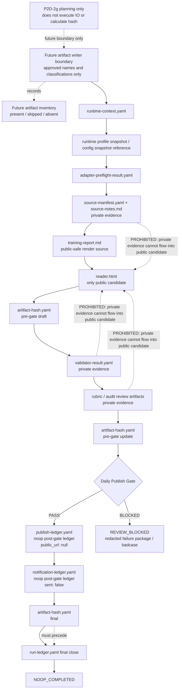

# P2D-2g AI Daily Publishing System Artifact Writer and Hash Manager Plan

Status: `P2D-2g_ARTIFACT_WRITER_AND_HASH_MANAGER_PLAN`

This document is P2D-2g planning only. It defines the future artifact writer,
artifact inventory, and two-phase artifact hash manager boundaries for the AI
Daily Publishing System. It does not implement runtime behavior.

Source of truth:

- `AGENTS.md`
- `docs/architecture/p2d-1-ai-daily-publishing-system-context-pack-r2.md`
- `docs/architecture/p2d-1-ai-daily-publishing-system-core-and-adapter-architecture.md`
- `docs/architecture/p2d-2a-ai-daily-publishing-system-mvp-scope-plan.md`
- `docs/architecture/p2d-2b-ai-daily-publishing-system-runtime-contract-and-artifact-schema-plan.md`
- `docs/architecture/p2d-2c-ai-daily-publishing-system-local-noop-runtime-plan.md`
- `docs/architecture/p2d-2d-ai-daily-publishing-system-gate-state-machine-implementation-plan.md`
- `docs/architecture/p2d-2e-ai-daily-publishing-system-skeleton-and-type-contract-plan.md`
- `docs/architecture/p2d-2f-ai-daily-publishing-system-state-machine-and-transition-test-plan.md`

Source-of-truth hierarchy:

1. P2D-1: architecture / Core-Adapter boundary / state naming / repository boundary
2. P2D-2a: MVP scope
3. P2D-2b: runtime contract and artifact schema
4. P2D-2c: local/manual/noop runtime execution chain and two-phase hash order
5. P2D-2d: implementation module boundary / artifact writer and hash manager boundary
6. P2D-2e: skeleton/type-contract boundary
7. P2D-2f: state machine / transition-test boundary

P2D-2g must not expand the P2D-2a MVP scope.

## 1. Goal and Scope Boundary

P2D-2g plans later artifact writer and artifact hash manager work. It is not
an implementation phase.

This planning phase:

- plans the future artifact writer boundary;
- plans the future artifact inventory record shape;
- plans the future artifact write-result and sink-result boundary;
- plans the future two-phase hash manager boundary;
- plans hash phase vocabulary, ordering, and failure mapping; and
- preserves the public/private artifact boundary from P2D-1 through P2D-2f.

This phase does not:

- create `src/`;
- create `tests/`;
- write code;
- create artifact files;
- create artifact examples;
- create schema files;
- implement artifact writer;
- implement hash calculation;
- implement file IO;
- implement artifact sink;
- implement runtime orchestrator;
- implement gate logic;
- implement validator / review reader;
- implement publisher / notifier;
- run tests;
- connect to external services;
- call live LLM;
- publish;
- send notification; or
- expand the P2D-2a MVP scope.

## 2. Future P2D-2g Execution Scope

### Allowed in future execution, if separately approved

A later execution phase may define static contract data only:

- static artifact name catalog;
- static artifact classification catalog;
- artifact inventory record shape;
- artifact write-result record shape;
- artifact sink result shape;
- hash phase enum / constants;
- artifact hash record shape;
- aggregate hash reference shape;
- failure mapping table for artifact write / hash failures; and
- tests for static artifact inventory and hash phase contracts, if separately
  approved.

### Conditionally allowed

The following are allowed only with separate approval and only inside the
previously approved skeleton/type-contract boundary:

- minimal artifact module only if the P2D-2e skeleton exists or is approved
  together;
- import-only tests;
- static contract tests;
- no-IO fake / in-memory declarations, only if explicitly approved; and
- pytest configuration only if needed and separately approved.

### Forbidden in P2D-2g

P2D-2g must not authorize:

- actual file writes;
- actual hash calculation;
- reading artifact contents;
- creating real artifacts;
- creating YAML/JSON artifact examples;
- creating fixture artifacts that resemble real runs;
- artifact sink implementation;
- runtime orchestration;
- gate evaluation;
- validator / rubric / audit implementation;
- source retrieval;
- report generation;
- HTML rendering;
- publisher / notifier implementation;
- failure package creation;
- badcase creation;
- external API calls;
- live LLM calls;
- deploy / publish / notification; or
- public URL creation.

## 3. Artifact Catalog Boundary

The future catalog is static data only. P2D-2g creates and reads no artifact
content.

Planned artifact names:

- `runtime-context.yaml`
- runtime profile snapshot / config snapshot reference
- `adapter-preflight-result.yaml`
- `source-manifest.yaml`
- `source-notes.md`
- `training-report.md`
- `reader.html`
- `validator-result.yaml`
- `rubric-review.stub.json`
- `rubric-review.json`
- `audit-review.stub.json`
- `audit-review.json`
- `publish-ledger.yaml`
- `notification-ledger.yaml`
- `artifact-hash.yaml`
- `run-ledger.yaml`
- `failure-package.yaml`
- `badcase-record.yaml`

Artifact classification:

| Classification | Artifact |
|---|---|
| Public candidate | `reader.html` |
| Public-safe render source / canonical report content | `training-report.md` |
| Private evidence | `source-manifest.yaml`, `source-notes.md`, `validator-result.yaml`, `rubric-review.stub.json`, `rubric-review.json`, `audit-review.stub.json`, `audit-review.json` |
| Ledger | `runtime-context.yaml`, runtime profile snapshot / config snapshot reference, `adapter-preflight-result.yaml`, `publish-ledger.yaml`, `notification-ledger.yaml`, `artifact-hash.yaml`, `run-ledger.yaml` |
| Failure evidence | `failure-package.yaml` |
| Governance evidence | `badcase-record.yaml` |

Catalog invariants:

- `reader.html` is the only public candidate.
- `training-report.md` is not public candidate; it is the public-safe render
  source and canonical report content.
- Private evidence must never be rendered into the public candidate.
- Artifact catalog declarations are static data only.
- P2D-2g creates no artifact content and reads no artifact content.

## 4. Artifact Inventory Boundary

The future artifact inventory record shape is:

```text
artifact_name
classification
expected_presence
actual_status: present | skipped | absent
path_reference
required_for_state
required_for_gate
hash_required_phase
redaction_status
notes
```

Inventory rules:

- The inventory is a shape only in this planning document.
- `actual_status` is limited to `present`, `skipped`, or `absent`.
- Future inventory records may describe required artifacts by state or gate, but
  they do not decide gates.
- No file stat or filesystem check is authorized unless later approved.
- No write is authorized.
- No read is authorized.
- No hash is authorized.
- No gate decision is authorized.

## 5. Artifact Writer Boundary

The future artifact writer is a boundary module, not a gate and not a runtime
orchestrator. P2D-2g Plan does not implement writer.

Future artifact writer responsibilities:

- accept already-produced artifact payloads or references;
- write only approved artifact names;
- enforce allowed artifact classification;
- record `present`, `skipped`, or `absent` status;
- prevent private evidence from being written into the public candidate;
- refuse unknown artifact names;
- refuse unclassified artifacts;
- refuse fabricated hashes;
- return write-result records; and
- map artifact sink failure to `SYSTEM_FAILED` where appropriate.

The future artifact writer must not:

- decide quality PASS;
- run gates;
- generate reports;
- render HTML;
- retrieve sources;
- call LLM;
- calculate hashes unless delegated to the hash manager in a later approved
  phase;
- publish;
- notify;
- create public URL;
- silently skip required artifacts;
- write unclassified artifacts; or
- write private evidence into `reader.html`.

## 6. Two-Phase Artifact Hash Manager Boundary

P2D-2g Plan does not calculate hash, read files, or write
`artifact-hash.yaml`. It plans the future hash manager contract only.

Hash phases:

- `pre-gate draft`
- `pre-gate update`
- `final`

Phase order:

1. `pre-gate draft` occurs after `reader.html` and before
   `validator-result.yaml`.
2. `pre-gate update` occurs after review artifacts and before the Daily Publish
   Gate.
3. `final` occurs after `publish-ledger.yaml` and `notification-ledger.yaml`,
   before final `run-ledger.yaml` close.

Hash rules:

- Only present artifacts may have hash entries.
- Skipped / absent artifacts must not be hashed as present.
- No fabricated hashes are allowed.
- Pre-gate hash evidence is required before the Daily Publish Gate.
- Final hash evidence is required before `NOOP_COMPLETED`.
- Final hash cannot retroactively override failed validation or a blocked Daily
  Publish Gate.
- Post-gate artifacts are not required in pre-gate hash.
- Final hash includes present pre-gate and post-gate artifacts.

Failure mapping:

- Missing pre-gate hash evidence before the Daily Publish Gate maps to
  `REVIEW_BLOCKED`.
- Artifact sink write failure while writing hash evidence maps to
  `SYSTEM_FAILED`.
- Final hash finalization failure maps to `SYSTEM_FAILED`.
- There is no `NOOP_COMPLETED` without final hash evidence.

## 7. Write Order Boundary

This is a future ordering contract only. P2D-2g Plan does not execute this
order.

Future local/noop success write order:

1. `runtime-context.yaml`
2. runtime profile snapshot / config snapshot reference
3. `adapter-preflight-result.yaml`
4. `source-manifest.yaml`
5. `source-notes.md`
6. `training-report.md`
7. `reader.html`
8. `artifact-hash.yaml` pre-gate draft for present pre-gate artifacts
9. `validator-result.yaml`
10. `rubric-review.stub.json` / `rubric-review.json`
11. `audit-review.stub.json` / `audit-review.json`
12. `artifact-hash.yaml` pre-gate update after review artifacts, before Daily
    Publish Gate
13. Daily Publish Gate decision recorded in run-ledger draft
14. `publish-ledger.yaml`
15. `notification-ledger.yaml`
16. `artifact-hash.yaml` final update / finalize
17. `run-ledger.yaml` final close

Ordering invariants:

- Final `run-ledger.yaml` close must not precede final hash.
- Noop publish / notification ledgers are post-gate artifacts.
- A noop publish ledger must not create, reserve, fake, or imply a public URL.
- A noop notification ledger must not send a message or expose private evidence.

## 8. Failure Mapping Boundary

Future artifact and hash failure mapping:

| Condition | Mapped state or failure class |
|---|---|
| unknown artifact name | `SYSTEM_FAILED` or validation contract failure, depending on stage |
| unclassified artifact | `SYSTEM_FAILED` |
| private evidence leak into public candidate | `REVIEW_BLOCKED` |
| required pre-gate artifact absent | `REVIEW_BLOCKED` |
| artifact sink write failure | `SYSTEM_FAILED` |
| pre-gate hash missing before Daily Publish Gate | `REVIEW_BLOCKED` |
| final hash finalization failure | `SYSTEM_FAILED` |
| public_url non-null in noop publish ledger | `REVIEW_BLOCKED` or `SYSTEM_FAILED`, according to stage |
| attempting `NOOP_COMPLETED` without final hash | `SYSTEM_FAILED` |

Failure invariants:

- No silent downgrade to success.
- No fabricated present status.
- No fabricated hash.
- No public URL.
- No relabeling failure as success.

## 9. Public / Private Boundary

Future checks must preserve these rules:

- `reader.html` is the only public candidate.
- `training-report.md` is public-safe render source, not public candidate.
- Private evidence cannot be copied into `reader.html`.
- Source notes / manifest / validator / rubric / audit are private evidence.
- Notification payload cannot contain private evidence.
- Failure package must be redacted.
- Badcase record must use redacted evidence pointers.

## 10. Test Plan Boundary

This phase creates and runs no tests. Future tests may be static contract tests
only if separately approved.

Future static contract tests:

- artifact catalog completeness;
- artifact classification correctness;
- `reader.html` only public candidate;
- `training-report.md` not public candidate;
- inventory status allowed values;
- unknown artifact rejected;
- private evidence leak rule represented;
- hash phases exact;
- `pre-gate draft` / `pre-gate update` / `final` order;
- present-only hash rule;
- skipped / absent not hashed as present;
- final hash required before `NOOP_COMPLETED`;
- final run-ledger close after final hash;
- failure mapping table completeness;
- no public URL in noop artifacts; and
- import/no-IO tests, if later approved.

Forbidden future tests:

- tests that write real artifact files;
- tests that compute real file hashes;
- tests that create YAML/JSON examples;
- tests that run runtime flow;
- tests that call external APIs; and
- tests that publish or notify.

## 11. Future File Scope Options

### Option A - recommended/default

Create only:

```text
docs/architecture/p2d-2g-ai-daily-publishing-system-artifact-writer-and-hash-manager-plan.md
```

Option A is the safest choice. It creates only this plan document and creates
no `src/`, `tests/`, code, artifacts, schemas, examples, writer implementation,
or hash manager implementation.

### Option B - conditional, not currently authorized

A separately approved execution may create:

```text
src/ai_daily_publishing_system/core/artifacts.py
tests/artifacts/test_artifact_catalog.py
tests/artifacts/test_hash_phases.py
```

Option B requires all of the following:

- separate user approval;
- the P2D-2e skeleton approved and merged, or separately approved for use;
- static constants / catalog / shape tests only;
- no real IO;
- no real hash calculation;
- no real artifacts;
- no runtime;
- no gates;
- no external calls;
- no publishing;
- no notification;
- tests are not run without separate authorization; and
- required `__init__.py`, package configuration, pytest configuration, or other
  skeleton files cannot be added implicitly.

Recommendation: choose Option A now.

## 12. Acceptance Criteria

P2D-2g planning is acceptable only when:

- artifact catalog exactly matches P2D-2b/P2D-2e;
- artifact classification exactly matches P2D-2e;
- `reader.html` is the only public candidate;
- `training-report.md` is not public candidate;
- inventory status is `present` / `skipped` / `absent` only;
- hash phases are exactly `pre-gate draft` / `pre-gate update` / `final`;
- write order matches the P2D-2c two-phase hash order;
- pre-gate hash precedes the Daily Publish Gate;
- final hash precedes final run-ledger close and `NOOP_COMPLETED`;
- no private evidence leak into public candidate is allowed;
- no actual IO is allowed unless later approved;
- no real artifacts / examples / schemas are allowed;
- no real hash calculation is allowed unless later approved;
- no external call is allowed;
- no public URL is allowed; and
- worktree contains only approved files.

## 13. Review Checklist

- [ ] File-scope audit
- [ ] Artifact catalog audit
- [ ] Artifact classification audit
- [ ] Public/private boundary audit
- [ ] Inventory shape audit
- [ ] Inventory status audit
- [ ] Write order audit
- [ ] Hash phase audit
- [ ] Present-only hashing audit
- [ ] No fabricated hash audit
- [ ] Failure mapping audit
- [ ] Noop public URL audit
- [ ] No IO audit
- [ ] No artifact generation audit
- [ ] No schema/example audit
- [ ] No runtime behavior audit
- [ ] No external API audit
- [ ] No unapproved `src`/`tests` audit

## 14. Mermaid Diagram



Diagram notes:

- The diagram is a future ordering contract only.
- P2D-2g Plan does not execute write order.
- Private-evidence arrows are prohibition markers, not data-flow permission.
- Noop ledger does not create public URL or send notification.
- Final run-ledger close must not precede final hash.

## 15. Non-Goals

The P2D-2g Plan does not:

- create any file except this planning document;
- create `src`;
- create `tests`;
- write code;
- implement artifact writer;
- implement hash manager;
- calculate hash;
- read or write artifact contents;
- create artifacts;
- create examples / fixtures / schemas;
- implement runtime;
- implement gates;
- implement validator / review reader;
- implement publisher / notifier;
- run tests;
- connect to external services;
- call live LLM;
- deploy;
- publish;
- send notification;
- commit; or
- push.

## 16. Definition of Done

The P2D-2g Plan is complete when:

- scope and safety boundaries are defined;
- artifact catalog boundary is defined;
- artifact classification boundary is defined;
- inventory shape is defined;
- artifact writer boundary is defined;
- two-phase hash manager boundary is defined;
- write order is defined;
- failure mapping is defined;
- public/private boundary is defined;
- test plan boundary is defined;
- future file options are defined;
- acceptance criteria are defined;
- review checklist is defined;
- Mermaid diagram is included;
- non-goals are included;
- no file is created except this planning document;
- no `src/` is created;
- no `tests/` is created;
- no code is written;
- no artifacts are created;
- no hash calculation is performed;
- no tests are run;
- no commit is created; and
- no push is performed.

Blockers: none.
