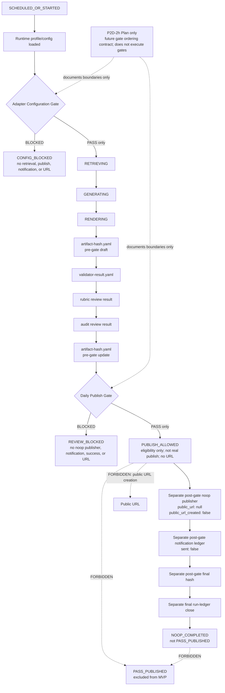

# P2D-2h AI Daily Publishing System Gate Contracts and Decision Boundary Plan

Status: `P2D-2h_GATE_CONTRACTS_AND_DECISION_BOUNDARY_PLAN`

## Source of Truth

This plan is governed by:

- `AGENTS.md`
- `docs/architecture/p2d-1-ai-daily-publishing-system-context-pack-r2.md`
- `docs/architecture/p2d-1-ai-daily-publishing-system-core-and-adapter-architecture.md`
- `docs/architecture/p2d-2a-ai-daily-publishing-system-mvp-scope-plan.md`
- `docs/architecture/p2d-2b-ai-daily-publishing-system-runtime-contract-and-artifact-schema-plan.md`
- `docs/architecture/p2d-2c-ai-daily-publishing-system-local-noop-runtime-plan.md`
- `docs/architecture/p2d-2d-ai-daily-publishing-system-gate-state-machine-implementation-plan.md`
- `docs/architecture/p2d-2e-ai-daily-publishing-system-skeleton-and-type-contract-plan.md`
- `docs/architecture/p2d-2f-ai-daily-publishing-system-state-machine-and-transition-test-plan.md`
- `docs/architecture/p2d-2g-ai-daily-publishing-system-artifact-writer-and-hash-manager-plan.md`

Source-of-truth hierarchy:

1. P2D-1 owns architecture, Core/Adapter separation, repository boundaries,
   state meaning, privacy, and evidence authority.
2. P2D-2a owns MVP scope and Daily Publish Gate conditions.
3. P2D-2b owns runtime contracts and artifact schema surfaces.
4. P2D-2c owns the local/manual/noop runtime chain and gate placement.
5. P2D-2d owns gate/state-machine implementation boundaries.
6. P2D-2e owns skeleton and static type-contract boundaries.
7. P2D-2f owns state-transition and forbidden-transition boundaries.
8. P2D-2g owns artifact, hash-phase, and write-order boundaries.

Lower-level plans must not override or expand higher-level boundaries.
P2D-2h does not expand the P2D-2a MVP scope.

## 1. Goal and Scope Boundary

P2D-2h plans future gate contracts and decision boundaries. It is not an
implementation phase.

This planning phase covers only:

- the Adapter Configuration Gate input boundary;
- the Adapter Configuration Gate decision boundary;
- the Daily Publish Gate input boundary;
- the Daily Publish Gate decision boundary;
- stable gate reason codes;
- blocking reason representation;
- evidence-reference representation;
- gate-to-state mappings;
- forbidden mappings; and
- static gate invariants and future test ownership.

This phase does not:

- create `src/`;
- create `tests/`;
- write code;
- add scripts;
- create type-contract files;
- implement a gate evaluator;
- implement a decision engine;
- implement Adapters;
- implement evaluator behavior;
- implement a validator or review reader;
- implement an artifact writer;
- implement an artifact hash manager;
- implement a runtime orchestrator;
- implement a publisher or notifier;
- read artifact contents;
- write ledgers;
- calculate hashes;
- create artifacts;
- run tests;
- connect to external services;
- call a live LLM;
- publish;
- send notification;
- create, reserve, fake, or imply a public URL; or
- expand the P2D-2a MVP scope.

The Core-owned invariant remains:

```text
No quality PASS, no public URL.
```

## 2. Source-of-Truth Hierarchy

### 2.1 P2D-1: Architecture Authority

P2D-1 owns the Core/Adapter boundary, state meaning, repository authority,
credential redaction, public/private evidence separation, and the rule that
Adapter configuration cannot weaken Core quality or safety gates.

### 2.2 P2D-2a: MVP Scope Authority

P2D-2a fixes the MVP as manual/local/noop-first. Real source providers, live
LLM calls, external APIs, real publishing, real notification, and
`PASS_PUBLISHED` production remain excluded.

### 2.3 P2D-2b: Runtime and Artifact Contract Authority

P2D-2b owns runtime context, profile snapshot, preflight, source, report,
reader, validator, review, ledger, and hash contract surfaces. P2D-2h may
reference those contracts but must not create schema files or artifact
examples.

### 2.4 P2D-2c: Local/Manual/Noop Sequence Authority

P2D-2c fixes Adapter Configuration Gate placement before runtime work and
Daily Publish Gate placement after validation, review, and pre-gate hash
evidence but before noop publish.

### 2.5 P2D-2d: Gate and State Boundary Authority

P2D-2d owns module responsibilities, gate purpose, failure classification, and
the distinction between gate decisions, state transitions, evidence writers,
and post-gate noop boundaries.

### 2.6 P2D-2e: Skeleton and Type-Contract Authority

P2D-2e limits future static contracts to declarations with no runtime behavior,
IO, gate evaluation, artifact reading, or import side effects.

### 2.7 P2D-2f: State-Transition Authority

P2D-2f fixes the approved MVP states, allowed transitions, forbidden
transitions, and the exclusion of `PASS_PUBLISHED` from the MVP state enum.

### 2.8 P2D-2g: Artifact, Hash, and Write-Order Authority

P2D-2g fixes the artifact catalog, visibility classification, artifact
inventory shape, two-phase hash sequence, 17-step write order, and the
requirement that pre-gate hash evidence precede the Daily Publish Gate.

P2D-2h translates these upstream decisions into gate contract planning. It
does not change them.

## 3. Future P2D-2h Execution Scope

Nothing in this section authorizes code, test, package, schema, or artifact
creation. Every future item requires separate user approval.

### Allowed in future execution, if separately approved

- Static Adapter Configuration Gate input shape.
- Static Adapter Configuration Gate decision shape.
- Static Daily Publish Gate input shape.
- Static Daily Publish Gate decision shape.
- Gate reason-code catalog.
- Blocking reason catalog.
- Gate evidence reference shape.
- Gate-to-state mapping table.
- Gate decision invariants.
- Tests for static gate contracts, if separately approved.

### Conditionally allowed

- A minimal gate module only if the P2D-2e skeleton exists or is approved
  together.
- Import-only tests.
- Static contract tests.
- No-IO fake or in-memory declarations, only if explicitly approved.
- Pytest configuration only if required and separately approved.

Conditional items are excluded by default and cannot be added implicitly.

### Forbidden in P2D-2h

- Actual gate evaluation over real files.
- Reading artifact contents.
- Validating real artifacts.
- Computing hashes.
- Writing ledgers.
- Running validator, rubric, or audit behavior.
- Creating a failure package.
- Creating a badcase record.
- Executing runtime transitions.
- Artifact writer implementation.
- Publisher or notifier implementation.
- Source retrieval.
- Report generation.
- HTML rendering.
- External API calls.
- Live LLM calls.
- Deploy, publish, or notification behavior.
- Public URL creation.

## 4. Adapter Configuration Gate Boundary

### Placement

The Adapter Configuration Gate is placed:

- after runtime profile and configuration loading;
- after runtime context and profile/config snapshot references are available;
- before retrieval, generation, rendering, publish, or notification; and
- before any external Adapter call.

No runtime stage beyond redacted configuration preflight evidence may begin
before this gate passes.

### Input Shape

The future static input shape represents:

```text
runtime_context_present
runtime_profile_snapshot_ref
runtime_profile_name
runtime_profile_mode: manual_local_noop
config_snapshot_ref
adapter_configuration_declared
required_credentials_presence_markers
redaction_status
publish_mode
notification_mode
eval_mode
adapter_capability_markers
noop_policy_markers
disabled_external_adapters_declared
environment_safety_marker
```

`manual_local_noop` is the combined MVP profile mode. It is not three mutually
exclusive `local`, `manual`, and `noop` runtime modes. `publish_mode`,
`notification_mode`, and `eval_mode` preserve the structured mode markers from
P2D-2b, while `adapter_capability_markers` and `noop_policy_markers` preserve
the required Adapter capability and noop-policy declarations.

For the MVP combined profile, `publish_mode` declares noop,
`notification_mode` declares noop or none, and `eval_mode` declares noop or the
approved manual review-stub mode. These markers do not authorize real provider
usage.

The Adapter Configuration Gate input shape must preserve the P2D-2b
mode/profile structure. These fields are declarations and references only.
They contain no raw credential values and perform no configuration loading,
capability probing, policy evaluation, or preflight work.

### Decision Values

```text
PASS
BLOCKED
```

### PASS Meaning

`PASS` means:

- the local/manual/noop Adapter configuration is safe to proceed to
  `RETRIEVING`;
- the structured `manual_local_noop` profile and publish, notification, and
  eval mode markers are present, valid, and non-contradictory;
- required configuration markers are present;
- required Adapter capability markers and noop-policy markers are present;
- credential presence is represented without exposing credential values;
- the environment is marked safe for the declared MVP mode; and
- external Adapters remain disabled in the MVP.

The mapping is:

```text
PASS -> RETRIEVING
```

### BLOCKED Meaning

`BLOCKED` means:

- transition to `CONFIG_BLOCKED`;
- no retrieval;
- no generation;
- no rendering;
- no validation;
- no review;
- no publish;
- no notification; and
- no public URL.

The mapping is:

```text
BLOCKED -> CONFIG_BLOCKED
```

### Must Block On

The future contract must represent blocking outcomes for:

- missing runtime context;
- missing required runtime profile or config snapshot reference;
- missing, ambiguous, or contradictory profile/mode structure;
- missing Adapter configuration declaration;
- missing required credential presence marker;
- missing Adapter capability markers;
- missing noop-policy markers;
- exposed raw credential value;
- a non-noop external Adapter enabled in the MVP;
- unsafe environment marker;
- a profile or mode declaration that could enable real external usage; or
- attempted real external API usage.

### Must Not Do

The Adapter Configuration Gate must not:

- retrieve sources;
- call Adapters;
- validate report quality;
- inspect private evidence content;
- publish;
- notify;
- repair configuration; or
- infer credential values.

## 5. Daily Publish Gate Boundary

### Placement

The Daily Publish Gate is placed:

- after `validator-result.yaml`;
- after the rubric review result;
- after the audit review result;
- after the `artifact-hash.yaml` pre-gate update;
- before the noop publisher;
- before the notification ledger;
- before final hash finalization; and
- before `NOOP_COMPLETED`.

The noop publisher, notification ledger, final hash, and final run-ledger close
are separate post-gate boundaries.

### Input Shape

The future static input shape represents:

```text
required_source_presence
source_manifest_ref
training_report_present
reader_html_present
validator_result
rubric_review_result
audit_review_result
artifact_inventory
pre_gate_artifact_hash_evidence
public_private_leak_check_result
noop_publish_config
noop_url_policy
declared_public_url_null_marker
declared_public_url_created_false_marker
credential_redaction_status
blocking_risk_flags
evidence_completeness_marker
```

Input records contain statuses, markers, classifications, and evidence
pointers. The pre-gate noop inputs declare noop publish configuration,
`public_url: null`, and `public_url_created: false` policy. They do not read or
validate artifact content.

Generated post-gate noop ledgers are not Daily Publish Gate inputs.
`publish-ledger.yaml`, `notification-ledger.yaml`, the final hash, and final
run-ledger close remain post-gate artifacts or boundaries.

### Decision Values

```text
PASS
BLOCKED
```

### PASS Meaning

`PASS` means:

- quality and safety gate conditions are satisfied;
- the state transition may move to `PUBLISH_ALLOWED`;
- the separately implemented noop publisher may later record its noop publish
  ledger;
- no real public URL exists or may be created; and
- the run is still not `PASS_PUBLISHED`.

The mapping is:

```text
PASS -> PUBLISH_ALLOWED
```

`PUBLISH_ALLOWED` is eligibility only. It is not real publish, terminal
success, URL creation, or notification authority.

### BLOCKED Meaning

`BLOCKED` means:

- transition to `REVIEW_BLOCKED`;
- no noop publisher;
- no notification;
- no final success;
- no public URL; and
- a failure or badcase path may be considered only in a later, separately
  approved stage.

The mapping is:

```text
BLOCKED -> REVIEW_BLOCKED
```

### Must Block On

The future contract must represent blocking outcomes for:

- missing required sources;
- missing `training-report.md`;
- missing `reader.html`;
- validator result missing, `NOT_RUN`, `BLOCKED`, `FAIL`, ambiguous, or
  unparseable;
- rubric review missing, `NOT_RUN`, `BLOCKED`, `FAIL`, ambiguous, or
  unparseable;
- audit review missing, `NOT_RUN`, `BLOCKED`, `FAIL`, ambiguous, or
  unparseable;
- review stub existence without explicit `PASS`;
- missing pre-gate artifact hash evidence;
- missing artifact inventory;
- private evidence leaking into `reader.html`;
- `reader.html` not classified as the only public candidate;
- `training-report.md` treated as a public candidate;
- `public_url` non-null in pre-gate noop publish configuration or noop URL
  policy;
- `public_url_created` true in pre-gate noop publish configuration or noop URL
  policy, even when `public_url` is null;
- credential value exposure;
- a blocking risk flag;
- incomplete evidence;
- an attempted real publish; or
- an attempted real notification.

### Must Not Do

The Daily Publish Gate must not:

- override validator, rubric, or audit results;
- convert `NOT_RUN` to `PASS`;
- treat file presence as `PASS`;
- create a public URL;
- call a publisher;
- send notification;
- calculate hashes;
- write artifacts;
- create a failure package;
- create a badcase record;
- call an LLM; or
- call an external API.

### Post-Gate Violation Boundary

If a future post-gate noop publisher writes or proposes a malformed
`publish-ledger.yaml`, that violation is outside the Daily Publish Gate input
boundary. A post-gate ledger with `public_url != null` or
`public_url_created == true` belongs to the future post-gate publisher or
runtime-close boundary.

- A malformed post-gate `publish-ledger.yaml` must prevent `NOOP_COMPLETED`.
- The violation must not be relabeled as success.
- The violation must not produce `PASS_PUBLISHED`.
- The generated ledger must not be read back as a Daily Publish Gate input.

## 6. Gate Decision Record Shape

P2D-2h does not replace the gate-specific decision shapes owned by P2D-2d and
P2D-2e. It defines a compatibility-preserving shared envelope plus
gate-specific payloads. These are shape-only planning contracts and create no
gate implementation.

### Shared Gate Decision Envelope

The future shared envelope is:

```text
run_id
gate_name
decision: PASS | BLOCKED
from_state
to_state
reason_codes
blocking_reasons
evidence_refs
input_evidence_refs
required_inputs_present
missing_inputs
redaction_status
public_url_created
public_url
checked_at
timestamp_policy
source_of_truth
notes
```

Field boundaries:

| Field | Planning boundary |
|---|---|
| `run_id` | Upstream-compatible run identity reference without secret material |
| `gate_name` | Adapter Configuration Gate or Daily Publish Gate |
| `decision` | Closed vocabulary: `PASS` or `BLOCKED` |
| `from_state` | State from which the gate decision applies |
| `to_state` | Only the approved gate-to-state mapping |
| `reason_codes` | Stable static reason-code identifiers |
| `blocking_reasons` | Redacted machine-readable blocking summaries |
| `evidence_refs` | Pointers only, never embedded private evidence |
| `input_evidence_refs` | Upstream-compatible input pointers only |
| `required_inputs_present` | Static completeness marker |
| `missing_inputs` | Missing input names or references, not fabricated values |
| `redaction_status` | Explicit redaction marker |
| `public_url_created` | Must be `false` in MVP noop |
| `public_url` | Must be `null` in MVP noop |
| `checked_at` | Upstream compatibility field supplied under timestamp policy |
| `timestamp_policy` | Declares whether and how a later approved runtime supplies `checked_at` |
| `source_of_truth` | Governing P2D document and section reference |
| `notes` | Non-executable clarification without private evidence |

### Adapter Configuration Gate Payload

The Adapter Configuration Gate-specific payload preserves:

```text
profile_name
checked_adapters
blocking_adapters
redacted_message
adapter_capability_markers
noop_policy_markers
runtime_profile_ref
config_snapshot_ref
credential_presence_markers
environment_safety_marker
```

### Daily Publish Gate Payload

The Daily Publish Gate-specific payload preserves:

```text
blocking_checks
validator_result_ref
rubric_review_result_ref
audit_review_result_ref
artifact_inventory_ref
pre_gate_hash_ref
noop_url_policy
public_private_leak_check_ref
credential_redaction_ref
```

### Upstream Compatibility Mapping

| Upstream field | Preserved as |
|---|---|
| `run_id` | Shared Gate Decision Envelope |
| `status: PASS \| BLOCKED` | Shared `decision: PASS \| BLOCKED` |
| `checked_at` | Shared envelope / `timestamp_policy` |
| `reason_codes` | Shared Gate Decision Envelope |
| `redaction_status` | Shared Gate Decision Envelope |
| `public_url_created` | Shared Gate Decision Envelope |
| `maps_to_state` | Shared `to_state` constrained by the approved mapping |
| `profile_name` | Adapter Configuration Gate Payload |
| `checked_adapters` | Adapter Configuration Gate Payload |
| `blocking_adapters` | Adapter Configuration Gate Payload |
| `redacted_message` | Adapter Configuration Gate Payload |
| `input_evidence_refs` | Shared Gate Decision Envelope |
| `blocking_checks` | Daily Publish Gate Payload |
| `noop_url_policy` | Daily Publish Gate Payload |

Decision-record rules:

- This is a shape only.
- `checked_at` is a compatibility and policy-controlled field.
- No runtime timestamp generation is authorized unless later approved.
- `public_url_created` must be `false` in MVP noop.
- `public_url` must be `null` in MVP noop.
- Raw credential values must not appear.
- Private evidence content must not appear.
- `evidence_refs` and `input_evidence_refs` are pointers, not embedded private
  evidence.
- Decision-record existence cannot grant publish authority by itself.

## 7. Gate-to-State Mapping Boundary

### Allowed Mappings

Adapter Configuration Gate:

```text
PASS -> RETRIEVING
BLOCKED -> CONFIG_BLOCKED
```

Daily Publish Gate:

```text
PASS -> PUBLISH_ALLOWED
BLOCKED -> REVIEW_BLOCKED
```

### Forbidden Mappings

```text
Adapter Configuration Gate BLOCKED -> RETRIEVING
Daily Publish Gate BLOCKED -> PUBLISH_ALLOWED
Daily Publish Gate PASS -> NOOP_COMPLETED
Daily Publish Gate PASS -> PASS_PUBLISHED
any gate -> public URL creation
any gate -> real publish
any gate -> notification send
```

Mapping invariants:

- `PUBLISH_ALLOWED` is eligibility only.
- The noop publisher is a separate post-gate boundary.
- `NOOP_COMPLETED` requires the later noop publish ledger, notification ledger,
  final hash, and final run-ledger close.
- `PASS_PUBLISHED` is excluded from MVP.
- A gate decision does not execute a transition, publish operation, ledger
  write, notification, or URL creation.

## 8. Reason Code Boundary

Reason codes are static data only. They identify a gate outcome but do not
evaluate inputs, execute transitions, write evidence, or trigger recovery.

### Adapter Configuration Gate Reason Codes

- `RUNTIME_CONTEXT_MISSING`
- `CONFIG_SNAPSHOT_MISSING`
- `ADAPTER_CONFIG_MISSING`
- `CREDENTIAL_MARKER_MISSING`
- `PROFILE_MODE_STRUCTURE_INVALID`
- `ADAPTER_CAPABILITY_MARKERS_MISSING`
- `NOOP_POLICY_MARKERS_MISSING`
- `RAW_CREDENTIAL_EXPOSED`
- `EXTERNAL_ADAPTER_ENABLED_IN_MVP`
- `UNSAFE_ENVIRONMENT`
- `AMBIGUOUS_RUNTIME_MODE`
- `REAL_EXTERNAL_API_ATTEMPTED`

### Daily Publish Gate Reason Codes

- `REQUIRED_SOURCE_MISSING`
- `TRAINING_REPORT_MISSING`
- `READER_HTML_MISSING`
- `VALIDATOR_RESULT_MISSING`
- `VALIDATOR_NOT_PASS`
- `RUBRIC_REVIEW_MISSING`
- `RUBRIC_NOT_PASS`
- `AUDIT_REVIEW_MISSING`
- `AUDIT_NOT_PASS`
- `REVIEW_STUB_WITHOUT_EXPLICIT_PASS`
- `PREGATE_HASH_MISSING`
- `ARTIFACT_INVENTORY_MISSING`
- `PRIVATE_EVIDENCE_LEAK`
- `PUBLIC_CANDIDATE_MISCLASSIFIED`
- `TRAINING_REPORT_MISCLASSIFIED_AS_PUBLIC`
- `NOOP_PUBLIC_URL_NON_NULL`
- `NOOP_PUBLIC_URL_CREATED_TRUE`
- `CREDENTIAL_EXPOSURE`
- `BLOCKING_RISK_PRESENT`
- `EVIDENCE_INCOMPLETE`
- `REAL_PUBLISH_ATTEMPTED`
- `REAL_NOTIFICATION_ATTEMPTED`

Noop URL reason-code semantics:

- `NOOP_PUBLIC_URL_NON_NULL` covers `public_url != null`.
- `NOOP_PUBLIC_URL_CREATED_TRUE` covers `public_url_created == true`, including
  when `public_url == null`.
- These codes are distinct and must not be collapsed.
- A pre-gate occurrence in noop publish configuration or noop URL policy blocks
  the Daily Publish Gate.
- A post-gate occurrence in a generated noop ledger is handled by the future
  post-gate publisher or runtime-close boundary and prevents
  `NOOP_COMPLETED`; it is not a Daily Publish Gate input.

Catalog rules:

- Codes are stable machine-readable identifiers.
- Codes contain no credential values or private evidence.
- A `PASS` decision has no blocking reason.
- A `BLOCKED` decision records one or more applicable reason codes.
- Codes do not select retry, repair, failure package, or badcase behavior.

## 9. Gate Invariants

Future invariant declarations and static contract tests must establish:

- No quality PASS, no public URL.
- Adapter Configuration Gate must pass before `RETRIEVING`.
- Adapter Configuration Gate `BLOCKED` cannot proceed to retrieval.
- Daily Publish Gate must pass before `PUBLISH_ALLOWED`.
- Daily Publish Gate `BLOCKED` cannot proceed to `PUBLISH_ALLOWED`.
- `PUBLISH_ALLOWED` does not equal real publish.
- `PUBLISH_ALLOWED` does not create a URL.
- `PASS_PUBLISHED` is excluded from MVP.
- `NOOP_COMPLETED != PASS_PUBLISHED`.
- review stub existence is not PASS.
- Missing, `NOT_RUN`, `BLOCKED`, `FAIL`, ambiguous, or unparseable review result
  blocks.
- Missing pre-gate hash evidence blocks the Daily Publish Gate.
- Private evidence leak blocks the Daily Publish Gate.
- A non-null `public_url` in pre-gate noop configuration or noop URL policy
  blocks the Daily Publish Gate with `NOOP_PUBLIC_URL_NON_NULL`.
- A true `public_url_created` marker in pre-gate noop configuration or noop URL
  policy blocks the Daily Publish Gate with
  `NOOP_PUBLIC_URL_CREATED_TRUE`, even when `public_url` is null.
- Generated post-gate publish and notification ledgers are not Daily Publish
  Gate inputs.
- A malformed post-gate noop ledger prevents `NOOP_COMPLETED` and cannot
  produce `PASS_PUBLISHED`.
- Raw credential value exposure blocks.

The invariant catalog is static contract data only. Importing or inspecting it
must not perform IO or execute a gate.

## 10. Public / Private / Credential Boundary

Credential rules:

- Raw credential values must never appear in gate decisions.
- Credentials are represented only by presence and redaction markers.
- Missing credential names may be represented only when allowed by upstream
  redaction policy.
- Tokens, cookies, webhooks, secret-derived hashes, and unredacted provider
  errors are prohibited.

Private evidence rules:

- Private evidence content must not be embedded in a gate decision record.
- `evidence_refs` must be pointers.
- Source notes, source manifest internals, validator details, rubric details,
  audit details, hashes, ledgers, failure packages, badcases, logs, traces, and
  credential errors remain private evidence.

Public candidate rules:

- `reader.html` is the only public candidate.
- `training-report.md` is the canonical public-safe render source, not a public
  candidate.
- Gate decisions must not create or imply a public URL.
- Noop `public_url` must be `null`.
- Noop `public_url_created` must be `false`.
- Pre-gate noop configuration and noop URL policy preserve both URL invariants
  as Daily Publish Gate inputs.
- Generated post-gate ledgers remain private evidence and are not Daily Publish
  Gate inputs.
- A generated noop ledger that violates either URL invariant prevents
  `NOOP_COMPLETED` at the post-gate publisher or runtime-close boundary.

## 11. Test Plan Boundary

This phase creates and runs no tests. Future tests may be static contract tests
only if separately approved.

### Future Static Contract Tests

- Adapter Configuration Gate input shape completeness.
- Adapter Configuration Gate decision shape completeness.
- Daily Publish Gate input shape completeness.
- Daily Publish Gate decision shape completeness.
- Reason-code catalog completeness.
- Gate-to-state mapping correctness.
- Forbidden mapping matrix.
- `public_url: null` and `public_url_created: false` invariants.
- `NOOP_PUBLIC_URL_NON_NULL` covers only `public_url != null`.
- `NOOP_PUBLIC_URL_CREATED_TRUE` covers `public_url_created == true`, including
  when `public_url == null`.
- Pre-gate noop URL policy violations block the Daily Publish Gate.
- Generated post-gate ledgers are excluded from Daily Publish Gate inputs.
- A malformed post-gate noop ledger prevents `NOOP_COMPLETED`.
- Review stub existence is not `PASS`.
- Missing, `NOT_RUN`, `BLOCKED`, `FAIL`, ambiguous, or unparseable review
  results block.
- Missing pre-gate hash blocks.
- Private evidence leak blocks.
- Credential exposure blocks.
- `PASS_PUBLISHED` is excluded.
- `PUBLISH_ALLOWED` remains eligibility-only.
- Import/no-IO tests, if later approved.

### Forbidden Future Tests

- Tests that read real artifacts.
- Tests that execute gate evaluation over real files.
- Tests that write ledgers.
- Tests that compute hashes.
- Tests that call Adapters or external APIs.
- Tests that publish or notify.
- Tests that create public URLs.
- Tests that call a live LLM.

Static tests must not execute runtime flow, generate fixtures resembling real
runs, create artifact files, mutate state, or invoke post-gate behavior.

## 12. Future File Scope Options

### Option A - recommended/default

Create only:

```text
docs/architecture/p2d-2h-ai-daily-publishing-system-gate-contracts-and-decision-boundary-plan.md
```

Option A is the safest option. It creates only the plan document and creates no
`src/`, `tests/`, code, artifacts, examples, fixtures, schemas, gate
implementation, or runtime behavior.

### Option B - conditional, not currently authorized

A separately approved execution may create:

```text
src/ai_daily_publishing_system/core/gates.py
tests/gates/test_gate_contracts.py
tests/gates/test_gate_mappings.py
```

Option B requires all of the following:

- Separate user approval.
- The P2D-2e skeleton approved and merged, or separately approved for use.
- Static constants, contract shapes, reason-code tables, and mapping tests
  only.
- No real IO.
- No real gate evaluation over real files.
- No artifacts.
- No runtime.
- No publisher or notifier.
- No external calls.
- Tests are not run without separate authorization.
- Required `__init__.py`, package configuration, pytest configuration, or
  other skeleton files cannot be added implicitly.

Recommendation: choose Option A now.

## 13. Acceptance Criteria for Future P2D-2h Execution

A separately approved future execution passes only when:

- Adapter Configuration Gate inputs and decisions are defined.
- Daily Publish Gate inputs and decisions are defined.
- Gate-to-state mappings match P2D-2d and P2D-2f.
- The reason-code catalog covers all approved blocking cases.
- A review stub without explicit `PASS` blocks.
- Missing, `NOT_RUN`, `BLOCKED`, `FAIL`, ambiguous, or unparseable review
  status blocks.
- Missing pre-gate hash evidence blocks.
- The `public_url: null` invariant is preserved.
- The `public_url_created: false` invariant is preserved.
- `NOOP_PUBLIC_URL_NON_NULL` and `NOOP_PUBLIC_URL_CREATED_TRUE` remain distinct.
- Daily Publish Gate inputs contain only pre-gate noop configuration and noop
  URL policy, not generated post-gate ledgers.
- A malformed post-gate noop ledger prevents `NOOP_COMPLETED` and cannot
  produce `PASS_PUBLISHED`.
- Raw credential values are prohibited.
- Private evidence content is prohibited in gate decisions.
- `PUBLISH_ALLOWED` remains eligibility-only.
- `PASS_PUBLISHED` remains excluded from MVP.
- No actual IO exists unless separately approved.
- No real artifacts, examples, fixtures, or schemas exist.
- No external call exists.
- No public URL exists.
- The worktree contains only explicitly approved files.

## 14. Review Checklist for Future P2D-2h Execution

- [ ] File-scope audit.
- [ ] Adapter Configuration Gate input audit.
- [ ] Adapter Configuration Gate decision audit.
- [ ] Structured profile/mode and combined `manual_local_noop` audit.
- [ ] Adapter capability and noop-policy marker audit.
- [ ] Daily Publish Gate input audit.
- [ ] Daily Publish Gate decision audit.
- [ ] Shared envelope and gate-specific payload compatibility audit.
- [ ] Gate-to-state mapping audit.
- [ ] Forbidden mapping audit.
- [ ] Reason-code catalog audit.
- [ ] Review-result blocking audit.
- [ ] Pre-gate hash dependency audit.
- [ ] Public URL invariant audit.
- [ ] `NOOP_PUBLIC_URL_NON_NULL` reason-code audit.
- [ ] `NOOP_PUBLIC_URL_CREATED_TRUE` reason-code audit.
- [ ] Post-gate ledger exclusion from Daily Publish Gate input audit.
- [ ] Malformed post-gate ledger prevents `NOOP_COMPLETED` audit.
- [ ] Credential redaction audit.
- [ ] Private evidence boundary audit.
- [ ] `PUBLISH_ALLOWED` eligibility audit.
- [ ] `PASS_PUBLISHED` exclusion audit.
- [ ] No-IO audit.
- [ ] No artifact generation audit.
- [ ] No runtime behavior audit.
- [ ] No external API audit.
- [ ] No unapproved `src/` or `tests/` audit.

Review must reject executable behavior hidden behind imports, constructors,
default factories, registration hooks, examples, fixtures, or package
initialization.

## 15. Mermaid Diagram



Diagram rules:

- The diagram is a future gate ordering contract only.
- P2D-2h Plan does not execute gates.
- Adapter Configuration Gate `PASS` only reaches `RETRIEVING`.
- Adapter Configuration Gate `BLOCKED` reaches `CONFIG_BLOCKED`.
- Daily Publish Gate `PASS` only reaches `PUBLISH_ALLOWED`.
- Daily Publish Gate `BLOCKED` reaches `REVIEW_BLOCKED`.
- `PUBLISH_ALLOWED` is not real publish.
- Noop publisher, notification ledger, final hash, and run-ledger close are
  separate post-gate boundaries.
- Generated post-gate ledgers are not Daily Publish Gate inputs.
- A malformed post-gate noop ledger prevents `NOOP_COMPLETED` and cannot
  produce `PASS_PUBLISHED`.
- No public URL is created or implied.
- `PASS_PUBLISHED` is excluded from MVP.

## 16. Non-Goals

The P2D-2h Plan does not:

- create any file except this planning document;
- create `src/`;
- create `tests/`;
- write code;
- implement a gate evaluator;
- implement a decision engine;
- read artifacts;
- write ledgers;
- calculate hashes;
- create artifacts;
- create examples, fixtures, or schemas;
- implement runtime behavior;
- implement a validator or review reader;
- implement an artifact writer or hash manager;
- implement a publisher or notifier;
- run tests;
- connect to external services;
- call a live LLM;
- deploy;
- publish;
- send notification;
- create a public URL;
- modify P2C outputs or ledgers;
- modify `AGENTS.md`;
- modify P2D-0, P2D-1, or P2D-2a through P2D-2g documents;
- run `git add`;
- commit; or
- push.

## 17. Definition of Done

The P2D-2h Plan is complete when:

- Scope and safety boundaries are defined.
- The source-of-truth hierarchy is defined.
- The Adapter Configuration Gate boundary is defined.
- The Daily Publish Gate boundary is defined.
- The gate decision shape is defined.
- Gate-to-state mappings are defined.
- Forbidden mappings are defined.
- The reason-code catalog is defined.
- Gate invariants are defined.
- The public/private/credential boundary is defined.
- The test plan boundary is defined.
- Future file options are defined.
- Acceptance criteria are defined.
- The review checklist is defined.
- The Mermaid diagram is included.
- Non-goals are included.
- No file is created except this planning document.
- No `src/` is created.
- No `tests/` is created.
- No code is written.
- No artifacts are created.
- No tests are run.
- No commit is created.
- No push is performed.

P2D-2h is complete by freezing gate contracts and decision boundaries for a
later, separately approved execution. It is not complete by implementing gate
evaluation or runtime behavior.
