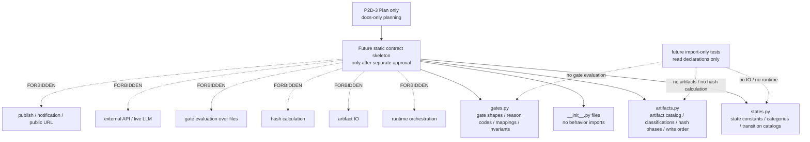

# P2D-3 AI Daily Publishing System Minimal Static Contract Skeleton Implementation Plan

Status: `P2D-3_MINIMAL_STATIC_CONTRACT_SKELETON_IMPLEMENTATION_PLAN`

This is a docs-only architecture planning document for the next AI Daily
Publishing System implementation slice. It plans a minimal static contract
skeleton only. It does not create package code, static modules, tests, schemas,
artifacts, examples, runtime behavior, gate evaluators, artifact IO, hash
calculation, external integrations, publishing, notification, or public URLs.

## 1. Goal and Scope Boundary

P2D-3 is minimal static contract skeleton implementation planning. It is not
the implementation itself.

This P2D-3 task creates only this planning document:

```text
docs/architecture/p2d-3-ai-daily-publishing-system-minimal-static-contract-skeleton-implementation-plan.md
```

This task does not:

- create `src/`;
- create `tests/`;
- write code;
- create a package skeleton;
- create static modules;
- create type contract files;
- create schema files;
- create real artifacts, examples, or fixtures that resemble real artifacts;
- implement runtime orchestration;
- implement state machine execution;
- implement artifact IO;
- implement file stat;
- implement hash calculation;
- implement gate evaluation over real files;
- implement validators or review readers;
- implement artifact writer behavior;
- implement publisher or notifier behavior;
- call a live LLM;
- call external APIs;
- publish;
- notify; or
- create, reserve, fake, imply, or record a public URL.

Future execution, if separately approved, is limited to static declarations,
constants, and shape catalogs. P2D-3 must not expand the P2D-2a MVP scope.

## 2. Source-of-Truth Hierarchy

Source of truth:

- `AGENTS.md`
- `docs/architecture/p2d-1-ai-daily-publishing-system-context-pack-r2.md`
- `docs/architecture/p2d-1-ai-daily-publishing-system-core-and-adapter-architecture.md`
- `docs/architecture/p2d-2a-ai-daily-publishing-system-mvp-scope-plan.md`
- `docs/architecture/p2d-2b-ai-daily-publishing-system-runtime-contract-and-artifact-schema-plan.md`
- `docs/architecture/p2d-2c-ai-daily-publishing-system-local-noop-runtime-plan.md`
- `docs/architecture/p2d-2d-ai-daily-publishing-system-gate-state-machine-implementation-plan.md`
- `docs/architecture/p2d-2e-ai-daily-publishing-system-skeleton-and-type-contract-plan.md`
- `docs/architecture/p2d-2f-ai-daily-publishing-system-state-machine-and-transition-test-plan.md`
- `docs/architecture/p2d-2g-ai-daily-publishing-system-artifact-writer-and-hash-manager-plan.md`
- `docs/architecture/p2d-2h-ai-daily-publishing-system-gate-contracts-and-decision-boundary-plan.md`

Hierarchy:

1. P2D-1: architecture / Core-Adapter boundary / repository boundary.
2. P2D-2a: MVP scope.
3. P2D-2b: runtime contract and artifact schema surfaces.
4. P2D-2c: local/manual/noop runtime chain and gate placement.
5. P2D-2d: module responsibility and gate/state-machine boundaries.
6. P2D-2e: skeleton and type-contract boundary.
7. P2D-2f: state transition and forbidden transition boundary.
8. P2D-2g: artifact/hash/write-order boundary.
9. P2D-2h: gate contract and decision boundary.

Lower-level plans may refine static implementation details only inside the
approved boundary. They must not override Core invariants, weaken gates, expand
MVP scope, introduce public URL behavior, or create runtime side effects.

## 3. Recommended First Implementation Slice

The recommended first implementation slice is static contract skeleton only.

It may consider, after separate approval:

- package skeleton;
- static state constants / enum;
- static state category sets;
- static artifact name constants;
- static artifact classification constants;
- static hash phase constants;
- static gate decision shapes;
- static gate reason-code catalogs;
- static gate-to-state mapping constants; and
- no-IO import-only contract tests, if separately approved.

This is not a runtime slice. It is not an artifact IO slice. It is not a gate
evaluator slice. It is not a hash manager implementation slice. It is not a
publisher/notifier slice. It is not a validator/review-reader slice.

## 4. Future Execution Scope

### Allowed in Future Execution, If Separately Approved

Candidate static package files:

```text
src/ai_daily_publishing_system/__init__.py
src/ai_daily_publishing_system/core/__init__.py
src/ai_daily_publishing_system/core/states.py
src/ai_daily_publishing_system/core/artifacts.py
src/ai_daily_publishing_system/core/gates.py
```

Optional static import-only tests, if separately approved:

```text
tests/static_contracts/test_states.py
tests/static_contracts/test_artifacts.py
tests/static_contracts/test_gates.py
```

These paths are candidate planning scope only. This P2D-3 task does not create
them. Future creation requires separate user approval.

### Conditionally Allowed

- Minimal package configuration only if the repo lacks necessary import setup and
  the user separately approves.
- Pytest configuration only if the user separately approves.
- `tests/__init__.py` only if needed and separately approved.
- Typing helper module only if required and separately approved.

### Forbidden in P2D-3 First Slice

- Runtime orchestrator.
- Transition executor.
- Gate evaluator over files.
- Artifact writer implementation.
- File IO.
- File stat.
- Hash calculation.
- Validator implementation.
- Review reader implementation.
- Publisher / notifier.
- Source retrieval.
- Report generation.
- HTML rendering.
- Ledger writing.
- Failure package creation.
- Badcase creation.
- Schemas / examples / fixtures resembling real artifacts.
- Live LLM / external API.
- Deploy / publish / notification / public URL.
- Tests that execute runtime behavior.

## 5. Static State Contract Boundary

Future `states.py`, if separately approved, should contain static constants only.

The future MVP state catalog contains exactly these 14 states from P2D-2f:

- `SCHEDULED_OR_STARTED`
- `CONFIG_BLOCKED`
- `RETRIEVING`
- `GENERATING`
- `RENDERING`
- `VALIDATING`
- `EVALUATING`
- `AUDITING`
- `PUBLISH_ALLOWED`
- `REVIEW_BLOCKED`
- `SYSTEM_FAILED`
- `ADAPTER_FAILED`
- `NOOP_COMPLETED`
- `BADCASE_CREATED`

State categories:

| Category | States |
|---|---|
| initial | `SCHEDULED_OR_STARTED` |
| active | `RETRIEVING`, `GENERATING`, `RENDERING`, `VALIDATING`, `EVALUATING`, `AUDITING` |
| intermediate eligibility | `PUBLISH_ALLOWED` |
| runtime terminal outcomes | `CONFIG_BLOCKED`, `REVIEW_BLOCKED`, `SYSTEM_FAILED`, `ADAPTER_FAILED`, `NOOP_COMPLETED` |
| governance follow-on | `BADCASE_CREATED` |

Future static declarations may include:

- allowed transition constants;
- forbidden transition constants;
- runtime failure source set;
- adapter failure source set; and
- static invariant constants.

Allowed transition constants should represent P2D-2f base transitions plus the
explicit runtime and adapter failure source-set expansions. The runtime failure
source set is `SCHEDULED_OR_STARTED`, `RETRIEVING`, `GENERATING`, `RENDERING`,
`VALIDATING`, `EVALUATING`, `AUDITING`, and `PUBLISH_ALLOWED`. The adapter
failure source set is `RETRIEVING`, `GENERATING`, `RENDERING`, `VALIDATING`,
`EVALUATING`, `AUDITING`, and `PUBLISH_ALLOWED`.

Forbidden transition constants should include:

- `SCHEDULED_OR_STARTED -> PUBLISH_ALLOWED`;
- `SCHEDULED_OR_STARTED -> NOOP_COMPLETED`;
- `CONFIG_BLOCKED -> RETRIEVING`;
- `REVIEW_BLOCKED -> PUBLISH_ALLOWED`;
- `SYSTEM_FAILED -> NOOP_COMPLETED`;
- `ADAPTER_FAILED -> NOOP_COMPLETED`;
- `PUBLISH_ALLOWED -> PASS_PUBLISHED`;
- `NOOP_COMPLETED -> PASS_PUBLISHED`;
- terminal-to-active same-run transitions; and
- any transition or semantic claim that creates, reserves, fakes, or implies a
  public URL.

State invariants:

- `PASS_PUBLISHED` excluded from the MVP state enum.
- `NOOP_COMPLETED != PASS_PUBLISHED`.
- `PUBLISH_ALLOWED` eligibility-only and non-terminal.
- terminal-to-active same-run forbidden.
- blocked/failed states cannot claim success.

This boundary authorizes no transition execution, no validator, no state
mutation, and no runtime flow.

## 6. Static Artifact Contract Boundary

Future `artifacts.py`, if separately approved, should contain static constants
only.

Artifact name catalog from P2D-2g:

- `runtime-context.yaml`
- runtime profile snapshot / config snapshot reference
- `adapter-preflight-result.yaml`
- `source-manifest.yaml`
- `source-notes.md`
- `training-report.md`
- `reader.html`
- `validator-result.yaml`
- `rubric-review.stub.json`
- `rubric-review.json`
- `audit-review.stub.json`
- `audit-review.json`
- `publish-ledger.yaml`
- `notification-ledger.yaml`
- `artifact-hash.yaml`
- `run-ledger.yaml`
- `failure-package.yaml`
- `badcase-record.yaml`

Classification constants:

| Classification | Artifacts |
|---|---|
| public candidate | `reader.html` |
| public-safe render source / canonical report content | `training-report.md` |
| private evidence | `source-manifest.yaml`, `source-notes.md`, `validator-result.yaml`, `rubric-review.stub.json`, `rubric-review.json`, `audit-review.stub.json`, `audit-review.json` |
| ledger | `runtime-context.yaml`, runtime profile snapshot / config snapshot reference, `adapter-preflight-result.yaml`, `publish-ledger.yaml`, `notification-ledger.yaml`, `artifact-hash.yaml`, `run-ledger.yaml` |
| failure evidence | `failure-package.yaml` |
| governance evidence | `badcase-record.yaml` |

Artifact invariants:

- `reader.html` only public candidate.
- `training-report.md` not public candidate; it is the public-safe render source
  and canonical report content.
- Public/private classification is static data only.

Hash phase constants:

- `pre-gate draft`
- `pre-gate update`
- `final`

Future static declarations may include:

- artifact inventory shape constants;
- artifact write-result shape constants;
- artifact sink-result shape constants;
- write order constants as a static list;
- present-only hash rule as a static invariant;
- skipped / absent not hashed as present invariant; and
- final hash before `NOOP_COMPLETED` invariant.

Future write order constants should mirror the P2D-2g 17-step order:

1. `runtime-context.yaml`
2. runtime profile snapshot / config snapshot reference
3. `adapter-preflight-result.yaml`
4. `source-manifest.yaml`
5. `source-notes.md`
6. `training-report.md`
7. `reader.html`
8. `artifact-hash.yaml` pre-gate draft for present pre-gate artifacts
9. `validator-result.yaml`
10. `rubric-review.stub.json` / `rubric-review.json`
11. `audit-review.stub.json` / `audit-review.json`
12. `artifact-hash.yaml` pre-gate update after review artifacts, before Daily
    Publish Gate
13. Daily Publish Gate decision recorded in run-ledger draft
14. `publish-ledger.yaml`
15. `notification-ledger.yaml`
16. `artifact-hash.yaml` final update / finalize
17. `run-ledger.yaml` final close

This boundary authorizes no actual file writes, no reading artifact contents, no
hash calculation, and no artifact examples.

## 7. Static Gate Contract Boundary

Future `gates.py`, if separately approved, should contain static constants only.

It may declare:

- Adapter Configuration Gate input shape constants;
- Adapter Configuration Gate decision shape / payload constants;
- Daily Publish Gate input shape constants;
- Daily Publish Gate decision shape / payload constants;
- shared gate decision envelope fields;
- gate-specific payload field sets;
- upstream compatibility mapping;
- Adapter reason codes;
- Daily Publish reason codes;
- gate-to-state mapping constants;
- forbidden mapping constants; and
- static gate invariants.

### Shared Gate Decision Envelope

Future shared envelope fields:

```text
run_id
gate_name
decision
from_state
to_state
reason_codes
blocking_reasons
evidence_refs
input_evidence_refs
required_inputs_present
missing_inputs
redaction_status
public_url_created
public_url
checked_at
timestamp_policy
source_of_truth
notes
```

Adapter Configuration Gate payload fields:

```text
profile_name
checked_adapters
blocking_adapters
redacted_message
adapter_capability_markers
noop_policy_markers
runtime_profile_ref
config_snapshot_ref
credential_presence_markers
environment_safety_marker
```

Daily Publish Gate payload fields:

```text
blocking_checks
validator_result_ref
rubric_review_result_ref
audit_review_result_ref
artifact_inventory_ref
pre_gate_hash_ref
noop_url_policy
public_private_leak_check_ref
credential_redaction_ref
```

Upstream compatibility mapping should preserve `run_id`, `status: PASS |
BLOCKED`, `checked_at`, `reason_codes`, `redaction_status`,
`public_url_created`, `maps_to_state`, gate-specific payload fields, and
`input_evidence_refs` as shape-level fields only.

Gate-to-state mapping constants:

```text
Adapter Configuration Gate PASS -> RETRIEVING
Adapter Configuration Gate BLOCKED -> CONFIG_BLOCKED
Daily Publish Gate PASS -> PUBLISH_ALLOWED
Daily Publish Gate BLOCKED -> REVIEW_BLOCKED
```

Forbidden mapping constants:

```text
Adapter Configuration Gate BLOCKED -> RETRIEVING
Daily Publish Gate BLOCKED -> PUBLISH_ALLOWED
Daily Publish Gate PASS -> NOOP_COMPLETED
Daily Publish Gate PASS -> PASS_PUBLISHED
any gate -> public URL creation
any gate -> real publish
any gate -> notification send
```

Adapter Configuration Gate reason-code catalog:

- `RUNTIME_CONTEXT_MISSING`
- `CONFIG_SNAPSHOT_MISSING`
- `ADAPTER_CONFIG_MISSING`
- `CREDENTIAL_MARKER_MISSING`
- `PROFILE_MODE_STRUCTURE_INVALID`
- `ADAPTER_CAPABILITY_MARKERS_MISSING`
- `NOOP_POLICY_MARKERS_MISSING`
- `RAW_CREDENTIAL_EXPOSED`
- `EXTERNAL_ADAPTER_ENABLED_IN_MVP`
- `UNSAFE_ENVIRONMENT`
- `AMBIGUOUS_RUNTIME_MODE`
- `REAL_EXTERNAL_API_ATTEMPTED`

Daily Publish Gate reason-code catalog:

- `REQUIRED_SOURCE_MISSING`
- `TRAINING_REPORT_MISSING`
- `READER_HTML_MISSING`
- `VALIDATOR_RESULT_MISSING`
- `VALIDATOR_NOT_PASS`
- `RUBRIC_REVIEW_MISSING`
- `RUBRIC_NOT_PASS`
- `AUDIT_REVIEW_MISSING`
- `AUDIT_NOT_PASS`
- `REVIEW_STUB_WITHOUT_EXPLICIT_PASS`
- `PREGATE_HASH_MISSING`
- `ARTIFACT_INVENTORY_MISSING`
- `PRIVATE_EVIDENCE_LEAK`
- `PUBLIC_CANDIDATE_MISCLASSIFIED`
- `TRAINING_REPORT_MISCLASSIFIED_AS_PUBLIC`
- `NOOP_PUBLIC_URL_NON_NULL`
- `NOOP_PUBLIC_URL_CREATED_TRUE`
- `CREDENTIAL_EXPOSURE`
- `BLOCKING_RISK_PRESENT`
- `EVIDENCE_INCOMPLETE`
- `REAL_PUBLISH_ATTEMPTED`
- `REAL_NOTIFICATION_ATTEMPTED`

Gate invariants:

- no quality PASS, no public URL.
- Adapter PASS -> `RETRIEVING`.
- Adapter BLOCKED -> `CONFIG_BLOCKED`.
- Daily PASS -> `PUBLISH_ALLOWED`.
- Daily BLOCKED -> `REVIEW_BLOCKED`.
- Daily PASS cannot go to `NOOP_COMPLETED`.
- Daily PASS cannot go to `PASS_PUBLISHED`.
- `NOOP_PUBLIC_URL_NON_NULL` covers `public_url != null`.
- `NOOP_PUBLIC_URL_CREATED_TRUE` covers `public_url_created == true`, including
  when `public_url == null`.
- Generated post-gate ledgers are not Daily Publish Gate inputs.
- malformed post-gate noop ledger prevents `NOOP_COMPLETED`.
- `PUBLISH_ALLOWED` remains eligibility-only.
- `PASS_PUBLISHED` remains excluded from MVP.

This boundary authorizes no gate evaluation over real files, no artifact reads,
no ledger writes, no decision engine, and no runtime behavior.

## 8. Package / Import Boundary

Future modules must be import-side-effect-free.

Package/import rules:

- no import-time file IO;
- no import-time environment reads;
- no import-time network calls;
- no import-time timestamp generation;
- no import-time path creation;
- no import-time registration hooks that execute behavior;
- no import-time artifact discovery;
- no import-time hash calculation;
- no import-time gate evaluation;
- no import-time external API checks;
- `__init__.py` must not import modules in a way that triggers behavior; and
- constants only.

Importing a future static module may expose static names and shapes only. It
must not discover files, read artifacts, calculate hashes, evaluate gates, create
paths, mutate process state, call adapters, call external APIs, or create logs,
ledgers, artifacts, notifications, or URLs.

## 9. Test Plan Boundary

Future tests are planned only. This P2D-3 task creates and runs no tests.

Future static/import tests may cover:

- import modules without side effects;
- exact state catalog;
- state category partition;
- allowed / forbidden transition constants;
- runtime failure source set;
- adapter failure source set;
- `PASS_PUBLISHED` exclusion;
- `NOOP_COMPLETED` invariant;
- artifact catalog completeness;
- artifact classification correctness;
- `reader.html` only public candidate;
- `training-report.md` not public candidate;
- hash phase exactness;
- write order constants;
- present-only hash invariant;
- skipped / absent not hashed as present invariant;
- gate envelope field completeness;
- gate-specific payload field completeness;
- reason-code catalog completeness;
- gate mapping constants;
- forbidden gate mappings;
- no public URL invariants;
- `NOOP_PUBLIC_URL_NON_NULL`;
- `NOOP_PUBLIC_URL_CREATED_TRUE`; and
- no runtime / IO imports.

Forbidden future tests:

- tests reading / writing real artifacts;
- tests computing hashes;
- tests running gates over files;
- tests running runtime flow;
- tests calling adapters / external APIs / live LLM;
- tests publishing / notifying / creating URL; and
- tests creating schemas / examples / fixtures resembling real artifacts.

## 10. Future File Scope Options

### Option A - Recommended/Default

Create only the P2D-3 planning document:

```text
docs/architecture/p2d-3-ai-daily-publishing-system-minimal-static-contract-skeleton-implementation-plan.md
```

This current task follows Option A.

### Option B - Static Skeleton Only, Conditional

Future separately approved work may create:

```text
src/ai_daily_publishing_system/__init__.py
src/ai_daily_publishing_system/core/__init__.py
src/ai_daily_publishing_system/core/states.py
src/ai_daily_publishing_system/core/artifacts.py
src/ai_daily_publishing_system/core/gates.py
```

No tests are included in Option B.

### Option C - Static Skeleton Plus Import-Only Tests, Conditional

Future separately approved work may create Option B files plus:

```text
tests/static_contracts/test_states.py
tests/static_contracts/test_artifacts.py
tests/static_contracts/test_gates.py
```

Option B/C are not currently authorized. They require separate user approval.
They must still include no runtime, no IO, no hash calculation, no artifacts, no
schemas / examples / fixtures, and no external calls. Tests must not run without
separate authorization. Package config, pytest config, and extra `__init__.py`
files are not implicit.

Recommendation: choose Option A now.

## 11. Acceptance Criteria

- P2D-3 planning doc defines first implementation slice.
- First slice is static constants / shapes only.
- No runtime behavior authorized.
- No IO authorized.
- No hash calculation authorized.
- No gate evaluation authorized.
- No validators / review readers authorized.
- No artifact writer behavior authorized.
- No publisher / notifier authorized.
- No schemas / examples / fixtures authorized.
- No public URL.
- File options explicit.
- Import-side-effect-free boundary defined.
- Tests future static / import-only if separately approved.
- Worktree contains only approved files.

## 12. Review Checklist

- [ ] File-scope audit.
- [ ] Source-of-truth audit.
- [ ] State constants audit.
- [ ] State categories audit.
- [ ] State transition constants audit.
- [ ] Artifact constants audit.
- [ ] Artifact classification audit.
- [ ] Hash phase constants audit.
- [ ] Write order constants audit.
- [ ] Gate constants audit.
- [ ] Gate payload/envelope audit.
- [ ] Reason-code audit.
- [ ] Mapping/invariant audit.
- [ ] Import-side-effect audit.
- [ ] Package boundary audit.
- [ ] No IO audit.
- [ ] No runtime audit.
- [ ] No artifact writer behavior audit.
- [ ] No artifact/hash implementation audit.
- [ ] No validator/review-reader audit.
- [ ] No publisher/notifier audit.
- [ ] No artifacts/schema/example audit.
- [ ] No external API audit.
- [ ] No unapproved tests audit.
- [ ] No public URL audit.

## 13. Mermaid Diagram



Diagram notes:

- The diagram is future static contract skeleton only.
- P2D-3 Plan does not create `src/` or `tests`.
- Future tests read declarations only.
- No runtime flow.
- No artifact IO.
- No hash calculation.
- No gate evaluation.
- No external API / live LLM.
- No publish / notification / public URL.

## 14. Non-Goals

P2D-3 Plan does not:

- create files except this planning document;
- create `src/`;
- create `tests/`;
- write code;
- implement runtime;
- implement state machine execution;
- implement gate evaluation;
- implement artifact writer / hash manager;
- implement validator / review reader;
- implement publisher / notifier;
- read or write artifacts;
- calculate hash;
- run tests;
- connect external services;
- call live LLM;
- deploy;
- publish;
- notify;
- create public URL;
- git add;
- commit; or
- push.

## 15. Definition of Done

P2D-3 Plan is complete when:

- scope and safety boundaries are defined;
- source-of-truth hierarchy is defined;
- first implementation slice is defined;
- future file options are defined;
- state static contract boundary is defined;
- artifact static contract boundary is defined;
- gate static contract boundary is defined;
- package/import boundary is defined;
- test plan boundary is defined;
- acceptance criteria are defined;
- review checklist is defined;
- Mermaid diagram is included;
- non-goals are included;
- no file is created except this planning document;
- no `src/` is created;
- no `tests/` is created;
- no code is written;
- no tests are run;
- no git add is run;
- no commit is created; and
- no push is performed.
