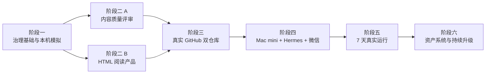

# 高阶产品思维每日训练总体实施路线

> **For agentic workers:** REQUIRED SUB-SKILL: Use superpowers:subagent-driven-development (recommended) or superpowers:executing-plans to implement each phase plan task-by-task. Steps use checkbox (`- [ ]`) syntax for tracking.

**Goal:** 把现有内容 Skill 和 HTML 原型升级为可在 Mac mini 每日运行、经过质量门禁、部署到 GitHub Pages、通过微信通知并能跨电脑回流 Bad Case 的正式产品系统。

**Architecture:** 私有控制仓库保存 Skill、规则、质量证据和失败包；公开网站仓库只接收通过门禁的 HTML。MacBook Air 负责开发治理，Mac mini 负责每日生产，Hermes 通过微信通知，GitHub 负责版本与失败包跨设备同步。

**Tech Stack:** Python 3 标准库、现有 Markdown/HTML 校验脚本、Git、GitHub 私有仓库、GitHub Pages、Hermes Agent、微信、Playwright 浏览器验证。

---

## 1. 计划拆分原则

设计稿包含多个可独立验收的子系统，不能由一个超长实施任务一次完成。项目拆成六个阶段，每个阶段都必须产出可运行、可测试、可回退的结果。

阶段二的内容治理和产品体验可以并行，之后在真实发布链路中汇合。

## 2. 阶段一：治理基础与本机双仓库模拟

**独立目标：** 不连接真实 GitHub、微信和 Mac mini，也能在 MacBook Air 上证明成功、失败、修复三条链路。

**详细计划：**

`docs/superpowers/plans/2026-06-27-governance-foundation-local-demo-implementation.md`

**交付：**

- 私有控制项目根目录 `AGENTS.md`
- 公开站点模拟目录 `AGENTS.md`
- 每日运行状态模型
- 八道门禁的统一结果格式
- 每个环节最多两次定向重试
- 失败包生成
- 上一期保留机制
- 微信成功和失败通知预览
- 本机成功、失败、修复三场景演示

**通过标准：**

- 成功场景只把合格 HTML 写入模拟公开仓库。
- 失败场景完成两次重试后停止，不覆盖上一期。
- 失败场景生成完整失败包和审核通知。
- 修复场景可以从失败状态恢复发布。
- 所有单元测试与集成测试通过。

## 3. 阶段二 A：内容质量评审与 Skill 稳定性

**独立目标：** 将“结构完整”和“Insight 真正合格”拆开评审，避免生成者自评和高分虚高。

**需要单独编写后续实施计划。**

**交付：**

- 独立 AI 评审输入与输出格式
- 思考深度、内容质量、表达质量的详细评分锚点
- 通过线、临界区和阻断区
- 第二 AI 评审触发器
- 评审冲突处理
- Case-specific 模板化检测
- V3、V6、V7 黄金样本与失败样本
- 评审校准测试
- 与现有 `validate_hermes_output.py` 的接口

**通过标准：**

- V7 原始退坡内容不能获得稳定通过。
- V3/V6 目标内容能解释性通过。
- 三个 Case 分别给出证据、扣分点和补强动作。
- 评审结果可以驱动定向重试，而不是只给分。

## 4. 阶段二 B：HTML 阅读产品与视觉门禁

**独立目标：** 把已确认的信息架构和视觉语言固化到生成器，使每日 HTML 稳定达到当前 reader 原型水平。

**需要单独编写后续实施计划。**

**交付：**

- 今日导读与三个核心 Insight
- 雷达简报优先级
- 候选池认知、分数和理由合并展示
- Case 的总览、推理、表达、资产四层结构
- 8 问八模块
- 六层完整判断链
- 结论、阶段结论和下一步影响的视觉强调
- 桌面端与移动端响应式设计
- 导航准确定位
- Playwright 截图和交互验证
- HTML 视觉门禁报告

**通过标准：**

- Markdown 的必要内容不丢失。
- 桌面端和 390px 移动端无横向溢出。
- 导航、按钮、标签和链接不产生误解。
- 三个 Case 的 8 问均可完整阅读。
- 用户不需要手工修改单日 HTML。

## 5. 阶段三：真实 GitHub 双仓库与 Pages

**独立目标：** 用 GitHub 取代本机模拟目录，形成真实控制仓库和公开网站仓库。

**需要单独编写后续实施计划。**

**交付：**

- GitHub 私有控制仓库
- GitHub 公开网站仓库
- 分支保护和最小权限凭证
- 稳定版 Skill 发布方式
- 失败包上传和 GitHub 问题单
- 公开站点发布命令
- GitHub Pages 首页、历史页和审核中状态
- 发布回滚

**通过标准：**

- 私有草稿和失败包不会进入公开仓库。
- 未通过门禁时公开仓库没有训练正文变更，只允许更新“今日内容审核中”状态。
- 通过门禁时 Pages 能更新并获得稳定链接。
- 可以回滚到上一期已验证版本。

## 6. 阶段四：Mac mini、Hermes 与微信联调

**独立目标：** 将真实生产任务迁移到长期运行的 Mac mini，并形成跨设备通知和回流。

**需要单独编写后续实施计划。**

**交付：**

- Mac mini 运行目录
- 定时启动方式
- 稳定版 Skill 同步
- 安装失败回退
- 成功微信通知
- 失败微信通知
- 2 小时单次提醒
- GitHub 问题单链接
- MacBook Air 拉取失败包流程

**通过标准：**

- MacBook Air 离线时 Mac mini 仍可完成每日任务。
- 成功后微信收到线上 HTML 链接。
- 失败后官网保留上一期，微信收到失败摘要。
- MacBook Air 能通过私有仓库取得完整失败包。

## 7. 阶段五：连续 7 天真实运行

**独立目标：** 用真实每日内容证明系统不是只在单次演示中有效。

**需要单独编写后续实施计划。**

**交付：**

- 连续 7 天运行记录
- 每日质量凭证
- 发布、重试、阻断统计
- 用户浏览器批注
- Bad Case 双线回流记录
- 门禁误杀和漏检分析
- 第一版质量周报

**通过标准：**

- 每次公开内容都有完整发布凭证。
- 未通过内容没有进入公开站点。
- 每个严重 Bad Case 都有规则或测试回流。
- 同类失败没有再次被误判为通过。
- 形成是否进入长期自动运行的明确结论。

## 8. 阶段六：个人资产系统

**独立目标：** 将每日训练从内容消费升级为长期职业资产。

**需要单独编写后续实施计划。**

**交付：**

- Case Asset Card 索引
- Watchlist 周复盘
- 面试素材库
- 项目迁移库
- Pattern 库
- 遗忘曲线复习任务

## 9. 总体验收指标

- 每日固定 3 个 Insight 级 Case。
- Case B 和 Case C 不因篇幅被压缩。
- 所有关键结论均有论据、边界和行动建议。
- 发布内容可溯源。
- 生成者自评没有放行权。
- 独立 AI 评审能够拦截高分但浅层内容。
- 每个环节最多两次定向重试。
- 失败不会覆盖上一期合格页面。
- 微信能准确通知成功或失败。
- 私有控制仓库能把失败包回流到 MacBook Air。
- Bad Case 同时推动产品升级和治理升级。

## 10. 执行约束

- 阶段一通过前，不创建真实生产自动发布。
- 阶段二 A 通过前，不宣称 Insight 质量已经稳定。
- 阶段二 B 通过前，不宣称 HTML 已达到正式产品标准。
- 阶段三通过前，不把 GitHub 当作正式生产链路。
- 阶段四通过前，不将 Mac mini 定时任务视为无人值守生产。
- 阶段五通过前，不宣称系统可以长期稳定运行。
