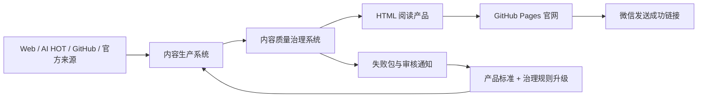

# 高阶产品思维每日训练：产品系统与内容质量治理设计

## 0. 文档状态

本文档记录截至 2026-06-27 已确认的产品方向、内容标准、质量治理机制、双电脑协作、GitHub 双仓库、微信通知和 Bad Case 回流方案。

本文档是后续实施计划的设计依据，不等同于已经完成的功能清单。

已确认原则：

1. 前台产品名统一为“高阶产品思维每日训练”。
2. Hermes 是 Mac mini 上的内部运行引擎，不作为用户可见品牌。
3. 每日固定生成 3 个 Insight 级深度 Case。
4. 信息质量、洞察深度和论证完整性优先于篇幅与阅读负担。
5. Markdown 是完整内容源，HTML 是阅读产品。
6. 产品升级线与内容质量治理线同步推进。
7. 用户本人是唯一人工质量负责人。
8. 用户通过 Codex 对话和浏览器批注提交质量反馈。
9. 每个失败环节最多进行 2 次定向重试。
10. 生成者自评没有放行权；常规使用 1 个独立 AI 评审，异常时增加第 2 个 AI 复核。
11. 未通过门禁的内容不得上线，官网保留上一期合格内容并显示“今日内容审核中”。
12. MacBook Air 负责开发和治理，Mac mini 负责每日生产。
13. GitHub 私有控制仓库负责生产治理，GitHub 公开网站仓库只负责正式展示。
14. 微信是跨设备即时通知渠道。
15. 严重 Bad Case 必须同时推动产品标准和治理规则升级。

## 1. 产品定位

高阶产品思维每日训练不是新闻摘要，也不是普通 AI 写作工具。它是一个面向个人成长和职业壁垒建设的每日训练产品，目标是持续训练：

- 高阶产品判断力
- 系统思维
- Insight 发现能力
- 论证能力
- 面试与汇报表达
- 案例资产化能力

一句话目标：

```text
让 AI 每天稳定生产可训练高阶产品思维的内容，并通过质量治理保证它不会靠运气维持质量。
```

成功不是“偶尔生成一篇好内容”，而是：

```text
每天可生产、可验证、可发布；发生退坡时可发现、可止损、可回流、可复测。
```

## 2. 系统全景

整个产品由五个相互连接的系统组成：

1. 内容生产系统
2. 内容质量治理系统
3. HTML 阅读产品
4. 自动运行与发布系统
5. Bad Case 回流与持续升级系统



## 3. 两条长期主线

### 3.1 产品升级线

产品升级线回答：

```text
这个每日训练产品是否更有价值、更有深度、更好读、更能形成个人能力？
```

负责：

- 搜索与案例选择质量
- 事实可信度与原文溯源
- 3 个深度 Case 的 Insight 水平
- 8 问与 6 层训练体验
- 分析方法工作台
- PREP、SCQA 和追问表达
- Case Asset Card 资产价值
- HTML 信息架构与视觉设计
- 桌面端和移动端阅读体验

### 3.2 内容质量治理线

内容质量治理线回答：

```text
这个 AI 生产系统是否可控、可追踪、可复测、可持续改进？
```

负责：

- 内容质量标准
- 硬规则门禁
- 独立 AI 评审
- 定向重试
- 发布阻断和兜底
- 失败包
- 跨电脑回流
- Skill 版本同步
- 回归测试
- 质量记录和问题关闭

### 3.3 两条线如何协同

- 产品升级线负责把质量上限拉高。
- 内容质量治理线负责守住质量下限。
- 同一个 Bad Case 可能同时暴露产品标准不够好和治理门禁不够严。
- 严重问题不能只修当天文件，必须判断是否需要升级两条线。

长期策略：

```text
双线并行，治理托底，产品拉高，真实运行持续校准。
```

## 4. 内容生产系统

### 4.1 每日输入

每日训练必须尝试使用：

- Search API / Web Search
- AI HOT
- GitHub / Open-source
- 官方公告、产品页、发布说明、论文和原始仓库

AI HOT 和社区内容是信号来源，不直接作为最终事实。影响深度判断的信号必须尽量回溯原始来源。

### 4.2 候选池

每日建立 8-13 个候选 Case。每个候选项至少需要：

- 标题
- 一段快速认知说明
- 发生了什么
- 为什么值得关注
- 原文链接
- 来源等级
- 训练价值
- 选择分数及文字理由
- 深度分析、雷达、Watchlist 或暂不处理的结论

Case Selection Score 不能只展示数字。用户必须理解为什么得分、分数意味着什么、为什么选它或不选它。

### 4.3 三个深度 Case

每日固定选择 Case A、Case B、Case C，确保训练目标具有差异：

- Case A：外部变化、基础设施、成本结构或行业变量
- Case B：产品、商业模式、组织治理或竞争策略
- Case C：个人能力、方法论、认知升级或职业壁垒

最高分不自动入选。高热度但不可验证的内容应降级；热度一般但训练价值和资产价值高的内容可以优先。

### 4.4 Insight 级内容标准

每个深度 Case 必须完整包含：

- Case 背景与事实分层
- 原始来源
- P6+ 第一反应
- 这个思路对在哪里
- 这个思路为什么不够
- P7+ 刹车动作
- Insight 总览
- 异常信号
- 分析方法工作台
- 8 问显性推理
- 现象、原因、本质、系统、趋势、机会六层洞察
- 底层矛盾与因果机制
- 反面论证与边界条件
- P7+ 追问与深度回答
- 决策取舍与优先验证
- PREP 表达
- SCQA 表达
- 被追问回应
- P6+ 易犯错误
- P7+ 正确思路
- 可复用 Pattern
- 迁移方式
- Case Asset Card
- Insight Quality Audit

### 4.5 8 问显性推理

8 问是训练的核心，不是结构占位：

1. 谁？
2. 在哪？
3. 损失什么？
4. 想得到什么？
5. 为什么卡住？
6. 谁共同作用？
7. 未来怎么变？
8. 价值流向哪里？

每一问必须说明：

- 目的
- 分析方法
- 为什么使用该方法
- 推导过程
- 阶段结论
- 如何影响下一步

问题和答案必须同时存在。阶段结论和下一步影响应当在 Markdown 与 HTML 中获得重点表达。

### 4.6 分析方法

“使用模型”正式改为“分析方法”。

方法包括但不限于：

- 第一性原理
- 利益相关者地图
- JTBD
- 价值链
- 系统关系图
- 因果链
- 约束理论
- S 曲线
- 情景推演
- 双钻模型
- 反事实分析
- 商业模式分析
- 风险与边界分析

不设方法数量要求。每个方法都必须产生可识别的分析增量；如果删除某个方法不影响 Insight，该方法就不应出现。

## 5. HTML 阅读产品

### 5.1 基本定位

Markdown 负责完整性，HTML 负责用户体验。HTML 不能为了简洁而削弱 Markdown 的推理深度。

设计原则：

```text
视觉服务理解，交互服务阅读，结构服务训练。
```

### 5.2 信息优先级

公开 HTML 的默认阅读顺序：

1. 今日导读
2. 三个核心 Insight
3. 三个 Case 的最终入选理由
4. 今日雷达简报
5. 候选池与选择判断
6. Case 深度阅读
7. 推理工作台
8. 表达演练
9. Case Asset Card
10. 来源、评分细则和质量审查等证据层

来源、评分阈值、质量审计必须存在，但不应抢占首要阅读动线。

### 5.3 Case 内部结构

每个 Case 分为四层：

- 总览：核心 Insight、结论先行、行动取舍
- 推理：背景、方法、8 问、六层、因果、边界
- 表达：PREP、SCQA、2 分钟表达、追问回应
- 资产：Pattern、迁移方式、Asset Card、Watchlist

### 5.4 视觉与交互要求

- 标题、正文、标签、按钮和链接必须视觉可辨。
- 重要结论、阶段结论和下一步影响需要稳定的强调语言。
- 避免大面积粗字、连续文字墙和无意义卡片嵌套。
- 字号、字重、行高、行宽和留白必须形成系统。
- 导航点击必须准确定位目标模块。
- 桌面端与移动端共用一套响应式页面。
- 移动端不得出现横向溢出、过小点击区或导航遮挡。
- HTML 每天应由稳定生成器生成，不依赖手工修改单日文件。

## 6. 每日端到端生产链路

### 6.1 主流程

```text
定时启动
→ 检查运行环境和稳定版 Skill
→ 搜索并核验来源
→ 建立候选池
→ 选择 3 个深度 Case
→ 生成完整 Markdown
→ 运行硬规则门禁
→ 运行独立 AI Insight 评审
→ 必要时定向重试
→ 生成 HTML
→ 运行 HTML 完整性门禁
→ 运行桌面端和移动端体验门禁
→ 生成发布凭证
→ 推送公开网站仓库
→ GitHub Pages 更新
→ Hermes 通过微信发送线上链接
```

### 6.2 每日状态

每次运行必须处于一个明确状态：

```text
等待运行
→ 生成中
→ 质量审核中
→ 定向重试中
→ 已通过待发布
→ 已发布
```

失败分支：

```text
未通过
→ 停止发布
→ 保留上一期
→ 生成失败包
→ 微信通知
→ 等待治理或人工审核
```

### 6.3 每日内部产物

每次运行至少保留：

- 完整 Markdown
- 最终或草稿 HTML
- 来源记录
- 候选池和选择记录
- 运行版本记录
- 硬规则门禁结果
- 独立 AI 评审结果
- 重试记录
- HTML 完整性结果
- 发布状态
- 必要时的失败包

建议后续形成以下机器可读或可审查文件：

```text
run-manifest.json
source-evidence.json
quality-report.md
reviewer-1.json
reviewer-2.json
retry-log.json
publish-status.json
failure-report.md
```

具体文件命名可在实施计划中调整，但信息不能缺失。

## 7. 质量门禁

### 7.1 评审分层

治理不能只依赖 AI，也不能只依赖脚本。

| 层级 | 负责内容 | 是否有放行权 |
| --- | --- | --- |
| 生成者自检 | 查漏补缺、发现明显问题 | 无 |
| 硬规则门禁 | 结构、字段、空壳、链接、渲染完整性 | 可直接阻断 |
| 独立 AI 评审 | Insight、论据、推理、表达、模板化 | 有条件放行 |
| 第二独立 AI | 临界、异常、冲突复核 | 有条件放行 |
| 用户本人 | 最终人工质量裁决 | 最终裁决 |

用户本人是唯一人工质量负责人。公开网站访问者不拥有反馈提交入口和质量裁决权。

### 7.2 门禁定义

| 门禁 | 主要判断 | 默认评测方式 | 失败处理 |
| --- | --- | --- | --- |
| G0 版本与环境 | 是否使用稳定版 Skill，运行依赖是否可用 | 版本清单、安装校验 | 保留旧稳定版并告警 |
| G1 来源 | 三类来源是否尝试，关键事实是否可溯源 | 来源记录、链接检查、事实等级 | 补查、降级或换 Case |
| G2 候选与选择 | 候选池是否完整，3 个 Case 是否平衡且有训练价值 | 结构检查 + 独立评审 | 重做候选或重新选择 |
| G3 Markdown 完整性 | 必需模块、8 问和 Asset Card 是否完整 | `validate_hermes_output.py` | 定向补写 |
| G4 事实质量 | 事实与观点是否分离，结论是否越过证据 | 来源核验 + 独立评审 | 补证据、降级或换 Case |
| G5 Insight 质量 | 是否有非显然判断、论证链、边界和行动价值 | 独立 AI 评审，异常时双评审 | 重写、降分或换 Case |
| G6 HTML 完整性 | Markdown 内容是否完整进入页面 | `validate_training_reader_html.py` | 修渲染器并重渲染 |
| G7 阅读体验 | 导航、层级、字体、留白、移动端是否可用 | 浏览器自动检查 + 视觉审查 | 修模板或样式 |
| G8 发布 | 所有必要门禁和发布凭证是否齐全 | 发布状态检查 | 阻断公开仓库更新 |

### 7.3 独立 AI 评审

规则：

1. 生成内容的 AI 可以自检，但不能给自己放行。
2. 每次运行至少由 1 个独立 AI 按固定标准评审。
3. 以下情况触发第 2 个独立 AI：
   - 分数接近通过线
   - 3 个 Case 评分异常接近
   - 高分但证据密度不足
   - 评审理由与硬规则结果冲突
   - 存在模板化或过度抽象风险
4. 两个评审结论冲突时，不自动发布。
5. Insight 临界项可等待用户裁决。
6. 硬规则失败不能通过人工判断强行发布。

## 8. 重试、阻断与发布兜底

### 8.1 定向重试

- 初次生成不计算为重试。
- 每个失败环节最多进行 2 次定向重试。
- 重试只修改失败对象，不无目的地重写整篇。
- 每次重试记录失败原因、修改范围、前后差异和复测结果。
- 后续新环节出现新问题，可以使用该环节自己的重试额度。
- 同一门禁连续两次重试仍失败，立即停止自动处理。

典型定向处理：

- 来源失败：补查或更换来源
- 案例选择失败：重新选择 Case
- Insight 浅：只重写对应 Case 的推理和表达
- 模板化：重建 Case-specific 论点和证据
- HTML 丢内容：修渲染或重新渲染
- 移动端失败：修模板和样式

### 8.2 发布兜底

当日内容最终未通过：

- 不推送到公开网站仓库。
- 官网继续展示最近一期已通过内容。
- 首页显示“今日内容审核中”。
- 不把旧内容伪装成今日内容。
- 未通过稿保留在私有控制仓库。
- 生成失败包并发送微信通知。
- 当天修复通过后可以恢复发布。

该规则体现：

```text
质量优先于按时发布，官网可用性优先于公开失败内容。
```

## 9. 双电脑运行架构

### 9.1 MacBook Air

定位：开发与治理中心。

负责：

- 使用 Codex 开发和迭代 Skill
- 修改内容标准、模板和评审规则
- 优化 HTML 阅读产品
- 读取和分析失败包
- 处理用户浏览器批注
- 补充门禁和回归测试
- 发布新的稳定 Skill 版本

### 9.2 Mac mini

定位：长期运行的每日生产中心。

负责：

- 长时间运行 Hermes Agent
- 每晚定时启动每日任务
- 同步最新稳定版 Skill
- 搜索、生成、评审、重试和发布
- 成功时发送微信 HTML 链接
- 失败时生成失败包并发送微信告警

Mac mini 不是规则源头，不直接修改核心内容标准。

## 10. GitHub 双仓库

### 10.1 私有控制仓库

定位：唯一生产与治理规则源。

保存：

- Skill 源文件和稳定版本
- 内容标准和模板
- 门禁、评审标准和测试
- 未发布 Markdown 和 HTML 草稿
- 独立 AI 评审报告
- 重试记录
- 失败包
- 用户批注和审核结论
- GitHub 问题单
- 修复与复测证据

### 10.2 公开网站仓库

定位：面向用户的正式阅读站点。

只保存：

- 已通过全部门禁的每日 HTML
- 首页和历史目录
- 字体、样式、脚本等公开静态资源
- “今日内容审核中”等公开状态

禁止保存：

- 未通过草稿
- 失败原因和内部质量报告
- 用户批注
- GitHub 凭证
- Skill 内部规则

### 10.3 成功与失败链路

成功：

```text
Mac mini 获取稳定版 Skill
→ 生成并通过全部门禁
→ 推送公开网站仓库
→ GitHub Pages 更新
→ 微信发送线上链接
```

失败：

```text
Mac mini 完成两次定向重试仍失败
→ 生成失败包
→ 推送私有控制仓库
→ 创建 GitHub 问题单
→ 公开网站仓库只更新“今日内容审核中”状态，不更新训练正文
→ 微信发送失败告警和问题单链接
```

## 11. 微信通知与人工审核

Codex 不是跨设备即时通知中心。Mac mini 上的 Hermes 通过已经关联的微信负责即时通知。

### 11.1 成功通知

至少包含：

- 日期
- 已通过状态
- 线上 HTML 链接

### 11.2 失败通知

至少包含：

- 日期
- 失败环节
- 自动重试次数
- 官网兜底状态
- 失败编号
- GitHub 问题单链接
- 建议处理动作

### 11.3 触发人工审核

以下情况需要通知用户：

- 两次定向重试仍失败
- 两个独立 AI 评审结论冲突
- Insight 评分处于临界区
- 高价值 Case 的事实仍不足
- 发现需要升级 Skill 或治理规则的严重问题

通知策略：

- 立即通知一次
- 2 小时未处理时提醒一次
- 此后不重复打扰

### 11.4 人工反馈入口

基础版采用：

```text
浏览器批注 + Codex 对话
```

不建设额外反馈后台，不向公开访问者提供反馈按钮。

Codex 负责把用户原始反馈整理为结构化失败包，但必须区分：

- 用户原始判断
- 系统自动发现
- AI 补充分析

Codex 不得把 AI 推断改写成用户原话。

## 12. 失败包与 Bad Case 回流

### 12.1 失败判定

以下情况可形成正式失败：

- 核心训练内容缺失
- 3 个 Case 未达到同等深度
- 高分但推理浅
- 结论没有足够论据
- 模板套话跨 Case 重复
- 事实不可溯源或越过证据
- 8 问或六层为空壳
- HTML 丢失 Markdown 内容
- 导航或移动端问题阻断阅读
- 验收流程误把部分通过当作整体通过
- 用户本人明确判定为不合格

### 12.2 失败包内容

```text
失败编号/
├── 当天 Markdown
├── 当天 HTML
├── 运行版本与环境
├── 来源和事实记录
├── AI 评审报告
├── 两次重试记录
├── 用户批注或截图
├── 用户认为不合格的原因
├── 系统自动发现的问题
├── 初步根因和严重等级
└── 修复与复测记录
```

### 12.3 回流流程

```text
发现失败
→ 登记
→ 归因
→ 判断影响产品线、治理线或两者
→ 修改耐久规则
→ 增加回归测试
→ 复测
→ 发布新稳定版本
→ Mac mini 同步
→ 重跑失败日期
→ 通过后关闭问题
```

### 12.4 双线升级要求

每个严重 Bad Case 都必须回答：

产品升级：

- 内容标准是否需要提高？
- HTML 表达是否需要调整？
- 用户是否缺少解释、证据或阅读引导？

治理升级：

- 为什么旧门禁没有发现？
- 是否需要新增评审维度或调整阈值？
- 是否需要把该案例加入长期回归样本？
- 下一次能否在发布前阻断？

V7 是第一个基准回流样本：

- 高分但内容浅
- 模板套话重复
- HTML 8 问空壳
- 端到端通过误判

## 13. Skill 版本与同步

Mac mini 不直接使用开发中的最新代码，只同步已标记为稳定的 Skill 版本。

```text
MacBook Air 开发
→ 测试通过
→ 发布稳定版本
→ Mac mini 检测新版本
→ 验证安装
→ 切换新版本
```

如果新版安装或验证失败：

- Mac mini 继续使用上一稳定版本
- 不破坏当天生产环境
- 通过微信告警

版本格式建议：

```text
高阶产品思维每日训练 Skill vX.Y.Z
```

- X：训练框架重大变化
- Y：内容标准、治理机制或 HTML 信息架构升级
- Z：小修复、门禁补强和文案调整

## 14. 当前基础与主要缺口

### 14.1 已具备

- V3 / V6 级内容质量参照
- 8 问、六层、PREP、SCQA 和 Asset Card 模板
- Markdown 结构检查
- HTML 内容完整性检查
- 失败登记校验
- V7 正式失败回流样本
- 当前 HTML 阅读原型

现有核心检查文件：

- `skill/scripts/validate_hermes_output.py`
- `skill/scripts/validate_training_reader_html.py`
- `skill/scripts/validate_failure_feedback.py`

### 14.2 仍需建设

- 独立 AI Insight 评审器
- 第二评审触发规则
- 两次定向重试编排
- 每日运行清单和发布凭证
- 本机双仓库模拟
- GitHub 私有控制仓库
- GitHub 公开网站仓库
- GitHub Pages 正式站点
- Mac mini 稳定版 Skill 同步
- Hermes 微信成功与失败通知
- 跨电脑失败包回流
- Bad Case 双线升级记录
- 连续真实运行稳定性验证

## 15. 演示与上线策略

### 15.1 第一步：本机模拟

在 MacBook Air 上模拟：

- 私有控制仓库
- 公开网站仓库
- Mac mini 每日生产角色
- 微信成功和失败通知文案

演示三条链路：

1. 成功生成并发布
2. 连续两次重试失败、阻断发布、生成失败包
3. MacBook Air 修复、发布新版、重新运行并恢复发布

### 15.2 第二步：真实联调

接入：

- 真实 GitHub 私有控制仓库
- 真实 GitHub 公开网站仓库
- GitHub Pages
- Mac mini 上的 Hermes
- 微信通知

### 15.3 第三步：真实运行

- 连续运行至少 7 天
- 每日保留质量凭证
- 记录成功、重试和失败情况
- 对真实 Bad Case 做双线回流
- 根据结果调整门禁与评审标准

## 16. 推荐实施顺序

1. 完成详细门禁、评审和运行状态设计。
2. 建立本机双仓库模拟。
3. 跑通成功、失败和修复三条链路。
4. 建立私有控制仓库和公开网站仓库。
5. 接入独立 AI 评审与两次定向重试。
6. 完成 GitHub Pages 阅读网站。
7. 在 Mac mini 安装稳定生产版本。
8. 接入 Hermes 微信通知。
9. 连续真实运行 7 天。
10. 根据 Bad Case 同步升级产品线和治理线。
11. 继续建设 Case Asset Card 索引、Watchlist 和个人资产系统。

## 17. `AGENTS.md` 设计结论

### 17.1 是否需要

需要。

标准文件名应为：

```text
AGENTS.md
```

不是 `AGENT.md`。

原因是这个项目已经由多个 AI Agent、两台电脑和两种运行职责共同维护。仅依赖对话记忆或 Skill 内部说明，无法稳定约束后续 Codex、Hermes 或其他 Agent 的项目级行为。

### 17.2 `AGENTS.md` 与 `SKILL.md` 的区别

`SKILL.md` 负责：

- 每日训练内容怎么搜索、分析和表达
- 单 Case 和诊断模式怎么运行
- 8 问、六层和 Asset Card 怎么生成

`AGENTS.md` 负责：

- 这个项目的使命和边界
- 哪个仓库是规则源头
- MacBook Air 与 Mac mini 的职责
- 什么内容可以进入公开仓库
- 哪些门禁不得绕过
- 如何运行测试和验证
- 如何处理 Bad Case
- 如何发布稳定版本
- 哪些文件是生成物，不能手工修成长期方案

简化表达：

```text
SKILL.md 管“怎么生产内容”；
AGENTS.md 管“所有 Agent 怎么安全地维护和运行这个项目”。
```

### 17.3 私有控制仓库的 `AGENTS.md`

根目录建议建立一份主 `AGENTS.md`，至少包含：

- 产品名称和北极星目标
- 内容质量优先级
- 唯一规则源说明
- 双电脑职责
- 双仓库边界
- 不可绕过的门禁
- 两次定向重试规则
- 发布兜底规则
- 用户是唯一人工质量负责人
- 浏览器批注和 Codex 对话的回流方式
- Bad Case 双线升级要求
- 修改后必须运行的验证
- 稳定版发布要求
- 禁止事项

### 17.4 公开网站仓库的 `AGENTS.md`

建议建立一份更短的 `AGENTS.md`，只约束网站仓库：

- 只接受通过全部门禁的公开产物
- 禁止提交失败包、草稿、内部报告和凭证
- 禁止直接手改单日 HTML 作为长期修复
- 视觉问题优先修生成器、模板或设计系统
- 发布前必须完成 HTML 完整性和响应式检查

### 17.5 编写时机

`AGENTS.md` 应在实施计划的第一阶段创建，在本机双仓库模拟前生效。

本设计文档先确定其职责；具体文本在实施计划获批后编写。

## 18. 成功标准

系统达到基础上线标准时，应能证明：

- 3 个深度 Case 都达到规定的 Insight 标准。
- 每个发布版本都有来源、评审、门禁和版本证据。
- 未通过内容不会进入公开网站仓库。
- 每个失败环节最多重试两次。
- 失败后官网能稳定保留上一期。
- Mac mini 能通过微信通知成功或失败。
- MacBook Air 能通过私有仓库取得完整失败包。
- 严重 Bad Case 能同时推动产品与治理升级。
- 新稳定版能同步回 Mac mini 并重跑失败日期。
- 同类失败不会再次被误判为通过。

## 19. 当前阶段不做

- 不做多人质量审核平台。
- 不向公开用户开放反馈入口。
- 不做复杂业务后台。
- 不引入付费服务器作为基础依赖。
- 不做数据库化知识库。
- 不追求一次性完全自动化治理。
- 不以按时发布为理由降低 Insight 质量。

优先用现有 Mac mini、GitHub、GitHub Pages、Hermes 和微信跑稳基础闭环。

## 20. 下一步

本设计确认后，下一步不是直接零散开发，而是形成分阶段实施计划：

1. 项目级 `AGENTS.md` 与目录边界
2. 每日运行清单、状态和质量凭证
3. 独立 AI 评审与门禁
4. 两次定向重试与失败包
5. 本机双仓库演示
6. GitHub 双仓库与 Pages
7. Mac mini 与微信联调
8. 真实 7 天运行与治理复盘
